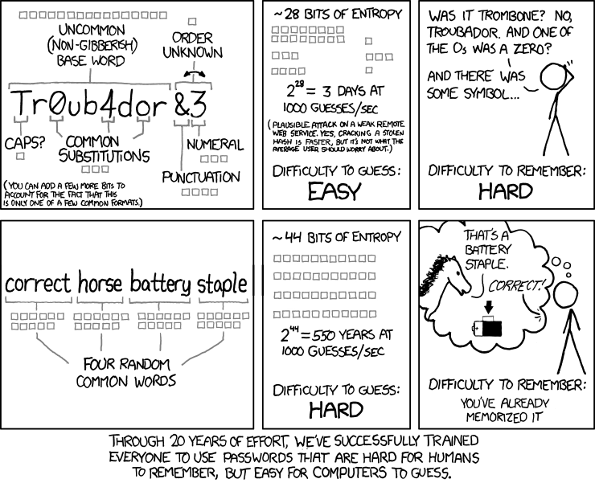

# Backups

Backups are a necessity in case of failure. Whether it is disk/drive failure or software failure, you want to have, well, backups in place to make sure you are able to get back on track. One of the most popular personal backup strategies is the 3-2-1 backup method. This snippet from Seagate says it well:

> 3 Copies of Data – Maintain three copies of data—the original, and at least two copies.
>
> 2 Different Media – Use two different media types for storage. This can help reduce any impact that may be attributable to one specific storage media type. It’s your decision as to which storage medium will contain the original data and which will contain any of the additional copies.
>
> 1 Copy Offsite – Keep one copy offsite to prevent the possibility of data loss due to a site-specific failure.

Using this format will help you get back up and running much faster than starting off from scratch. One thing to note with backups is that they work off of a proactive approach. This means you have to not only do this once, but maintain a healthy backup lifestyle in order to prevent data loss as much as you can. You can also have your own "3-2-1-#-#-#rule", where you add your own customization to the basic strategy. You do have to take the cost of the storage devices into mind, whether it is cloud storage providers or even for a hard drive purchase.&#x20;

There are multiple ways of following the rule. Here are some of the other location suggestions:

* Backups on disk (DAS, SAN, NAS and appliances)
* Backups on tape
* Backups on removable storage
* Storage snapshots
* External storage stored at a friends/relatives house
* External storage stored in a bank vault

There are a lot of complications to consider for backups as well:

* Weather
* Potential Fire
* Electric Static (while moving the device(s))
* Home Invasion
* Police Confescation
* Drive/Disk Failure
* etc.

Using the 3-2-1 is a way of being proactive and making your data be redundant in case of any of the aforementioned complications.

## File System Formats

For data backups, and even for data storage in general, it is a good idea to take a look at the properties that a file system format gives you. Keeping these in mind can help you choose what format is better for your situation.

<table><thead><tr><th width="168.33333333333331"></th><th width="127">NTFS</th><th>APFS </th><th>HFS+ </th><th>exFAT</th><th>FAT32</th></tr></thead><tbody><tr><td><strong>OS Readable</strong></td><td>Windows (Native), macOS (Read-Only), Linux</td><td>macOS (Native)</td><td>macOS (Native)</td><td>Windows, macOS, Linux</td><td>Windows, macOS, Linux</td></tr><tr><td><strong>Journaling</strong></td><td>X</td><td>X</td><td></td><td></td><td></td></tr><tr><td><strong>Permissions Tracking</strong></td><td>X</td><td>X</td><td>X</td><td></td><td></td></tr><tr><td><strong>Max File Size</strong></td><td>16TB Default (4KB Cluster Size), 2MB Cluster Size 8 PB</td><td>8 EB</td><td>slightly less than 8 EB</td><td>16 EB</td><td>4GB</td></tr><tr><td><strong>Max Volume Size</strong></td><td>16TB Default (4KB Cluster Size), 2MB Cluster Size 8 PB</td><td></td><td>slightly less than 8 EB</td><td>64 ZB</td><td>512 MB to 16 TB</td></tr><tr><td><strong>Legend</strong></td><td>X = yes</td><td></td><td></td><td></td><td></td></tr></tbody></table>

## Encryption

From the CIA triad (Confidentiality, Integrity, and Availability), encryption falls under the Confidentiality principle. This means that only authorized users are allowed to access/modify the data. In order to apply this principle to our data, we need to encrypt our data, so we can only see it. Although there are brute force attempts possible to find out a password, I will not go deep into that here. Here are the tools I use for encryption:

* VeraCrypt (for Full Disk Encryption)
* Cryptomator (for when I have to store files in the cloud)

There are more softwares located at: https://www.privacyguides.org/encryption/ if you are interested. For encryption passwords, make sure you use a password manager and create long passwords or create long passphrases. Here is an xkcd comic that might help clarify whether to choose password vs passphrase (if you have a password manager, then this might not matter too much):

<figure><figcaption></figcaption></figure>

## Backup Lifestyle

After your data is encrypted, and your file system of choice is chosen, the last step is to actually backup the data. The first time you are backing up data, it usually is a full backup. "The primary advantage to performing a full backup during every operation is that a complete copy of all data is available with a single set of media" . This takes the longest time due to the amount of data being transferred. After the full backup is completed, the nest two backup operations become available to you: incremental backups and differential backups. Incremental backups will copy only the data that has changed since the last backup operation of any type . Incremental backups keep on adding files that are new or modified from the last backup. Incremental backups do not take into account if you previously did a full backup or an incremental backup. Differential backups on the other hand, do take that into account. A differential is similar to incremental in the first time it is run. "However, each time it is run afterwards, it will continue to copy all data changed since the previous full backup. Thus, it will store more backed up data than an incremental on subsequent operations, although typically far less than a full backup. Moreover, differential backups require more space and time to complete than incremental backups, although less than full backups". With that being said, here are some tools I use for backups:

Tools:

* Déjà Dup Backups (for backing up Linux home directory files)
* FreeFileSync (for syncing files from one folder to another)

Both of these work off of a incremental backup format, at least in my usage. After the backups are complete, you have to setup a cadence at which you will keep backing up on. For some it's daily, for others, its monthly. It is different for everybody.

## Current Setup

| Storage Location      | Backup Strategy Principle Covered                    |
| --------------------- | ---------------------------------------------------- |
| Local Storage (on PC) | 1 copy of data, 1 unique media                       |
| External Hard Drive   | 1 copy of data                                       |
| Cloud Storage         | 1 copy of data, 1 unique media, 1 copy offsite       |
| **=**                 | **3 copies of data, 2 unique media, 1 copy offsite** |

For the local storage, I have it stored on the main OS I use. I also have a 2TB internal hard drive, which I frequently backup my data to using FreeFileSync. I also use Deja Dup to duplicate my OS and upload it to the 2TB internal drive as well, to maintain an encrypted copy of my host machine files. I backup this 2TB internal hard drive to a 2TB external hard drive as well. This makes it 3 copies of the same data. For important files, I do upload them to the cloud as well. I currently use Proton Drive for this. As part of their Proton Unlimited plan, they allow for 500GB of storage in the cloud. The cloud storage allows me to have 3 versions of pretty much similar data in different formats.&#x20;

## Sources:

* https://www.seagate.com/blog/what-is-a-3-2-1-backup-strategy/
* https://www.veeam.com/blog/321-backup-rule.html
* https://www.seagate.com/support/kb/file-system-format-comparisons-006171en/
* https://en.wikipedia.org/wiki/Comparison\_of\_file\_systems
* https://www.csoonline.com/article/3519908/the-cia-triad-definition-components-and-examples.html
* https://xkcd.com/936/
* https://youtu.be/S0KZ5iXTkzg
  * https://yewtu.be/watch?v=S0KZ5iXTkzg (Invidious link)
* https://flathub.org/apps/details/org.gnome.DejaDup
* https://rsync.samba.org/
* https://www.techtarget.com/searchdatabackup/feature/Full-incremental-or-differential-How-to-choose-the-correct-backup-type
