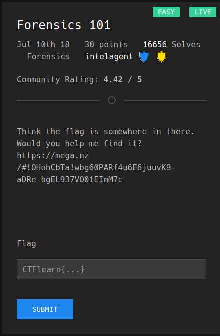
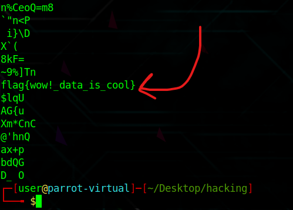

# Forensics 101

This question is asking us to find a flag hidden somewhere. After downloading the file, my first step was to run the linux command called "strings" onto the file. This allows us to see the text from the file. This allowed me to see the flag hidden in the file:

