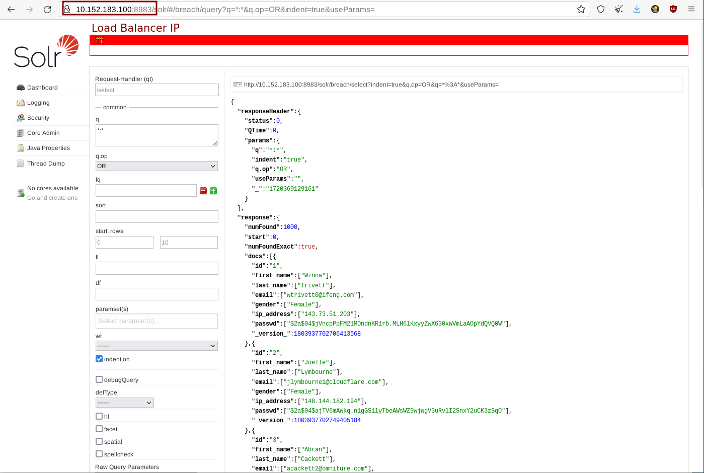
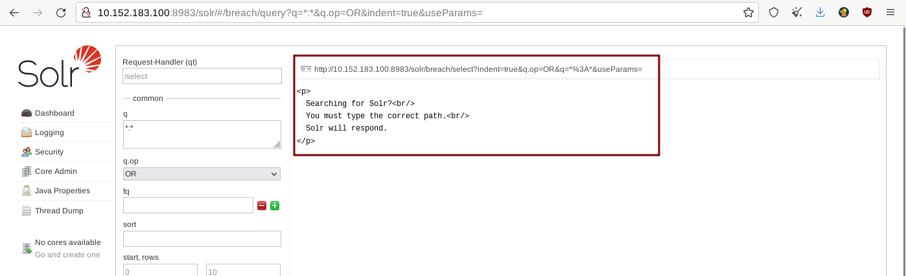

# Containerization

## Introduction

I have seen application containerization solutions mentioned for a while now, and I wanted to look into a a couple of these solutions to be used for breach infrastructure, especially for breach data indexing (Apache Solr). From an outside perspective, it seems like a good way to have lightweight systems that allow for scaling up if required. The title, however, alludes to containerizing solutions in general, which I will use as an umbrella term to include virtual machines as well. **I will be basing this blog on a Linux OS, but the tools will work on Windows and macOS as well.**&#x20;


My testing environment for this blog was a Debian 12 virtual machine hosted on Virtual Box. It has 50GB of storage, 6000MB RAM, and 3 cores.


This blog will discuss 3 different solutions:

1. Virtual Machines
2. Podman (similar to Docker)
3. Microk8s (Kubernetes, which is similar to Docker Swarm)

## Virtual Machines

When it comes to virtual machines, there are two main types of hypervisors: Type 1 (VMware ESXi, Microsoft Hyper-V, KVM) and Type 2 (Oracle VM VirtualBox, VMware Workstation, Microsoft Virtual PC). I would highly recommend planning for your breach data environment prior to choosing a type of hypervisor because as your data and environment changes, it becomes a bit more tedious to move from one type to another. As such for hobbyists, I would recommend Type 2, while for organizations, I would recommend Type 1. There are a lot of online tutorials that discuss the benefits of Type 1 in comparison to Type 2 and vice versa, so I will not discuss those here. In this section, I will discuss the following:

* Operating System (OS) Recommendations
* Scripting with Bash and Ansible
* VM Escape

Virtual machines are great for having a separate, virtual, system that allows for segmenting your project from the host OS. As you download different types of breaches, there is always a possibility for it to be infected with malware. Having a separate system allows us to mitigate this situation with a high percentage of success rate. The steps for setting up a VM has been discussed a lot online, so I chose not to decide it here. However, the steps should be similar to what is listed here: [https://linuxsimply.com/linux-basics/os-installation/virtual-machine/debian-on-virtualbox/](https://linuxsimply.com/linux-basics/os-installation/virtual-machine/debian-on-virtualbox/). The steps to download Solr are in the docs: [https://solr.apache.org/guide/solr/latest/deployment-guide/installing-solr.html](https://solr.apache.org/guide/solr/latest/deployment-guide/installing-solr.html).

### Operating System (OS) Recommendations

When it comes to OSes to put on the Virtual Machines, I always recommend Linux (Debian-based) as it is the most flexible for most things (excluding Video Games). You have a package manager at your fingertips that allows for easy access to download your applications. The OS itself is lighter in weight compared to macOS and Windows. You do have to apply security and privacy hardening on Linux for it to be secure and private, but due to its less bloated system, it is easier to do. There is minimal OS telemetry. It is highly customizable. However, all of this comes at a learning curve, which is not steep (but definitely can get steep for things like OS hardening, compilation flags, etc.). With that being said, when it comes to breach data environments, as of writing this blog (July 2024), I would recommend the following Linux OSes at what I would consider different Linux learning tiers:

* Debian (Novice)
* Fedora Silverblue (Advanced Beginner)

#### Debian (Novice)

[Debian](https://www.debian.org/) is an entry-level operating system in the Linux ecosystem, although some consider Linux Mint to be that. Linux Mint (and Ubuntu) is based on Debian. I recommend this OS as the installation method for this OS and using the OS out of the box is really easy. You simply follow the prompts and the OS is good to go. For installing packages, the \`apt\` package manager gives you most tools, and Flatpak and Snap managers are one command away to be installed. There is a lot of tutorials and documentation for Debian in case one gets stuck, which is why I have this listed at the Novice level.

#### Fedora Silverblue (Advanced Beginner)

[Fedora Silverblue](https://fedoraproject.org/atomic-desktops/silverblue/) is a semi-rolling release Fedora-based atomic/immutable distribution. I mention this in my blog due to my strong belief in having backups, which is what the atomic/immutable aspect of it allows you to have. When updating your system, if it fails, and your OS gets mis-configured, you can roll the OS back to a previous snapshot. This way you will always have a working OS. Working with breach data and setting up the infrastructure takes time, and in my opinion, having a backup, even at the OS-level is needed. Silverblue also uses [Toolbx](https://containertoolbx.org/), which allows you to segment projects on your system. This would allow you to try other configurations on another project, without it affecting your main working project. Silverblue uses GNOME as the desktop, however if you prefer KDE, Sway, or Budgie, check out the other variants: [https://fedoraproject.org/atomic-desktops/](https://fedoraproject.org/atomic-desktops/).

### Scripting with Bash and Ansible

Once the OS is setup, there are automated and repeatable ways to configure your environment. I have had great success with both Bash and Ansible, so I will be mentioning these here. In terms of automation of breach data infrastructure, I would recommend having a script/playbook that does the following:

* Updates and upgrades the system
* Updates and upgrades the packages/applications
* Installs applications from package managers (apt packages, flatpaks, snaps, etc.)
* Installs apps from source (GitHub, GitLab, etc.)
* Downloads and/or edits any configuration files

An example of this can be the following:

* Updating and upgrading the system using apt
* Installing ripgrep using apt
* Downloading and Installing Apache Solr from source
* Editing Solr configuration files based on your requirements

> I unfortunately do not have any Bash scripts or Ansible playbooks that are specifically for breach data. If I end up working on those and if I remember to, I will update this blog with that information.

#### Bash

Bash is a command interpreter and a programming language for Linux \[2]. Scripts can be written to automate command execution on your system. For example, if you want to have the same configuration on multiple machines, you would use Bash. See the following as an example to what a script can look like:

```bash
#!/usr/bin/env bash 
#Shebang line that tells the system what interpreter to use 

#Environment variables
non_root_user="user"
HOME="/home/$non_root_user"
downloads_directory="$HOME/Downloads"

#Example list
apt_package_list=(
    akregator
    apt-transport-https
    bleachbit
    btop
    wget
    zsh
)

#Example function
install_apt_packages() {
    apt update -y && apt upgrade -y
    for package in "${apt_package_list[@]}"; do
        echo "Installing Apt Package: $package"
        apt install -y $package
    done
}
```

Scripting like this allows for repeated customization of your system. Simply have the script on the machine, and run it. This will go line by line and execute the commands on your system. This is great for having a running document that you can rely on to set up your system. Although Bash is good for basic tasks, I would recommend Ansible more, as it has validation built into it, notifying you when errors are found.

#### Ansible

Ansible is an IT automation software that allows you to create playbooks dictating what you want the end result to look like. Think of playbooks as a script (playbook) that calls multiple functions (tasks) in order to get a job done. Compared to Bash, Ansible does have a learning curve to it. I have written a [cheatsheet](https://github.com/harisqazi1/ansible/blob/main/ansible\_cheatsheet.md), that is meant to speed-run the learning process a bit. I won't be mentioning all of the features of Ansible here, as it might go off of the scope of this blog a bit. The only feature worth mentioning is that it allows you to have a playbook, which repeats the same setup on all the systems, allowing systems to be the same in configuration. This is great for enterprise environments, but I would recommend it for personal use as well. I would recommend reading the [Ansible Docs](https://docs.ansible.com/ansible/latest/getting\_started/index.html) as a starting point to catch up to speed on the technology and its benefits.

> TLDR: Think of a bash script natively as UDP, while an Ansible playbook as TCP. Ansible checks to make sure commands are executed properly and the output is as expected, while bash natively does not.

#### VM Escape

Breach data comes in various formats, such as SQL dumps, text files, or in an archival formats (.7z, .zip, etc.). It could definitely be possible that any of these contain not only malware, but malware that exploits vulnerabilities in the VM in order to escape the environment (see: https://en.wikipedia.org/wiki/Virtual\_machine\_escape). As such, defense in depth is a model that is important to keep in mind when dealing with anything security related. In order to be safe when dealing with breach data, I do the following:

\- Check the file extensions to make sure it isn't anything suspicious. No breach file should have a ".exe" extension. It is breach data, not a cracked video game

\- Run \`head \*filename\*\`. This allows you to see the first 10 lines of the file. You can then verify if this is an executable file or breach data

\- If you are still uncertain, you can grab the SHA256 or MD5 hashes of the file and upload them to [VirusTotal](https://www.virustotal.com/gui/home/upload). Of course, you can also use [ClamAV](https://www.clamav.net/) to check this first. **NOTE: MD5 and SHA-1 are known to have hash-collisions, so be wary of this.**

## Podman

I was thinking of mentioning Docker here. However, I personally use [Podman](https://podman.io/). The reasoning is simple: "Podman stands out from other container engines because it’s daemonless, meaning it doesn't rely on a process with root privileges to run containers"\[3]. It would be unfair for me to discuss Docker, when I myself do not use it or plan to use it. Most of the commands that work for Podman, should work for Docker as well (You will have to change `podman` to `docker` in your commands. If the aforementioned root-less architecture is a risk accepted for you in relation to a little higher learning curve, feel free to use docker as there is more support and documentation for it. The goal isn't to push an individual to use a specific solution, but to use a specific technology for their needs.

### Apache Solr

The following will be a list of commands you can use to get Apache Solr, up and running. (**This is not a script**, but could easily be modified into one - if your file paths match with what the script has):

```bash
# Update and upgrade your system to the newest packages
sudo apt update && sudo apt upgrade
# Install Podman
sudo apt -y install podman
# Pull Solr from the Docker repository
podman pull docker.io/solr
# Creating a container called solr_breach
podman run -d -p 8983:8983 --name solr_breach solr
# Check to see if container is running
podman container list
# Create a breach core
podman exec -it solr_breach bin/solr create_core -c breach
# Make a directory you will connect to the container
mkdir solr_local
# Post (send) the data to Solr; $PWD = "/home/[user]/Downloads/solr_local"
podman run --rm -v "$PWD:/mydata" --network=host solr bin/solr post -c breach /mydata/soletrade-users.txt.json
```

Just like that, you have Apache Solr setup and ready to go in a containerized environment. The following commands are just for maintenance:&#x20;

```bash
# Remove container
podman stop solr_breach
podman rm solr_breach
# Restart container after stopping it
podman start solr_breach
# Deleting all documents in a core
## Go to http://0.0.0.0:8983/solr/#/breach/documents
## change document type to XML
## Add the following under Document(s):
<delete> 
   <query>*:*</query> 
</delete>
## 
Hit Submit Button
```

If you wanted to go with another container, you would just pull it. You could, of course, create your own Dockerfile (which Podman can read), if you want to setup a custom breach system. Maybe you have a custom app you built for breach data. In that case, using a Dockerfile would be great for you to set your environment up as a container. If you wanted to connect multiple containers, you can look into [Docker Compose](https://docs.docker.com/compose/) as well. The popular service `search.0t.rocks` was using exactly this: [https://github.com/MiyakoYakota/search.0t.rocks/blob/main/docker-compose.yml](https://github.com/MiyakoYakota/search.0t.rocks/blob/main/docker-compose.yml). If you did want to learn docker, the following link has some great places to start: [https://github.com/veggiemonk/awesome-docker?tab=readme-ov-file#where-to-start](https://github.com/veggiemonk/awesome-docker?tab=readme-ov-file#where-to-start).

## Microk8s (Kubernetes)

Kubernetes is similar to Docker Swarm, in that both solutions allow you to scale your container up to scale for demand. This works well for high-demand systems, where resource intensive tasks are conducted. Think of Kubernetes as a way to replicate an image to multiple Podman containers, and scale it up to balance your workload.

So why Microk8s? I can only test on the hardware / software that I do have. Kubernetes (and Docker Swarm) relies on having multiple machines where you can create multiple nodes to work simultaneously. Can I setup a network of VMs running simultaneously to create this network of machines? I can. Do I have the resources for that on my machine? Not at this moment. The good thing is that the similar to how Kubernetes is meant for multiple machines, Microk8s allows you to do all that work on a small scale on one machine \[5]\[6]. Since the commands are similar for both, this should not be a problem when setting up a bigger system.


I will mention Microk8s and Kubernetes interchangeably going forward. Just know that Microk8s is running Kubernetes at a small scale, so it essentially is Kubernetes.


### Apache Solr

Create the following files first, so that way you can run the commands back to back. On Linux, you can install gedit (`sudo apt install gedit -y`) or use the command line editor like nano or vim to edit files. I would recommend creating a folder (`mkdir breach-YAML`) where you can store the following files. This makes deployment much easier, since we can point Kubernetes to read a folder instead of 4 different files.

#### PersistentVolume

We will start off by creating a persistent volume. This will allow us to create a volume location on our local machine that Kubernetes via Microk8s will recognize.

`breach-pv.yaml`:

```yaml
apiVersion: v1
kind: PersistentVolume
metadata:
  name: solr-pv
spec:
  capacity:
    storage: 10Gi
  accessModes:
    - ReadWriteMany
  hostPath:
    path: /mnt/test
```


In my testing, instead of `/mnt/test/` Kubernetes mounted to a subfolder where snap applications store their files. To mitigate this, I went into a pod (after the infrastructure was up and running; after deployment) and then created a file called "hello.txt" in `/opt/solr/server/solr/mydata`. I then ran `find / -iname "hello.txt"` on my local machine, to see where this file was created. That will be the location you will need to upload your breach data to, for it to be readable by Kubernetes.


#### PersistentVolumeClaim

We then create a persistent volume claim. This allows each pod to "request" a capacity from the persistent volume. NOTE: The persistent volume claim cannot exceed the storage size of the persistent volume. If you have 10Gi storage capacity in the volume, keep the storage <= 10Gi in the volume claim.

`breach-pvc.yaml`:

```yaml
apiVersion: v1
kind: PersistentVolumeClaim
metadata:
  name: solr-pvc
spec:
  accessModes:
    - ReadWriteMany
  resources:
    requests:
      storage: 10Gi
```

I have chosen the access mode to be `ReadWriteMany`. This means "the volume can be mounted as read-write by many nodes" \[16]. &#x20;

Deployment

This is the main file where we mention the image we plan to use: Apache Solr. In this file, you also connect the persistent volume claim to the image. This way you can connect your host to the pods without having to run additional commands.

`breach-deployment.yaml`:

```yaml
apiVersion: apps/v1
kind: Deployment
metadata:
  name: solr-deployment
spec:
  replicas: 3
  selector:
    matchLabels:
      app: solr
  template:
    metadata:
      labels:
        app: solr
    spec:
      containers:
        - name: solr
          image: solr:latest
          ports:
            - containerPort: 8983
          volumeMounts:
            - mountPath: /opt/solr/server/solr/mydata
              name: solr-storage
      volumes:
        - name: solr-storage
          persistentVolumeClaim:
            claimName: solr-pvc
```

#### Load Balancing

The last part we need, is to load balance our setup. If this ends up getting big to the point where multiple teams need to access breach data quickly, we need to have a way to provide for all of those users without having them visit another endpoint.

`breach-service.yaml`:

```yaml
apiVersion: v1
kind: Service
metadata:
  name: solr-service
spec:
  selector:
    app: solr
  ports:
    - protocol: TCP
      port: 8983
      targetPort: 8983
  type: LoadBalancer
```

#### All YAML combined (will not work)

I combined all the YAML information into one file and this **did not work**. Kubernetes only ran 1/4 YAML configs in the one file, thus it needs to be broken down into separate files. However, if you just wanted all the configs in one location, see the following:

```yaml
---
# breach-pv.yaml
apiVersion: v1
kind: PersistentVolume
metadata:
  name: solr-pv
spec:
  capacity:
    storage: 10Gi
  accessModes:
    - ReadWriteMany
  hostPath:
    path: /mnt/test
    
# breach-pvc.yaml
apiVersion: v1
kind: PersistentVolumeClaim
metadata:
  name: solr-pvc
spec:
  accessModes:
    - ReadWriteMany
  resources:
    requests:
      storage: 10Gi

# breach-deployment.yaml
apiVersion: apps/v1
kind: Deployment
metadata:
  name: solr-deployment
spec:
  replicas: 3
  selector:
    matchLabels:
      app: solr
  template:
    metadata:
      labels:
        app: solr
    spec:
      containers:
        - name: solr
          image: solr:latest
          ports:
            - containerPort: 8983
          volumeMounts:
            - mountPath: /opt/solr/server/solr/mydata
              name: solr-storage
      volumes:
        - name: solr-storage
          persistentVolumeClaim:
            claimName: solr-pvc

# breach-service.yaml
apiVersion: v1
kind: Service
metadata:
  name: solr-service
spec:
  selector:
    app: solr
  ports:
    - protocol: TCP
      port: 8983
      targetPort: 8983
  type: LoadBalancer
```

#### Executing Commands on Multiple Pods

While working on this project, I did not find a way to run commands on multiple pods. Yes, there are ways to output YAML files of container configurations, but not what is in the container itself. For example, if I created a core (index) in Apache Solr on a pod and then pushed data to it, the other nodes would not have this change. See the following images as an example of what happens when I go to query that indexed data (indexed data is dummy data from [https://mockaroo.com/](https://mockaroo.com/)) :

<figure><figcaption></figcaption></figure>

<figure><figcaption></figcaption></figure>

The IP Address is for the load balancer, but since only one pod has the information and the others don't, we start getting errors when it starts to query other nodes. To mitigate, I used the following shell script.

`script.sh`:

```bash
#!/bin/bash

# Get the list of pod names
PODS=$(microk8s kubectl get pods -l app=solr -o jsonpath='{.items[*].metadata.name}')

# Loop through each pod and run the command
for POD in $PODS; do
  echo "Running command on pod: $POD"
  microk8s kubectl exec $POD -- $1 #The command line first argument
  ## For longer commands put it in between a \"\"
done
```

In order to run commands, you would run the script and then the command right after. For example: `bash script.sh "./bin/solr create_core -c breach"`.&#x20;

#### Setup

The following are now the commands that I used to setup the Solr system.&#x20;


Just to note after installing `microk8s`, if you reboot, you will not have to run `snap run microk8s` each time and can run it directly as `microk8s`. Only for taking down the infrastructure will you need to run `snap run.`


<pre class="language-bash"><code class="lang-bash"><strong>#!/bin/bash
</strong><strong># MicroK8s
</strong>#Install snapd
sudo apt install snapd ufw -y
# Install microK8s
sudo snap install microk8s --classic
# Allow firewall rules
sudo ufw allow in on cni0 &#x26;&#x26; sudo ufw allow out on cni0
sudo ufw default allow routed
# Fix permissions so you can run commands
sudo usermod -a -G microk8s user
sudo chown -R user ~/.kube
newgrp microk8s
# Start microk8s
snap run microk8s start
# Enable Add-ons
snap run microk8s enable dns 
snap run microk8s enable dashboard
snap run microk8s enable storage #storage is deprecated, `hostpath-storage` should be used
# Run this in another terminal; Access the URL and token for Kubernetes dashboard; 
snap run microk8s dashboard-proxy
# Apply all yaml files from breach folder
snap run microk8s kubectl apply -f ./breach
# Create a core (index) called breach - this will create a core on all pods
bash script.sh "./bin/solr create_core -c breach"
# You then push the breach data to all of the pods as well: 
bash script.sh "./bin/solr post -c breach /opt/solr/server/solr/mydata/MOCK_DATA.csv"
## After this all the nodes have it and the load balancer IP will not have any issues since they all have the data setup.
## Check the load balancer to make sure no errors are showing up in searches (by running it 10-20 times)

# Cleanup
## Delete the deployment
snap run microk8s kubectl delete deployment solr-deployment
## Reset Microk8s in case you need to use it for another project
sudo snap run microk8s reset
## Stop Microk9s
sudo snap run microk8s stop
</code></pre>

I have recorded a video where I run these commands and show the output of this to some aspect. I do understand this blog is a bit more technical and more text-forward than my other blogs.



## General Recommendations

My recommendation for when to use what "container" depends on the situation. If you are a beginner hobbyist, I would recommend using a virtual machine. It is straight-forward to setup, and you don't have to worry about learning a new technology or mitigating container issues. Virtual Machines (if you do not connect the from VM to host) allow you to segment the files in the virtual machine, preventing potential malware from getting on to your host machine. If you want something a bit lightweight, then I can recommend Podman or Docker. These are lighter than virtual machines and take less work to setup than virtual machines when it comes to applications. However, with containers you have to understand how ports, volumes, etc. work in order to get your application in a state you want it. Finally, Kubernetes (by itself, and at a Microk8s-level - including Minikube, Kind, etc.) is what I would recommend for a team of users and for corporate environments. This is great for load balancing and high availability for your applications, and hobbyist will most likely not deal with those issues. If your team is leveraging Docker already, then Docker Swarm might be a better fit for you.

## Errors

I ran into a lot of errors trying to setup Minikube and Kind. Microk8s ended up working for me, but I still wanted to share the errors I had encountered:

* Ran into an issue where minikube was having trouble running with podman in the runtime container mentioned on https://minikube.sigs.k8s.io/docs/drivers/podman/. To mitigate this error, I have then switched from Podman to Docker to continue working on this blog. This still did not resolve anything
* Docker rootless and docker root-full led to me having the same error: When I SSH into the pod, it asks me if the Docker daemon is running...which Minikube should have taken care of when initializing
* With Kind I couldn't add docker images from docker hub. I was limited to local only
* Minikube with Docker was running into issues of misconfiguration, without me tweaking any settings. It worked once, but then it just stopped after

## Conclusion

I used this blog as an excuse to play around with Kubernetes, as I wanted to see how container orchestration can be used for bigger breach data environments. I spent a lot of time trying out Kubernetes at a small scale with Minikube and then Kind (for a little bit). Microk8s just seem to have an easy setup, and had a more friendly tutorial to go with it. No driver configuration or anything needed. All that to say, I did learn a lot of Kubernetes while writing this blog. I do hope my setup is beneficial to others in a similar situation.&#x20;

## Sources

1. https://aws.amazon.com/compare/the-difference-between-type-1-and-type-2-hypervisors/
2. https://www.gnu.org/software/bash/manual/bash.html#What-is-a-shell\_003f
3. https://www.redhat.com/en/topics/containers/what-is-podman
4. https://github.com/containers/podman/blob/main/docs/tutorials/rootless\_tutorial.md
5. https://stackoverflow.com/a/52027977 or https://stackoverflow.com/questions/52024961/difference-between-minikube-kubernetes-docker-compose-docker-swarm-etc
6. https://stackshare.io/stackups/kubernetes-vs-minikube
7. https://askubuntu.com/questions/40011/how-to-let-dpkg-i-install-dependencies-for-me
8. https://kubernetes.io/docs/tutorials/hello-minikube/
9. https://dev.to/donhadley22/deploying-a-simple-application-in-a-container-with-minikube-in-a-docker-runtime-3en8
10. https://adamtheautomator.com/apache-solr-tutorials/
11. https://stackoverflow.com/questions/61144060/minikube-driver-podman-has-anyone-been-able-to-get-it-to-work
12. https://minikube.sigs.k8s.io/docs/drivers/podman/
13. https://kubernetes.io/docs/tasks/tools/install-kubectl-linux/
14. https://iximiuz.com/en/posts/kubernetes-kind-load-docker-image/
15. https://kubernetes.io/docs/tasks/configure-pod-container/configure-persistent-volume-storage/
16. https://kubernetes.io/docs/concepts/storage/persistent-volumes/
17. [https://k8syaml.com/](https://k8syaml.com/)
18. [https://chatgpt.com](https://chatgpt.com)
