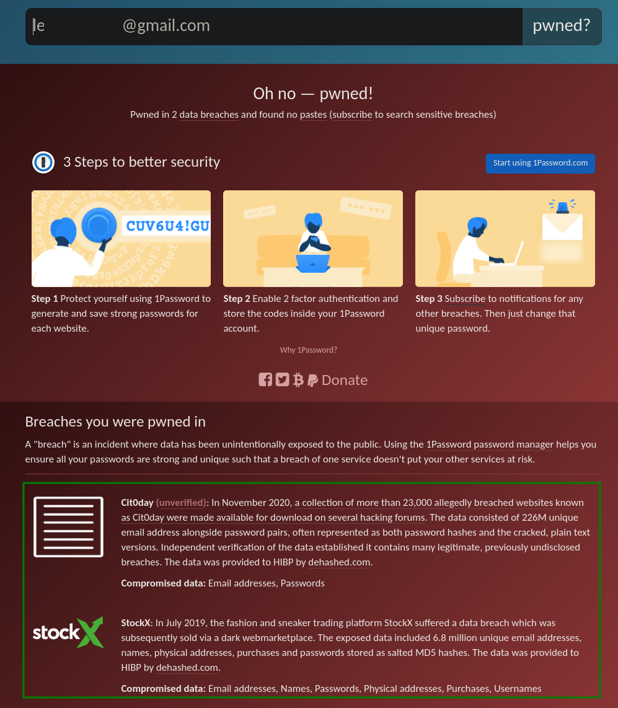
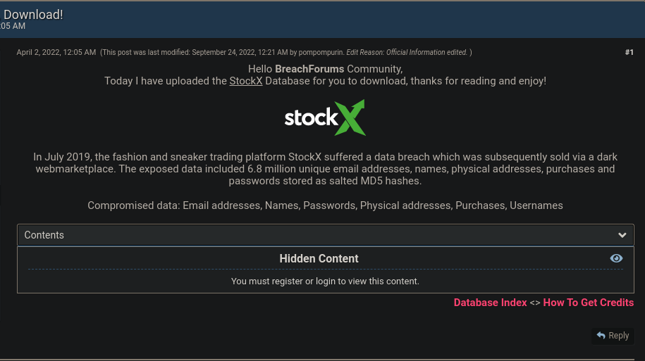
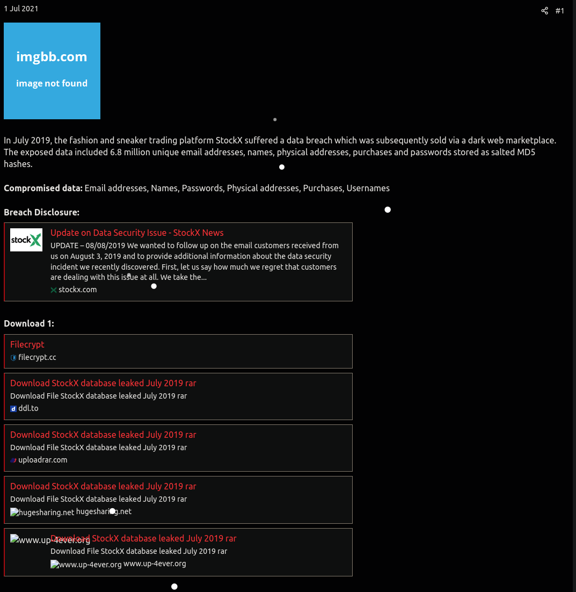
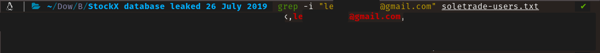
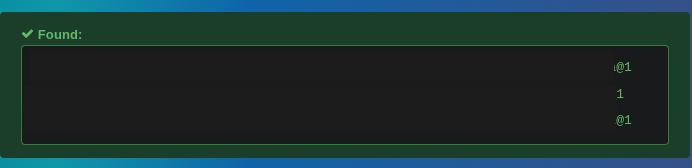
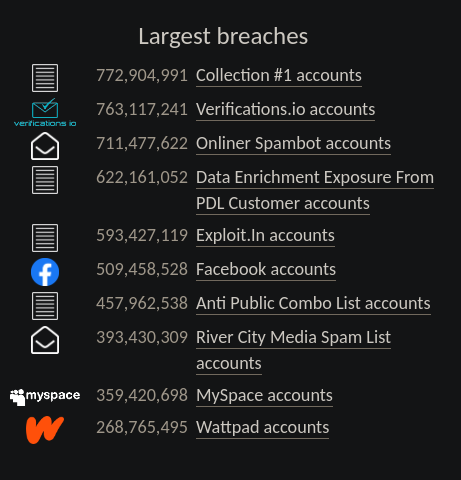

# Leveraging Breach Data

## Breach Data

According to the Australian Government, "A data breach happens when personal information is accessed, disclosed without authorization, or is lost". Once that data is out in the open, either being sold for a profit or just shared online, that data is then known as "breach data". Not all data breaches contain the same type of data. There are some data breaches that would only contain an email and a password hash, while others have IP Addresses, last login time, plain-text password, etc. It depends on the breach and the industry of the company that is breached. For example, for healthcare companies whose data has been exposed, you will more likely find Social Security Numbers in the data. This may not be the case if a online gaming company had their data breached. There is usually a misconception with breach data, where people assume that all breach data is the result of threat actors. Systems can be misconfigured, thus allowing anybody with internet access to view the private files. Companies, themselves, can send data to the wrong parties, leading to a breach of data, as well. Now that I have given a bit of background into what data breaches are, I will go into detail of how to leverage breach data in order to learn more about a target/subject whilst doing an OSINT investigation.

## Leveraging Breaches

There are two websites that I use that can tell you if you have been part of a data breach. They are [https://haveibeenpwned.com/](https://haveibeenpwned.com/) and [https://dehashed.com/](https://dehashed.com/). I like haveibeenpwned (HIBP) because you do not have to login in order to use the search feature. With that being said, I will be using HIBP for the rest of this tutorial. In order to use either of the aforementioned sites, you will need the email address of the target/subject. The way I go about getting this information is by leveraging people search websites in order to get this information. I will start off by only using a First name, Last name, and City, then pivoting to as much information as I can.

<figure><figcaption></figcaption></figure>

From just one website, I was able to get their address, potential phone numbers, potential associates, and email addresses. Now that we have the email address, we can use HIBP in order to see if this email was part of any breaches:

<figure><figcaption></figcaption></figure>

We now see that the user was part of 2 data breaches. If you look online for the StockX breach, you will most likely see a website called (currently) BreachForums. It is meant to pick up from where RaidForums (now offline) left off from. It is a website where people sell and buy data breaches. Here is the listing for StockX's breach:

<figure><figcaption></figcaption></figure>

The website makes money by charging people in order to download the breach. I have never paid for a data breach, nor do I plan on paying for it in the future. There are ways to search on Google/DuckDuckGo/etc. in way where you can find a breach for free, whether on pastebin-type or shady websites. This method is called Dorking (ex. Google Dorking). For StockX, I was able to find the data on a shady website:

<figure><figcaption></figcaption></figure>


**I DO NOT vouch for any of these websites. There is always a chance of these files being malicious and possibly being trojans. Please use proper safety and security while browsing online.**


With the breach downloaded, we now search for the email we have for the target/subject:

<figure><figcaption></figcaption></figure>

In the previous image, I have covered some of the data as there is someone's personal data associated with it. One of the fields was a hash of the password.

> A hash is an output of a hashing algorithm run on data. Commonly, these are used for password storage. The way that hashes work is that it takes your password, runs it in the algorithm, and then saves your hash with your account. Every time you try to log in after that, the website takes whatever text you input as a password, runs it in the algorithm, and then compares that output to the output of the password you had given it initially. If they both are the same, then you are able to log in. There are currently 2 popular "weak" algorithms, that are easy to brute force: MD5 and SHA-1.

I used an online website, [https://hashes.com/en/decrypt/hash](https://hashes.com/en/decrypt/hash), in order to see if they had cracked this hash before:

<figure><figcaption></figcaption></figure>

Because the password was using a weak algorithm for hashing, MD5, it was easy for this website to crack it. You could always use hashcat ([https://hashcat.net/hashcat/](https://hashcat.net/hashcat/)) or John the Ripper ([https://www.openwall.com/john/](https://www.openwall.com/john/)) to crack these locally. These do end up being CPU/GPU intensive, so just a warning about that. I now have the password. From the password, if they are part of other breaches, you can then search for that password in those breaches to see if they are potentially using other emails/usernames. For this example, the StockX breach had shown me their username for the account, as well as, a name of a family member (assumed by me) on the account. I will use that information to pivot to get more information. I had no luck with the account name, so I went with the name of the family member:

<figure><figcaption></figcaption></figure>

I was able to find two more accounts for the same person. In addition, I did find out new usernames, emails, and password hashes for this person as well. I put all the hashes I had found so far into the same website I had mentioned before to see if the website had these hashes cracked and in their cache. Turns out, they did:

<figure><figcaption></figcaption></figure>

All three of the passwords had the same word in the beginning, but just had the end tweaked a bit. I now have more proof that these accounts belong to the same person.

This was only data I had found with **one** of the breaches. You can keep going down the rabbit hole by taking this information and then searching it in other breach data as well. In addition, with the new emails found, you can plug those into HIBP and see if those emails were part of other breaches as well. I just wanted to show a brief summary of how one can leverage breach data in order to pivot to new information. There will be a point where you find out all you can about a person using people search websites. When that happens, I believe the next step is to use breach data to gain more insight to the target/subject.

## Creating your own Breach Collection

I learned about being proactive from Michael Bazzell in regards to privacy. His books state how there are tasks one can complete to be ahead of the breaches and leaks that will lessen an impact for a person when their data is eventually in a breach. I use the same logic but for data breaches. There is completely nothing wrong with searching for a data breach, downloading it, and then using it for your research. However, there is a timely cost for this, as there is time that it takes to go hunt down data breaches, as well as, downloading them. That is why I suggest people be proactive and build their own collection. If you have your own collection, then there is time saved if the target/subjects data is found in one of the breaches that you have. I recommend downloading from the "Largest breaches" section of HIBP:

<figure><figcaption></figcaption></figure>

I believe these are useful due to their quantity. There will always be niche breaches that your target/subject is going to be a part of. These, however, give you a good starting point for your investigations. Make sure to backup your collection, as these end up taking up a lot of space the more you collect. I highly recommend the 3-2-1 backup strategy from Seagate at: [https://www.seagate.com/blog/what-is-a-3-2-1-backup-strategy/](https://www.seagate.com/blog/what-is-a-3-2-1-backup-strategy/). This will make sure that if you are still able to function, even if you lose one copy of your breach collection.

Hope this helps with your future OSINT research!

## Sources

* [https://www.oaic.gov.au/privacy/data-breaches/what-is-a-data-breach](https://www.oaic.gov.au/privacy/data-breaches/what-is-a-data-breach)
