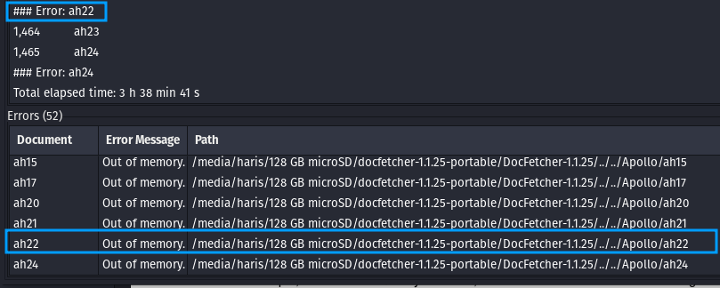

# Miniature Breach Index

I spent a long time trying to see how small I can go when setting up a breach index environment. These types of software I was looking at are called "[full-text search engines](https://en.wikipedia.org/wiki/Full-text\_search)", if you wanted look into the topic further. This is an adjacent blog to my "Breach Data Infrastructure" blog. This blog will be discussing a small-form factor for breach indexing: self-contained on a microSD card.

## Considerations

Most of my time spent on this project (more of a curiosity) was testing out various full-text search engine (most open-source) software. There are two main types of search engine databases: In-memory and On-disk \[1]. "An in-memory database stores the data in memory and uses disk for backup, while an on-disk database stores the data on disk and uses memory for caching" \[2]. For a small scale environment, on-disk databases are preferred as the CPU / RAM power might not fit the requirements. Here are what I tested and a small summary of their features/downsides (**Caveat: I was testing these on a Pop!\_OS VM, so your results may vary**):

| Name                                                                                                            |                                                                                                                                                                                                                                                                                                                                                                                                                                                                                                                                                                                                |
| --------------------------------------------------------------------------------------------------------------- | ---------------------------------------------------------------------------------------------------------------------------------------------------------------------------------------------------------------------------------------------------------------------------------------------------------------------------------------------------------------------------------------------------------------------------------------------------------------------------------------------------------------------------------------------------------------------------------------------- |
| Apache Solr ([https://solr.apache.org/](https://solr.apache.org/))                                              | <ul><li>Easy to set-up</li><li>No need for filter (No Logstash-type configuration needed)</li><li>Great documentation</li><li>Not meant for small scale (docker version still depends on some Linux packages)</li><li>On-Disk Search Engine</li><li>Easy to use GUI</li><li>API</li><li>JSON, CSV, and XML supported natively</li><li>Word, PDF, etc. supported with Solr Cell</li></ul>                                                                                                                                                                                                       |
| ZincSearch ([https://zincsearch-docs.zinc.dev/](https://zincsearch-docs.zinc.dev/))                             | <ul><li>Meant for small scale</li><li>On-Disk Search Engine</li><li>Self-contained (requires only the files it comes with)</li><li>Mediocre documentation</li><li>A lot of config required for basic indexing</li><li>Easy to use GUI</li><li>No need for filter (No Logstash-type configuration needed)</li><li>API</li><li>Seems to accept only JSON format</li></ul>                                                                                                                                                                                                                        |
| Quickwit ([https://quickwit.io/](https://quickwit.io/))                                                         | <ul><li>Easy to set-up</li><li>10 MB document size limit (Not meant to index files bigger than 10 MB; see <a href="https://github.com/quickwit-oss/quickwit/issues/3797">issue</a>) </li><li>Easy and clean GUI</li><li>API</li><li>Project team has Discord, which makes issue resolution a breeze</li><li>Self-contained (requires only the files it comes with)</li><li>Meant for small scale</li><li><a href="https://quickwit.io/docs/overview/concepts/indexing/#supported-data-formats">Only JSON allowed</a></li><li>You need a filter (Logstash-type) to submit to an index</li></ul> |
| DocFetcher ([https://docfetcher.sourceforge.io/en/index.html](https://docfetcher.sourceforge.io/en/index.html)) | <ul><li>Easy to set-up</li><li>Easy to use GUI</li><li>It can index big files (tested with ~170 MB file)</li><li>Displaying a big file (~170 MB) uses a lot of CPU and ends up crashing the system</li><li>Self-contained (requires only the files it comes with)</li><li>Meant for small scale</li></ul>                                                                                                                                                                                                                                                                                      |
| Datashare ([https://datashare.icij.org/](https://datashare.icij.org/))                                          | <ul><li>Easy to set-up</li><li>Easy to use GUI</li><li>Clean GUI</li><li>Indexing a big file (~170 MB) file took longer than 15 minutes</li><li>Seems to be self-contained (requires only the files it comes with)</li></ul>                                                                                                                                                                                                                                                                                                                                                                   |

Here are some other software I tried that did not end up working for me either. Didn't want to go into detail for these as I didn't end up spending too much time with these:

* [https://github.com/dosyago/DownloadNet ](https://github.com/dosyago/DownloadNet)
* [https://github.com/Ogefest/filehunter ](https://github.com/Ogefest/filehunter)
* [https://sphinxsearch.com/docs/current.html](https://sphinxsearch.com/docs/current.html)
* [https://github.com/valeriansaliou/sonic](https://github.com/valeriansaliou/sonic)
* [https://docs.lnx.rs/](https://docs.lnx.rs/)
* [https://alash3al.github.io/srchx/](https://alash3al.github.io/srchx/)
* [https://www.lesbonscomptes.com/recoll/pages/index-recoll.html ](https://www.lesbonscomptes.com/recoll/pages/index-recoll.html)
* [https://swishplusplus.sourceforge.net/ ](https://swishplusplus.sourceforge.net/)
* [https://grothoff.org/christian/doodle/ ](https://grothoff.org/christian/doodle/)
* [https://sourceforge.net/projects/searchmonkey/](https://sourceforge.net/projects/searchmonkey/)
* [http://hyperestraier.sourceforge.net/](http://hyperestraier.sourceforge.net/)
* [https://www.namazu.org/](https://www.namazu.org/)

There is a Python search engine library called Whoosh that seemed promising for this use case: [https://whoosh.readthedocs.io/en/latest/intro.html](https://whoosh.readthedocs.io/en/latest/intro.html). I did a bit of testing on Windows, and the closest alternatives I saw that could have worked on Windows were:

* [https://www.voidtools.com/downloads/](https://www.voidtools.com/downloads/) (only seems to index file names, not content)
* [https://puggle.sourceforge.net/index.html](https://puggle.sourceforge.net/index.html) (portable version at: [https://puggle.sourceforge.net/portable\_manual.html](https://puggle.sourceforge.net/portable\_manual.html)) (not tested)
* [https://docfetcher.sourceforge.io/en/download.html](https://docfetcher.sourceforge.io/en/download.html) (not tested)
* [https://www.listary.com/](https://www.listary.com/) (only seems to index file names)

From this list, since DocFetcher worked for Linux, I assume it might be the only options from the aforementioned choices that might actually work.

## MicroSD

After testing all the aforementioned software, the only one that worked at a MicroSD scale on Linux was DocFetcher. I downloaded the Linux file from [https://docfetcher.sourceforge.io/en/download.html](https://docfetcher.sourceforge.io/en/download.html). I then unzipped the file. Before I ran the GUI, I had to break down the data. One issue I noted with DocFetcher was that it was able to index files as large as 170 MB, but it was having a really rough time displaying that file in the GUI. I realized that if I broke a breach down into 50 mb parts, it will be easier for it to highlight exactly where the text matches without running the memory or CPU up. I ran the following on a breach:

```
split -C 50m --numeric-suffixes input_filename output_prefix
```

> \-C = put at most SIZE bytes of records per output file
>
> \--numeric-suffixes = same as -d, but allow setting the start value

This took 10 minutes 30 seconds for the split command to complete on 4.9 GB of CSV data. To add context for this, this is first of all a MicroSD card (read and write is on the slower side), but also has NTFS formatting on it (which Linux has to be configured to read/write). &#x20;

After the command was completed, I moved all of the output files into one folder. I ran DocFetcher with `./DocFetcher-GTK3.sh` in the DocFetcher folder. From there I right-clicked in the "Search Scope" area to add a folder and selected my folder with all the 50MB breach files. Here is my config:

<figure><figcaption></figcaption></figure>

My CPU was fluctuating between 5 - 10% usage for this. Not a downside or anything, just wanted to point this out as a normal part of this procedure. This ended up taking 13 minutes to complete indexing. However, when I search for a string, I got an instant result. I would say 50 MB might be a bit on the bigger side. The software starts to lag when displaying 50 MB worth of data (160000 - 300000 lines of csv text). My safe recommendation would be \~25 MB so 100000 lines.&#x20;

For the previous approach, I used the `split` command to split the data. That led to files not having headers after they were split (only the first file had a header). To mitigate this issue, we can use `miller` and its split function: [https://miller.readthedocs.io/en/latest/reference-verbs/index.html#split](https://miller.readthedocs.io/en/latest/reference-verbs/index.html#split) \[5]. Excerpt from the miller documentation:

```
Examples: Suppose myfile.csv has 1,000,000 records.

100 output files, 10,000 records each. First 10,000 records in split_1.csv, next in split_2.csv, etc.
  mlr --csv --from myfile.csv split -n 10000
  
10 output files, 100,000 records each. Records 1,11,21,etc in split_1.csv, records 2,12,22, etc in split_2.csv, etc.
  mlr --csv --from myfile.csv split -m 10
Same, but with JSON output.
  mlr --csv --from myfile.csv split -m 10 -o json
```

For miller, we don't have the option to set a file size (in terms of bytes), but we can choose how many records per file (`-n`) or how many files we want in total (`-m`).  I will choose the records per file option for this with the option of 80,000. I feel like half of the lower-bound we got previously should be good enough for display.


The miller software in the apt repository does not have the split function. The GitHub release does. Link: [https://github.com/johnkerl/miller/releases](https://github.com/johnkerl/miller/releases).


Here was the command I ran:&#x20;

`mlr --csv --from breach_name.csv split -n 80000`&#x20;

This took about 7 minutes to complete, but since one line in the CSV file had an extra column, the code stopped when it got to about 75% completion. About 3.7 GB of data was already split by then. I still wanted to use this to see how big the DocFetcher index would get with this information. The folder without any indexing was 90.4 MB. After indexing 3.7 GB of data, the index folder increased to 3.0 GB. Not bad at all; this is about 81% of the actual breach size. I was able to get a result from the search instantly like before, and also get to see the full file after a couple of seconds. My recommendation would be the 80000 records.

### Issue #1

While indexing a large set of files (2000+; each \~13 MB each), the indexing ran into an issue. I ended up not keeping the indexed data. Snippet of issue:

```
program.name=DocFetcher
program.version=1.1.25
program.build=20210525-2203
program.portable=true
java.runtime.name=OpenJDK Runtime Environment
java.runtime.version=11.0.20.1+1-post-Ubuntu-0ubuntu122.04
java.version=11.0.20.1
sun.arch.data.model=64
os.arch=amd64
os.name=Linux
os.version=(redacted)
user.language=en
org.apache.lucene.store.AlreadyClosedException: this IndexWriter is closed
	at org.apache.lucene.index.IndexWriter.ensureOpen(IndexWriter.java:749)
	at org.apache.lucene.index.IndexWriter.ensureOpen(IndexWriter.java:763)
	at org.apache.lucene.index.IndexWriter.updateDocument(IndexWriter.java:1567)
	at org.apache.lucene.index.IndexWriter.addDocument(IndexWriter.java:1316)
	at net.sourceforge.docfetcher.model.index.IndexWriterAdapter.add(IndexWriterAdapter.java:53)
	at net.sourceforge.docfetcher.model.index.file.SimpleDocWriter.write(SimpleDocWriter.java:44)
	at net.sourceforge.docfetcher.model.index.file.LuceneDocWriter.add(LuceneDocWriter.java:36)
	at net.sourceforge.docfetcher.model.index.file.FileContext.index(FileContext.java:161)
	at net.sourceforge.docfetcher.model.index.file.FileIndex$1.handleFile(FileIndex.java:295)
	at net.sourceforge.docfetcher.model.index.file.HtmlFileLister.runWithHtmlPairing(HtmlFileLister.java:126)
	at net.sourceforge.docfetcher.model.index.file.HtmlFileLister.doRun(HtmlFileLister.java:57)
	at net.sourceforge.docfetcher.util.Stoppable.run(Stoppable.java:57)
	at net.sourceforge.docfetcher.model.index.file.FileIndex.visitDirOrZip(FileIndex.java:442)
	at net.sourceforge.docfetcher.model.index.file.FileIndex.doUpdate(FileIndex.java:159)
	at net.sourceforge.docfetcher.model.TreeIndex.update(TreeIndex.java:148)
	at net.sourceforge.docfetcher.model.index.Task.update(Task.java:98)
	at net.sourceforge.docfetcher.model.index.IndexingQueue.threadLoop(IndexingQueue.java:193)
	at net.sourceforge.docfetcher.model.index.IndexingQueue.access$100(IndexingQueue.java:46)
	at net.sourceforge.docfetcher.model.index.IndexingQueue$2.run(IndexingQueue.java:118)
Caused by: org.apache.lucene.index.CorruptIndexException: checksum failed (hardware problem?) : expected=e9e614b2 actual=fa14b6d7 (resource=BufferedChecksumIndexInput(MMapIndexInput(path="(redacted_by_me)")))
	at org.apache.lucene.codecs.CodecUtil.checkFooter(CodecUtil.java:419)
	at org.apache.lucene.codecs.CodecUtil.checksumEntireFile(CodecUtil.java:526)
	at org.apache.lucene.codecs.lucene50.Lucene50PostingsReader.checkIntegrity(Lucene50PostingsReader.java:1286)
	at org.apache.lucene.codecs.blocktree.BlockTreeTermsReader.checkIntegrity(BlockTreeTermsReader.java:339)
	at org.apache.lucene.codecs.perfield.PerFieldPostingsFormat$FieldsReader.checkIntegrity(PerFieldPostingsFormat.java:348)
	at org.apache.lucene.codecs.perfield.PerFieldMergeState$FilterFieldsProducer.checkIntegrity(PerFieldMergeState.java:271)
	at org.apache.lucene.codecs.FieldsConsumer.merge(FieldsConsumer.java:96)
	at org.apache.lucene.codecs.perfield.PerFieldPostingsFormat$FieldsWriter.merge(PerFieldPostingsFormat.java:164)
	at org.apache.lucene.index.SegmentMerger.mergeTerms(SegmentMerger.java:216)
	at org.apache.lucene.index.SegmentMerger.merge(SegmentMerger.java:101)
	at org.apache.lucene.index.IndexWriter.mergeMiddle(IndexWriter.java:4356)
	at org.apache.lucene.index.IndexWriter.merge(IndexWriter.java:3931)
	at org.apache.lucene.index.ConcurrentMergeScheduler.doMerge(ConcurrentMergeScheduler.java:624)
	at org.apache.lucene.index.ConcurrentMergeScheduler$MergeThread.run(ConcurrentMergeScheduler.java:661)
```

I was not able to find a solution for this error. I assume it has something to do with the amount of memory provided to the application.

### Issue #2

I was indexing 1468 files, which took about 3 hours and 39 minutes (see image below). At 1290 files, the indexing started running into errors with files.&#x20;

<figure><figcaption></figcaption></figure>

I did hit "Update Index" option on the index after it was completed, but this did not mitigate this issue. I did see a potential solution for this on the wiki ([https://sourceforge.net/p/docfetcher/wiki/FAQ/](https://sourceforge.net/p/docfetcher/wiki/FAQ/)):

<figure><figcaption></figcaption></figure>

I have not tried this completely, but increasing the RAM did mitigate some memory issues I was dealing with.

### Suggestions

Based on the issues above, and my overall experience with DocFetcher, here are some suggestions I will give:

* If possible, filter (split, sort, etc.) data on a PC/laptop to make the read/write much quicker
* Edit the DocFetcher file (`DocFetcher-GTKX.sh` on Linux and `misc/DocFetcher.bat` on Windows) to increase the RAM to give it more memory to work off of
* The data does not need to be formatted in a certain way (CSV, JSON, etc.). However, add the extension(s) to the index settings so it does not overlook your files at index time

### Potential Solution: Quickwit

I was going to try to show a demo for the MicroSD card with Quickwit, but as one line was off in the file, it would throw off the system. They do have an API that can handle bulk data, if you want to check it out: [https://quickwit.io/docs/reference/es\_compatible\_api/#\_bulk--batch-ingestion-endpoint](https://quickwit.io/docs/reference/es\_compatible\_api/#\_bulk--batch-ingestion-endpoint). It is doable to use off of a MicroSD card. As breach data is not specifically meant to be formatted a certain way (for example the "Collection" series), this would not really work for me. If you have breach data that has all the data formatted properly, I would recommend giving Quickwit a shot. It does have a clean interface.&#x20;

## Conclusion

I set out with a goal of finding the possibility if breach data indexing was possible on a microSD card. I was able to figure it out and test it out with some breach data. It does need a bit of trial and error to get it to to work, but it is completely possible to do so. This is obviously not a realistic scenario for breach data indexing, but it was something I was just curious about and wanted to prove was possible.

## Sources

1. [https://prabhatsharma.in/blog/in-search-of-a-search-engine-beyond-elasticsearch-introducing-zinc/](https://prabhatsharma.in/blog/in-search-of-a-search-engine-beyond-elasticsearch-introducing-zinc/)
2. [https://www.mydistributed.systems/2020/07/an-overview-of-storage-engines.html](https://www.mydistributed.systems/2020/07/an-overview-of-storage-engines.html)
3. [https://chistadata.com/knowledge-base/overview-of-clickhouse-full-text-search-using-the-quickwit/](https://chistadata.com/knowledge-base/overview-of-clickhouse-full-text-search-using-the-quickwit/)
4. [https://stackoverflow.com/questions/2016894/how-can-i-split-a-large-text-file-into-smaller-files-with-an-equal-number-of-lin](https://stackoverflow.com/questions/2016894/how-can-i-split-a-large-text-file-into-smaller-files-with-an-equal-number-of-lin)
5. [https://unix.stackexchange.com/questions/720634/how-can-i-split-a-csv-file-linewise-retaining-headers-in-both-output-files](https://unix.stackexchange.com/questions/720634/how-can-i-split-a-csv-file-linewise-retaining-headers-in-both-output-files)
6. [https://sourceforge.net/p/docfetcher/discussion/702424/thread/4ebb4816/](https://sourceforge.net/p/docfetcher/discussion/702424/thread/4ebb4816/)
