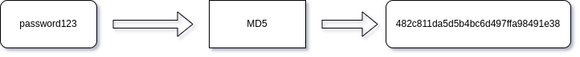
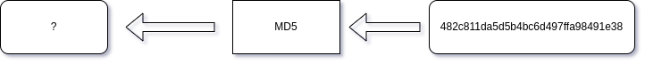

# Hash Cracking for Dummies

## What is a Hash?

Hashes are the output of a hashing algorithm. These algorithms produce a unique, fixed-length string called the hash value (a.k.a. “message digest”) for any given piece of data. Unlike encryption, hashing is a one-way function. It is impossible to "decrypt" a hash. However, for passwords, you can "crack"/"decrypt" the hash to get the original password.

Here are some common hashing algorithms:

| Algorithm | Full Name                            | Output Bit Value |
| --------- | ------------------------------------ | ---------------- |
| MD5       | Message-digest algorithm (version 5) | 128              |
| SHA-1     | Secure Hash Algorithm 1              | 160              |
| SHA-256   | Secure Hash Algorithm 2              | 256              |
| bcrypt    | bcrypt                               | 184              |

## Usage

Hashes have been around for a long time and have been utilized for different reasons. For example, if you have ever downloaded a software, or even a single file, from a website, sometimes you might see "SHA-265" or "SHA-1" next to the file. These are the hashes of the file. The owner of the file, used the respective hashing algorithm, and then outputs that value next to the file location. This is so after you download the file, you can make sure you have the exact file, as the owner intended it to be. This comes really handy for tools that are meant to protect privacy and security. If you download a file, and it turns out that the hash of your file does not match the hash provided by the owner, then either there was a mistake by the owner, or the file has been tampered with.

Another use of hashing is for passwords. This is the main focus of this blog. Today, the standard for password storage by organizations is hashing. For example, when you sign up to a website, you are asked to create a password for that website. In the back-end, when your password is entered at creation time, that password is then run through a hashing algorithm. The output of the hashing algorithm is stored on the organization's database. The next time you log in, whatever string you put as your password, gets entered into the system, ran through the same hashing algorithm, and then compared with the hash stored in the database. If the hash of the password you entered is the same as the hash saved on the database, then you are allowed to enter the website. Otherwise, you get an "incorrect password" error or something of that sort.

Example of a password hashing process:

<figure><figcaption></figcaption></figure>

## Brute-Force and Rainbow Tables

I did mention at the beginning of the post that hashing is a one-way function. So, how are we going to "decode" or "crack" these hashes? Well, in a basic password hashing process (not including salts or peppers), you have 3 main parts: the plain text password, the hash function, and the hashed output. From a cracking standpoint, you only need the hash function and the hashed output to get started. Leveraging the same methodology as the hash creation process, we can reverse it to get the original password, thus "cracking" the hash. For example, if your password is "password123", that gets pushed into a hashing algorithm and then comes out.

<figure><figcaption></figcaption></figure>

We can use the same methodology to get the original password.

<figure><figcaption></figcaption></figure>

This can be done using brute-forcing and rainbow tables. A rainbow table is a large, pre-computed table designed to cache the output of cryptographic hash functions to decrypt hashed passwords into plain-text. Rainbow tables greatly reduce the complexity in cracking large numbers of passwords through a pre-generated data set of password hashes. Vast numbers of hashed passwords can be run through this data set and, following several stages of reduction by which hashes are split into smaller components, computed and linked to words and letters to reveal whole passwords in plain-text. Rainbow tables only contain a fraction of the passwords, and they allow you to crack all passwords with only a fraction of the effort. The larger you make the table, by keeping a larger fraction of passwords, the faster the cracking is. This is why it is called a trade-off. Essentially, a rainbow table is pre-generated hashes that you can just leverage to crack hashes. Think of it like a dictionary. You have a word and its meaning in the dictionary. When you read a book and see a word you didn't know previously, you check out the dictionary to see what the definition is. You can think of it as the following analogy: word:definition:dictionary = hash:plain-text:rainbow table. There are tools for generation of rainbow tables, and you can also download some premade rainbow tables as well for different hashes. Here are some recommendations to check out if interested: rainbowcrack (`sudo apt install rainbowcrack`) and [https://freerainbowtables.com/](https://freerainbowtables.com/). I do want to add that rainbow tables are a proactive approach to hash cracking. In addition, it is resource intensive in terms of storage. You will basically have a dictionary of hashes, however, the more characters you try to get the hash table of, the more exponentially the storage space is. What makes it worse is that you are limited to one hash (based on your storage space) per rainbow table. For example, imagine if you have 4 Terabytes of MD5 hashed passwords. Your hard drive is full. But, the hash you just found is of SHA-1 type. You will not be able to crack it based on your rainbow table (since your Rainbow table was all MD5 hashes). This is why I like the brute-forcing version of cracking hashes.

Brute-forcing usually has 2 forms: systematically or methodically (not the official verbiage for this). With a systematic approach, for a 4 character password, you will go from AAAA to 9999 (or 0000 to ZZZZ depending on how the software is configured). For 4 character passwords, this will be done in a couple of seconds with some basic computing resources and an easy to crack hash (MD5 or SHA-1). For passwords that are 8 characters and higher, with mixed symbols (i.e. !, @, #, $, %...), and lowercase and uppercase, this will take a lot of time. Even if you were to add the mixed symbols to the 4-character password, that would still be fast to crack (< 10 minutes worst case scenario). You can always do this, but there is a faster method, which never guarantees 100% success, but it works great for brute forcing a lot of hashes in a short amount of time. This is the methodical brute-forcing, or brute-forcing with a wordlist. Wordlists, in terms of password/hash cracking, are a list of passwords that have been cracked already by others and have been compiled into a list for others to use for their cracking. An example of this is Rockyou ([https://github.com/danielmiessler/SecLists/blob/master/Passwords/Leaked-Databases/rockyou.txt.tar.gz](https://github.com/danielmiessler/SecLists/blob/master/Passwords/Leaked-Databases/rockyou.txt.tar.gz)). RockYou Inc. had a vulnerability on their website that allowed an unauthorized user to download all the usernames and passwords. Since they did not use hashing for their passwords, the passwords obtained by the unauthorized user were the actual users' passwords. This led to the RockYou wordlist being created and being passed around. The list currently, in iterations I have seen, only contains the passwords for that breach. A lot of people still use passwords that are in this list, which is why some hash cracking enthusiasts use RockYou as the first stop. There are so many other wordlists out there as well from other breaches there. These can be used with automated tools (discussed later) to crack the hashes.

> **TL;DR:**
>
> **Brute-force**: takes a lot of time; covers all possible passwords; hash-neutral; reactive
>
> **Rainbow tables**: much quicker; covers all possible passwords; non-hash-neutral; takes a lot of resources; proactive
>
> **wordlists**: wordlist of real world passwords used by others; used with brute-forcing to crack hashes

Enough about the background, lets get to the fun stuff...cracking

## Cracking Methodology

There are a lot of hash cracking tools out there. The two most commonly used are hashcat ([https://hashcat.net/hashcat/](https://hashcat.net/hashcat/)) and John the Ripper ([https://www.openwall.com/john/](https://www.openwall.com/john/)) and both are open source. I personally like hashcat due to the ease of its usage. For this blog, I will be using hashcat for the tutorial. However, I would encourage you to check out John the Ripper as well. Let's get started. There are a lot of tutorials for downloading/installing hashcat, so I will leave that out of this post. I will put you in a realistic situation, and walk you to the steps I take for hash cracking.

Situation: A new breach has just been released on breach marketplaces for a company called "Cyber Games and Games, LLC" (made up by me). The individual who had breached and had stolen this data has stated that they were able to exfiltrate the following fields: username, email, password hash, security questions and answers. However, the threat actor has only released the password hashes to the public and kept the rest for themselves. You have just learned about what hash cracking is and want to give it a shot on "live" data. You end up choosing the following hash randomly: a7b2a5cc760e5f2b97868c021dbe08c6

### Step 1 - Understanding the hash

From MD5 to NTLM to MurmurHash3, all hashes are different. Some do have similar bit values, or similar string lengths (sizes). This is why the first task is to identify what type of hash we currently have. In some breaches, the poster will also mention the hash algorithm used for the passwords. While in others, that is not the case. Let's say for the situation above, the hash was not given to you. Here are the tools I use to find out what the hash is:

#### Web-pages:

* [https://www.tunnelsup.com/hash-analyzer/](https://www.tunnelsup.com/hash-analyzer/)
* [https://hashes.com/en/tools/hash\_identifier](https://hashes.com/en/tools/hash\_identifier)

#### Command-line tools:

* [https://www.kali.org/tools/hash-identifier/](https://www.kali.org/tools/hash-identifier/)
* [https://www.kali.org/tools/hashid/](https://www.kali.org/tools/hashid/)

If you enter the hash into any of those tools, you end up with MD5 (for some it may say MD4 in addition to MD5). Let's go with the assumption that it is MD5 based on our initial analysis. Worst case, we do the following steps, but for MD4.

### Step 2 - Cracking the Hash

As mentioned before, the two main ways of cracking are using rainbow tables or brute-forcing. Even brute-forcing has two different ways of being used. For this example, I will brute-force with a wordlist. In addition, I will use the RockYou wordlist I had mentioned above. We have the tool (hashcat), the wordlist (RockYou), and we even have the hash algorithm (MD5). Now it is time to build the query for hashcat. Before I write the query, I take a look at the hashcat documentation page for example hashes ([https://hashcat.net/wiki/doku.php?id=example\_hashes](https://hashcat.net/wiki/doku.php?id=example\_hashes)). Here, I can grab the "Hash-Mode" value for the hash algorithm I want to use to crack the hash. Scrolling to MD5, we see "0", next to it. This is optional for building the query, but I **always** put my hash in a file before cracking it. It makes it easier for hashes with semicolons or other symbols in it. I made a file called "hash" that has the hash (a7b2a5cc760e5f2b97868c021dbe08c6) pasted in it. Time to make the command line arguments for hashcat (on Linux):

`hashcat -a 0 -m 0 hash rockyou.txt`

> **hashcat** = calling the hashcat application via the command-line
>
> **-a 0** = --attack-mode 0 = "I want to brute-force based on a list I have provided" A.K.A "dictionary attack or straight mode”
>
> **-m 0** = --hash-mode 0 = "I want to use the MD5 hash for cracking this hash"
>
> **hash** = file where I had stored the hash in (could also have been hash.txt as well)
>
> **rockyou.txt** = the wordlist I will be using for this dictionary attack

Run the command. If you followed all the steps I did until now, you should have the following output after hashcat had completed running:

`a7b2a5cc760e5f2b97868c021dbe08c6:iwant2know`

This is in the format hash:plain-text password. You now have cracked a hash. You went from only knowing the hash to figuring out the hashing algorithm, and then cracking it. I just want to give a heads-up, I used MD5 because it is an easier algorithm to crack. Others take much, much, longer to crack (ex. bcrypt).

## Exercises

Here are some exercises I made for you to practice. These are all taken from the RockYou wordlist. The hash may not always be MD5......

`482c811da5d5b4bc6d497ffa98491e38`

`6b716f9f6f5f64f100ced0b4d1636b41034a62da`

`9774DA4F22171D549B97AC7BF28B5290`

**Solution (decode the following from base64)**: `TUQ1OnBhc3N3b3JkMTIzClNIQS0xOm11bXBsZWJlcnJ5NSAKTlRMTTogbGlvbmxpb25saW9u`

## Sources:

* [https://www.sentinelone.com/cybersecurity-101/hashing/](https://www.sentinelone.com/cybersecurity-101/hashing/https://cheatsheetseries.owasp.org/cheatsheets/Password\_Storage\_Cheat\_Sheet.htmlhttps://en.wikipedia.org/wiki/MD5https:/en.wikipedia.org/wiki/SHA-1https:/en.wikipedia.org/wiki/SHA-2https:/en.wikipedia.org/wiki/Bcrypthttps:/www.authgear.com/post/password-hashing-saltinghttps://www.csoonline.com/article/3623195/rainbow-tables-explained-how-they-work-and-why-theyre-mostly-obsolete.htmlhttps://www.kali.org/tools/rainbowcrack/#rainbowcrackhttps://www.computerworld.com/article/2522045/rockyou-hack-exposes-names--passwords-of-30m-accounts.html)
* [https://cheatsheetseries.owasp.org/cheatsheets/Password\_Storage\_Cheat\_Sheet.html](https://www.sentinelone.com/cybersecurity-101/hashing/https://cheatsheetseries.owasp.org/cheatsheets/Password\_Storage\_Cheat\_Sheet.htmlhttps://en.wikipedia.org/wiki/MD5https:/en.wikipedia.org/wiki/SHA-1https:/en.wikipedia.org/wiki/SHA-2https:/en.wikipedia.org/wiki/Bcrypthttps:/www.authgear.com/post/password-hashing-saltinghttps://www.csoonline.com/article/3623195/rainbow-tables-explained-how-they-work-and-why-theyre-mostly-obsolete.htmlhttps://www.kali.org/tools/rainbowcrack/#rainbowcrackhttps://www.computerworld.com/article/2522045/rockyou-hack-exposes-names--passwords-of-30m-accounts.html)
* [https://en.wikipedia.org/wiki/MD5](https://www.sentinelone.com/cybersecurity-101/hashing/https://cheatsheetseries.owasp.org/cheatsheets/Password\_Storage\_Cheat\_Sheet.htmlhttps://en.wikipedia.org/wiki/MD5https:/en.wikipedia.org/wiki/SHA-1https:/en.wikipedia.org/wiki/SHA-2https:/en.wikipedia.org/wiki/Bcrypthttps:/www.authgear.com/post/password-hashing-saltinghttps://www.csoonline.com/article/3623195/rainbow-tables-explained-how-they-work-and-why-theyre-mostly-obsolete.htmlhttps://www.kali.org/tools/rainbowcrack/#rainbowcrackhttps://www.computerworld.com/article/2522045/rockyou-hack-exposes-names--passwords-of-30m-accounts.html)
* [https://en.wikipedia.org/wiki/SHA-1](https://www.sentinelone.com/cybersecurity-101/hashing/https://cheatsheetseries.owasp.org/cheatsheets/Password\_Storage\_Cheat\_Sheet.htmlhttps://en.wikipedia.org/wiki/MD5https:/en.wikipedia.org/wiki/SHA-1https:/en.wikipedia.org/wiki/SHA-2https:/en.wikipedia.org/wiki/Bcrypthttps:/www.authgear.com/post/password-hashing-saltinghttps://www.csoonline.com/article/3623195/rainbow-tables-explained-how-they-work-and-why-theyre-mostly-obsolete.htmlhttps://www.kali.org/tools/rainbowcrack/#rainbowcrackhttps://www.computerworld.com/article/2522045/rockyou-hack-exposes-names--passwords-of-30m-accounts.html)
* [https://en.wikipedia.org/wiki/SHA-2](https://www.sentinelone.com/cybersecurity-101/hashing/https://cheatsheetseries.owasp.org/cheatsheets/Password\_Storage\_Cheat\_Sheet.htmlhttps://en.wikipedia.org/wiki/MD5https:/en.wikipedia.org/wiki/SHA-1https:/en.wikipedia.org/wiki/SHA-2https:/en.wikipedia.org/wiki/Bcrypthttps:/www.authgear.com/post/password-hashing-saltinghttps://www.csoonline.com/article/3623195/rainbow-tables-explained-how-they-work-and-why-theyre-mostly-obsolete.htmlhttps://www.kali.org/tools/rainbowcrack/#rainbowcrackhttps://www.computerworld.com/article/2522045/rockyou-hack-exposes-names--passwords-of-30m-accounts.html)
* [https://en.wikipedia.org/wiki/Bcrypt](https://www.sentinelone.com/cybersecurity-101/hashing/https://cheatsheetseries.owasp.org/cheatsheets/Password\_Storage\_Cheat\_Sheet.htmlhttps://en.wikipedia.org/wiki/MD5https:/en.wikipedia.org/wiki/SHA-1https:/en.wikipedia.org/wiki/SHA-2https:/en.wikipedia.org/wiki/Bcrypthttps:/www.authgear.com/post/password-hashing-saltinghttps://www.csoonline.com/article/3623195/rainbow-tables-explained-how-they-work-and-why-theyre-mostly-obsolete.htmlhttps://www.kali.org/tools/rainbowcrack/#rainbowcrackhttps://www.computerworld.com/article/2522045/rockyou-hack-exposes-names--passwords-of-30m-accounts.html)
* [https://www.authgear.com/post/password-hashing-salting](https://www.sentinelone.com/cybersecurity-101/hashing/https://cheatsheetseries.owasp.org/cheatsheets/Password\_Storage\_Cheat\_Sheet.htmlhttps://en.wikipedia.org/wiki/MD5https:/en.wikipedia.org/wiki/SHA-1https:/en.wikipedia.org/wiki/SHA-2https:/en.wikipedia.org/wiki/Bcrypthttps:/www.authgear.com/post/password-hashing-saltinghttps://www.csoonline.com/article/3623195/rainbow-tables-explained-how-they-work-and-why-theyre-mostly-obsolete.htmlhttps://www.kali.org/tools/rainbowcrack/#rainbowcrackhttps://www.computerworld.com/article/2522045/rockyou-hack-exposes-names--passwords-of-30m-accounts.html)
* [https://www.csoonline.com/article/3623195/rainbow-tables-explained-how-they-work-and-why-theyre-mostly-obsolete.html](https://www.sentinelone.com/cybersecurity-101/hashing/https://cheatsheetseries.owasp.org/cheatsheets/Password\_Storage\_Cheat\_Sheet.htmlhttps://en.wikipedia.org/wiki/MD5https:/en.wikipedia.org/wiki/SHA-1https:/en.wikipedia.org/wiki/SHA-2https:/en.wikipedia.org/wiki/Bcrypthttps:/www.authgear.com/post/password-hashing-saltinghttps://www.csoonline.com/article/3623195/rainbow-tables-explained-how-they-work-and-why-theyre-mostly-obsolete.htmlhttps://www.kali.org/tools/rainbowcrack/#rainbowcrackhttps://www.computerworld.com/article/2522045/rockyou-hack-exposes-names--passwords-of-30m-accounts.html)
* [https://www.kali.org/tools/rainbowcrack/#rainbowcrack](https://www.sentinelone.com/cybersecurity-101/hashing/https://cheatsheetseries.owasp.org/cheatsheets/Password\_Storage\_Cheat\_Sheet.htmlhttps://en.wikipedia.org/wiki/MD5https:/en.wikipedia.org/wiki/SHA-1https:/en.wikipedia.org/wiki/SHA-2https:/en.wikipedia.org/wiki/Bcrypthttps:/www.authgear.com/post/password-hashing-saltinghttps://www.csoonline.com/article/3623195/rainbow-tables-explained-how-they-work-and-why-theyre-mostly-obsolete.htmlhttps://www.kali.org/tools/rainbowcrack/#rainbowcrackhttps://www.computerworld.com/article/2522045/rockyou-hack-exposes-names--passwords-of-30m-accounts.html)
* [https://www.computerworld.com/article/2522045/rockyou-hack-exposes-names--passwords-of-30m-accounts.html](https://www.sentinelone.com/cybersecurity-101/hashing/https://cheatsheetseries.owasp.org/cheatsheets/Password\_Storage\_Cheat\_Sheet.htmlhttps://en.wikipedia.org/wiki/MD5https:/en.wikipedia.org/wiki/SHA-1https:/en.wikipedia.org/wiki/SHA-2https:/en.wikipedia.org/wiki/Bcrypthttps:/www.authgear.com/post/password-hashing-saltinghttps://www.csoonline.com/article/3623195/rainbow-tables-explained-how-they-work-and-why-theyre-mostly-obsolete.htmlhttps://www.kali.org/tools/rainbowcrack/#rainbowcrackhttps://www.computerworld.com/article/2522045/rockyou-hack-exposes-names--passwords-of-30m-accounts.html)
