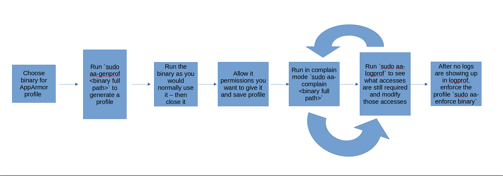

# AppArmor

This blog is a continuation of me looking into solutions for managing application permissions, in this case with Mandatory Access Control.

#### Author's Note

This blog was initially planned to include AppArmor **and** SELinux. After reading the beginning chapters of the SELinux System Administration, Third Edition and SELinux Cookbook from Sven Vermeulen, I realized that SELinux is not worth diving into for my uses. I honestly gave it the same shot that I give all other new technology I test out. For me, the learning curve is just too severe for this to be of use to me. The amount of granular configuration that SELinux provides is great - but it comes at the cost of usability. Also, I don't want to accidentally lock myself out of my main machine due to me forgetting to run `restorecon` on a folder I modified or something along those lines. It is a great tool, just not for me at this time.

## Testing Environment

I will be using a similar testing environment to my Application Sandboxing blog. I will be using Pop!\_OS 22.04 on KVM/QEMU. The following command gets this up and running:

```bash
virt-install --virt-type=kvm --name PopOS --vcpus=2 --memory=4096 --os-variant=popos20.04 --cdrom=/var/lib/libvirt/images/pop-os_22.04_amd64_intel_43.iso  --network=default --disk size=40
```

Similar commands for VM management as previously mentioned as well:

* List all VMs: `virsh list --all`
* Start PopOS (or VM name): `virsh start PopOS`
* GUI view into a running VM: `virt-viewer --connect qemu:///system PopOS`
* Find IP Address of VM (for SSH): `virsh domifaddr --domain PopOS`
* To shutdown: `virsh destroy PopOS`

I did mess up my VM while working on the Application Hardening blog by trying to switch from X11 to Wayland. I edited some configuration files and that led to a constant issue with the display. It would have been nice to have a snapshot for that VM...which I did not have. For this blog, I am also including the command I am using for snapshots as well. Before the snapshot I did the following:

* modified the resolution to 1920x1080
* Installed SSH `sudo apt install openssh*` - this automatically enables it as well (helpful to SSH into a VM without the GUI)
* Updated and upgraded the system with `sudo apt update && sudo apt upgrade -y`
* Modified the Power Saving Options: `Screen Blank: Never` and `Automatic Suspend: Off`

To snapshot the system, I ran `virsh snapshot-create-as --domain PopOS --name "PopUpdate and Upgrade"`. This took about 2 minutes to complete. You should be able to revert by running `virsh snapshot-revert --domain PopOS --snapshotname PopUpdate and Upgrade`.

## Background - Types of Access Controls

Access controls are "a type of security measure that limits the visibility, access, and use of resources in a computing environment" \[3]. According to SentinelOne, there are currently 5 types of access controls \[3]:

#### **Discretionary Access Control (DAC)**

DAC is the easiest and most flexible type of access control model to work with. In DAC, the owner of the resource exercises his privilege to allow others access to his resources. But the spontaneity in granting this permission has flexibilities, and at the same time creates a security hazard if the permissions are handled injudiciously. DAC is prevalently found in environments where sharing of data is very much appreciated, but in very sensitive cases, it might not be appropriate.

#### **Mandatory Access Control (MAC)**

MAC is a stricter access control model in which access rights are controlled by a central authority – for example system administrator. Besides, users have no discretion as to permissions, and authoritative data that is usually denomination in access control is in security labels attached to both the user and the resource. It is implemented in government and military organizations due to enhanced security and performance.

#### **Role Based Access Control (RBAC)**

RBAC is one of the prominent access control models that are in practice in various organizations. The access rights are granted according to the positions within this organization. For example, a manager may be allowed to view some documents that an ordinary worker does not have permission to open. RBAC makes management easier because permissions are related to roles and not users, thus making it easier to accommodate any number of users.

#### **ABAC (Attribute-Based Access Control)**

Contrasted to RBAC, ABAC goes beyond roles and considers various other attributes of a user when determining the rights of access. Some of these can be the user’s role, the time of access, location, and so on. This model gives high granularity and flexibility; hence, an organization could implement complex access policy rules that will adapt to different scenarios.

#### **Rule-Based Access Control (RuBAC)**

RuBAC is an extension of RBAC in which access is governed by a set of rules that the organization prescribes. These rules can thus factor in such things as the time of the day, the user’s IP address, or the type of device a user is using. RuBAC is especially suitable to be applied in conditions where access should be changed according to certain conditions within the environment.

**For this blog, we will only focus on Mandatory Access Control.**

## Introduction

There are 2 popular MACs when it comes to Linux: AppArmor and SELinux. AppArmor is default on distributions in the Ubuntu and SUSE derived systems, while SELinux is default in the RHEL (Red Hat Enterprise Linux) and Fedora derived systems. I will dive deep into AppArmor going forward, but I just wanted to hint at a theme going forward: AppArmor works on an application by application basis, while SELinux works on every user and file on system itself. This gives SELinux much more complexity and granularity than AppArmor.

## SELinux vs. AppArmor

I read the following well written comparison between SELinux and AppArmor in the Mastering Linux Security and Hardening book (link #4) that I felt would work really well here:

* SELinux labels all system processes and all objects such as files, directories, or network ports. For files and directories, SELinux stores the labels in their respective inodes as extended attributes. (An inode is the basic filesystem component that contains all information about a file, except for the filename.)
* AppArmor uses pathname enforcement, which means that you specify the path to the executable file that you want AppArmor to control. This way, here’s no need to insert labels into the extended attributes of files or directories.
* With SELinux, you have system-wide protection out of the box.
* With AppArmor, you have a profile for each individual application.
* With either SELinux or AppArmor, you might occasionally find yourself having to create custom policy modules from scratch, especially if you’re dealing with either third-party applications or homegrown software. With AppArmor, this is easier, because the syntax for writing AppArmor profiles is much easier than the syntax for writing SELinux policies. And AppArmor comes with utilities that can help you automate the process.
* Just as SELinux can, AppArmor can help prevent malicious actors from ruining your day and can help protect user data.

## Sandboxing vs. Mandatory Access Control

In the previous blog "Application Sandboxing", I discussed sandboxing solutions such as Firejail and Bubblewrap. I wanted to have a small section describing the difference between what a sandbox provides and what a MAC (like AppArmor and SELinux) provide. First, both work on different levels on the operating system. Sandboxing works in user space (a.k.a userland) while MACs work in kernel space \[5]. Red Hat does a good job at phrasing the difference \[6]:

User space:

> User space refers to all of the code in an operating system that lives outside of the kernel. Most Unix-like operating systems (including Linux) come pre-packaged with all kinds of utilities, programming languages, and graphical tools - these are user space applications. We often refer to this as “userland.”
>
> Userland applications can include programs that are written in C, Java, Python, Ruby, and other languages. In a containerized world, these programs are typically delivered in a container image format such as Docker. When you pull down and run a Red Hat Enterprise Linux 7 container image from the Red Hat Registry, you are utilizing a pre-packaged, minimal Red Hat Enterprise Linux 7 user space which contains utilities such as bash, awk, grep, and yum (so that you can install other software).
>
> All user programs (containerized or not) function by manipulating data, but where does this data live? This data can come from registers in the CPU and external devices, but most commonly it is stored in memory and on disk. User programs get access to data by making special requests to the kernel called system calls. Examples include allocating memory (variables) or opening a file. Memory and files often store sensitive information owned by different users, so access must be requested from the kernel through system calls.

Kernel space:

> The kernel provides abstraction for security, hardware, and internal data structures. The open() system call is commonly used to get a file handle in Python, C, Ruby and other languages. You wouldn’t want your program to be able to make bit level changes to an XFS file system, so the kernel provides a system call and handles the drivers. In fact, this system call is so common that is part of the POSIX library.
>
> Notice in the following drawing that bash makes a getpid() call which requests its own process identity. Also, notice that the cat command requests access to /etc/hosts with a file open() call. In the next article, we will dig into how this works in a containerized world, but notice that some code lives in user space, and some lives in the kernel.

I saw an image on the Red Hat site that explains this well:

<figure><figcaption></figcaption></figure>

Programs like Firejail and Bubblewrap try to isolate programs/binaries at the user space level by using Linux features such as user namespaces (feature that Linux kernel provides to allow us to isolate resources for a set of processes) and seccomp (allows for filtering the syscalls invoked by a process and can thereby be used to restrict which syscalls a given process is allowed to execute) \[7,9,10]. This gives them limited control when compared to MACs, which work at the kernel space level. MACs actually leverage the Linux Security Modules, which are frameworks that allow the Linux kernel to work with security models. "LSM was designed in order to answer all the requirements for successfully implementing a mandatory access control module, while imposing the fewest possible changes to the Linux kernel" \[8]. This allows the MACs to deny access to kernel objects like files, inodes, credentials, and inter-process communication objects \[11]. All this boils down to one statement: MACs are much more powerful tool as it's control goes beyond the user space.

Now that the technical background is covered, let's jump into working with AppArmor.

## AppArmor

"AppArmor is Mandatory Access Control (MAC) like security system for Linux. AppArmor confines individual programs to a set of files, capabilities, network access and rlimits, collectively known as the AppArmor policy for the program, or simply as a profile. New or modified policy can be applied to the running system without a reboot. AppArmor aims to be easy to understand and use for most common requirements by presenting its profiles in an administrator friendly language" \[12]. AppArmor works by leveraging executable path's instead of the system-wide approach that SELinux. This means that if an application moves from `/usr/bin/application_name` to `/home/user/Documents/application_name`, the AppArmor profile will need to be updated to reflect this, otherwise AppArmor will **not work**.

On Debian-based distributions, AppArmor is enabled by default. This can be verified by running `systemctl status apparmor.service` and `aa-status`. If you want to see the pre-made profiles on your system, you can run `ls /etc/apparmor.d`. If those are not installed for any reason, that can be done by running `sudo apt install apparmor-easyprof apparmor-notify apparmor-utils apparmor-profiles apparmor-profiles-extra` \[4,15].

Now let's jump into making a custom AppArmor profile for Firefox. Here are the requirements I have for Firefox:

* No access to cameras
* No root access
* No access to any connected USB devices, other than keyboard
* No access to most folders, other than what Firefox itself needs to run and maybe just `~/Downloads`

You can download command-line tools to assist with creating profiles from the command-line with `sudo apt install apparmor-utils` \[4]. Instead of writing everything formally, I'll just write notes that helped me to understand AppArmor \[15]:

* Absolute paths (`/usr/bin/firefox`) and file globs (`/usr/*/firefox`) can be used for file access
* File access rules include the following:
  * read (`r`)
  * write (`w`)
  * memory map as executable (`m`)
  * file locking (`k`)
  * creation of hard links (`l`)
  * executing another program with another program inheriting the policy (`ix`)
  * executable under another profile, after cleaning the environment (`Px`)
  * execute under a child profile, after cleaning the environment (`Cx`)
  * execute unconfined, after cleaning the environment (`Ux`)
  * etc.
* variables (ex. `@{HOME}` can be defined and manipulated outside the profile (`#include <tunables/global>` for `@{PROC}` and `@{HOME}`)
* explicit deny rules are supported to override allow rules (ex access to `@{HOME}/bin/bad.sh` is denied with auditing due to `audit deny @{HOME}/bin/** mrwkl,` even though general access to `@{HOME}` is permitted with `@{HOME}/** rw,`)
* You can inherit allow/deny capabilities by importing other files into your profile, such as `#include <abstractions/audio>`. This will import the "rules" from the audio file in the abstractions directory. This prevents rules from being typed out multiple times
* It seems that `aa-easyprof` is superseded by `sudo aa-genprof` so the command to make a skeleton for your application would be `sudo aa-genprof /usr/bin/firefox`
  * After choosing from `(A)llow / [(D)eny] / (I)gnore / (G)lob / Glob with (E)xtension / (N)ew / Audi(t) / (O)wner permissions off / Abo(r)t / (F)inish`, I had a profile created. I did choose `(G)lob` when I felt the permission was too specific (for example, a specific Firefox profile directory - these change per install)
* To edit a profile, you run `sudo aa-complain /usr/bin/firefox`, then `sudo aa-logprof`. This will allow you to catch the "complaints" and then resolve them to update the profile
* To finalize the profile, you will have to bounce back between running the application, `sudo aa-logprof`, and then back to the application. For Firefox, different files were being accessed over multiple sessions, so I had to account for those as well
* After you are done with the changes, you just run `sudo aa-enforce application` to begin enforcing the policy
* `/usr/bin/aa-notify` will allow you to see AppArmor denials, which you can use to fine tune your profile as well
* You can find more about profile languages here: [QuickProfileLanguage · Wiki · AppArmor / apparmor · GitLab](https://gitlab.com/apparmor/apparmor/-/wikis/QuickProfileLanguage)

For Firefox, I ended up with the following (after tweaking settings for about a week):

```
# Last Modified: Mon Sep 23 17:41:43 2024
abi <abi/3.0>,

include <tunables/global>

/usr/lib/firefox/firefox flags=(complain) {

  network inet dgram,
  network inet stream,
  network inet6 dgram,
  network inet6 stream,
  network netlink raw,
  network unix dgram,
  network unix seqpacket,
  network unix stream,

  signal (receive send) set=exists peer=/usr/lib/firefox/firefox,
  signal receive set=term peer=/usr/lib/firefox/firefox,
  signal send set=(kill term) peer=/usr/lib/firefox/firefox,

  ptrace (read readby) peer=/usr/lib/firefox/firefox,

  deny / r,
  deny /boot/ r,
  deny /dev/ r,
  deny /etc/ r,
  deny /etc/** r,
  deny /home/ r,
  deny /media/ r,
  deny /mnt/ r,
  deny /opt/ r,
  deny /proc/ r,
  deny /root/ r,
  deny /srv/ r,
  deny /sys/ r,
  deny /usr/bin/ r,
  deny /usr/bin/apt-cache x,
  deny /usr/lib/firefox/pingsender x,
  deny /usr/share/applications/** r,
  deny /var/lib/flatpak/ r,
  deny /var/lib/flatpak/app/io.gitlab.librewolf-community/** r,
  deny owner /home/*/ r,
  deny owner /home/*/.* r,
  deny owner /home/user/.bash_logout r,
  deny owner @{XDG_DESKTOP_DIR} r,
  deny owner @{XDG_DOCUMENTS_DIR} r,
  deny owner @{XDG_MUSIC_DIR} r,
  deny owner @{XDG_PICTURES_DIR} r,
  deny owner @{XDG_PUBLICSHARE_DIR} r,
  deny owner @{XDG_TEMPLATES_DIR} r,
  deny owner @{XDG_VIDEOS_DIR} r,

  /dev/** rw,
  /etc/fonts/** r,
  /etc/gai.conf r,
  /etc/glvnd/egl_vendor.d/ r,
  /etc/gnome/defaults.list r,
  /etc/gtk-3.0/settings.ini r,
  /etc/host.conf r,
  /etc/hosts r,
  /etc/ld.so.cache r,
  /etc/ld.so.conf r,
  /etc/ld.so.conf.d/ r,
  /etc/ld.so.conf.d/* r,
  /etc/locale.alias r,
  /etc/machine-id r,
  /etc/mime.types r,
  /etc/nsswitch.conf r,
  /etc/pop-os/os-release r,
  /etc/pulse/* r,
  /etc/ssl/* r,
  /etc/vulkan/** r,
  /proc/** r,
  /run/systemd/resolve/stub-resolv.conf r,
  /run/user/ r,
  /sys/bus/pci/devices/ r,
  /sys/dev/ r,
  /sys/dev/char/ r,
  /sys/dev/char/* r,
  /sys/devices/ r,
  /sys/devices/** r,
  /sys/devices/pci0000:00/ r,
  /sys/devices/pci0000:00/**/ r,
  /sys/devices/system/cpu/** r,
  /usr/bin/evince r,
  /usr/bin/lsb_release mrix,
  /usr/bin/python3.10 ix,
  /usr/bin/python3.10 r,
  /usr/lib/ r,
  /usr/lib/firefox/* mr,
  /usr/lib/firefox/** r,
  /usr/lib/firefox/firefox-bin mrix,
  /usr/lib/firefox/glxtest mrix,
  /usr/lib/locale/** r,
  /usr/lib/python3.10/ r,
  /usr/lib/python3.10/** r,
  /usr/lib/python3/** mr,
  /usr/lib/x86_64-linux-gnu/* mr,
  /usr/lib/x86_64-linux-gnu/** mr,
  /usr/lib32/ r,
  /usr/lib64/ r,
  /usr/libx32/ r,
  /usr/local/lib/ r,
  /usr/local/lib/python3.10/dist-packages/ r,
  /usr/local/share/fonts/ r,
  /usr/local/share/fonts/** r,
  /usr/sbin/ r,
  /usr/share/** r,
  /var/cache/fontconfig/** r,
  /var/lib/ r,
  /var/lib/flatpak/exports/share/** r,
  /var/lib/snapd/desktop/*/ r,
  /var/lib/snapd/desktop/applications/* r,
  owner /home/*/.bash_history r,
  owner /home/*/.cache/ r,
  owner /home/*/.cache/* rwk,
  owner /home/*/.cache/** k,
  owner /home/*/.cache/** rw,
  owner /home/*/.config/** k,
  owner /home/*/.config/** rw,
  owner /home/*/.icons/ r,
  owner /home/*/.icons/** r,
  owner /home/*/.local/ rw,
  owner /home/*/.mozilla/** m,
  owner /home/*/.mozilla/** rwk,
  owner /home/*/.mozilla/firefox/** r,
  owner /home/*/.themes/** r,
  owner /home/haris/.local/** r,
  owner /home/user/.local/share/* w,
  owner /proc/** rw,
  owner /run/user/** r,
  owner /run/user/** w,
  owner /sys/fs/cgroup/** r,
  owner /tmp/** rwk,
  owner /usr/lib/firefox/** rw,
  owner @{XDG_DOWNLOAD_DIR}/** rw,

}
```

This is about 141 lines. This took me 10-15 minutes to make, and then another 20 to test and finalize. One thing to note is that, this will **not** work for your machine, unless you are using Pop!\_OS as well. If you want to use it feel free, and then run `aa-complain` and `aa-logprof` to tweak changes until it works for you. It was my first time making a profile, but I could go back and start cleaning and combing some rules as well, to make the profile much more user friendly. I did try using inheritance for this ("include xyz"), but that ended up having two rules go against each other and the profile did not end up working. However, it is **highly** recommended to use inheritance to prevent "recreating the wheel" for the rules. I have worked on some AppArmor profiles (one so far). If you wanted to check it out, the link to that is: [GitHub - harisqazi1/AppArmor-Profiles](https://github.com/harisqazi1/AppArmor-Profiles). That's pretty much it. If you wanted some out-of-the-box profiles, check out [GitHub - roddhjav/apparmor.d: Full set of AppArmor profiles (\~ 1500 profiles)](https://github.com/roddhjav/apparmor.d).

## Workflow

The typical workflow ends up being the following for AppArmor profiles:

<figure><figcaption></figcaption></figure>

## Conclusion

After reading about both AppArmor and SELinux, I have a different respect for how easy AppArmor makes working with MACs. After this blog is over, I plan to make more profiles as I go. I want to get to a caliber where I can contribute to [GitHub - roddhjav/apparmor.d: Full set of AppArmor profiles (\~ 1500 profiles)](https://github.com/roddhjav/apparmor.d), but that will be some time for now.

## Sources

1. https://www.cyberciti.biz/faq/how-to-create-create-snapshot-in-linux-kvm-vmdomain/
2. [Create KVM Virtual Machine Snapshot with Virsh Command](https://www.linuxtechi.com/create-revert-delete-kvm-virtual-machine-snapshot-virsh-command/)
3. [What is Access Control? Types, Importance & Best Practices](https://www.sentinelone.com/cybersecurity-101/cybersecurity/what-is-access-control/)
4. [Mastering Linux Security and Hardening - Third Edition | Security | eBook](https://www.packtpub.com/en-us/product/mastering-linux-security-and-hardening-9781837630516)
5. [User space and kernel space - Wikipedia](https://en.wikipedia.org/wiki/User\_space\_and\_kernel\_space)
6. [Architecting Containers Part 1: Why Understanding User Space vs. Kernel Space Matters](https://www.redhat.com/en/blog/architecting-containers-part-1-why-understanding-user-space-vs-kernel-space-matters)
7. [GitHub - netblue30/firejail: Linux namespaces and seccomp-bpf sandbox](https://github.com/netblue30/firejail)
8. https://en.wikipedia.org/wiki/Linux\_Security\_Modules
9. [Understanding Linux Namespaces » The Bored Dev](https://theboreddev.com/understanding-linux-namespaces/)
10. [Improving Linux container security with seccomp | Enable Sysadmin](https://www.redhat.com/sysadmin/container-security-seccomp)
11. [A Brief Tour of Linux Security Modules — Star Lab Software](https://www.starlab.io/blog/a-brief-tour-of-linux-security-modules/)
12. [GettingStarted · Wiki · AppArmor / apparmor · GitLab](https://gitlab.com/apparmor/apparmor/-/wikis/GettingStarted)
13. [About · Wiki · AppArmor / apparmor · GitLab](https://gitlab.com/apparmor/apparmor/-/wikis/About)
14. https://ubuntu.com/server/docs/apparmor
15. https://ubuntu.com/tutorials/beginning-apparmor-profile-development#1-overview
16. [SELinux System Administration, Third Edition - Third Edition | Cloud & Networking | eBook](https://www.packtpub.com/en-us/product/selinux-system-administration-third-edition-9781800201477)
17. [SELinux Cookbook | Cloud & Networking | eBook](https://www.packtpub.com/en-us/product/selinux-cookbook-9781783989669)
18. https://opensource.com/sites/default/files/gated-content/cheat\_sheet\_selinux\_v2.pdf
