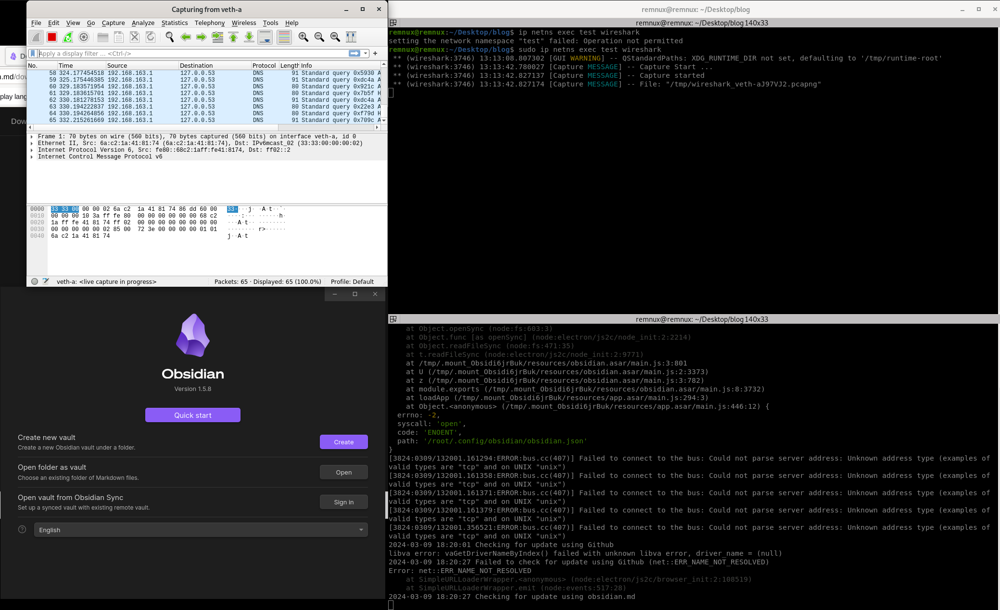
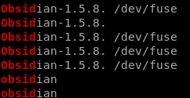
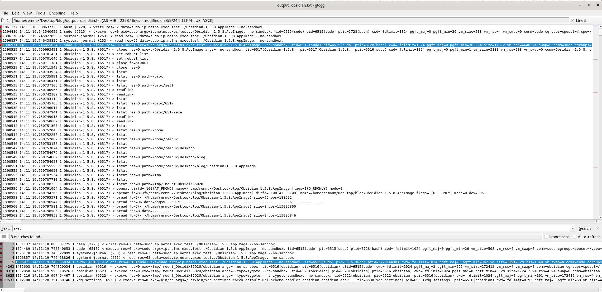
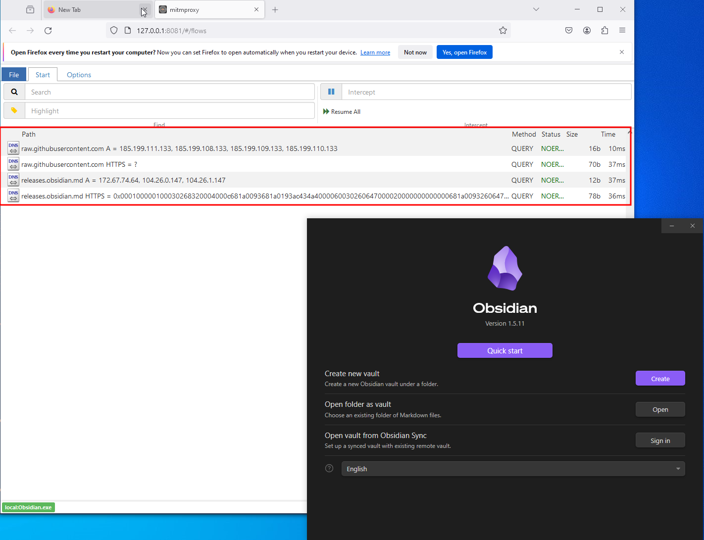
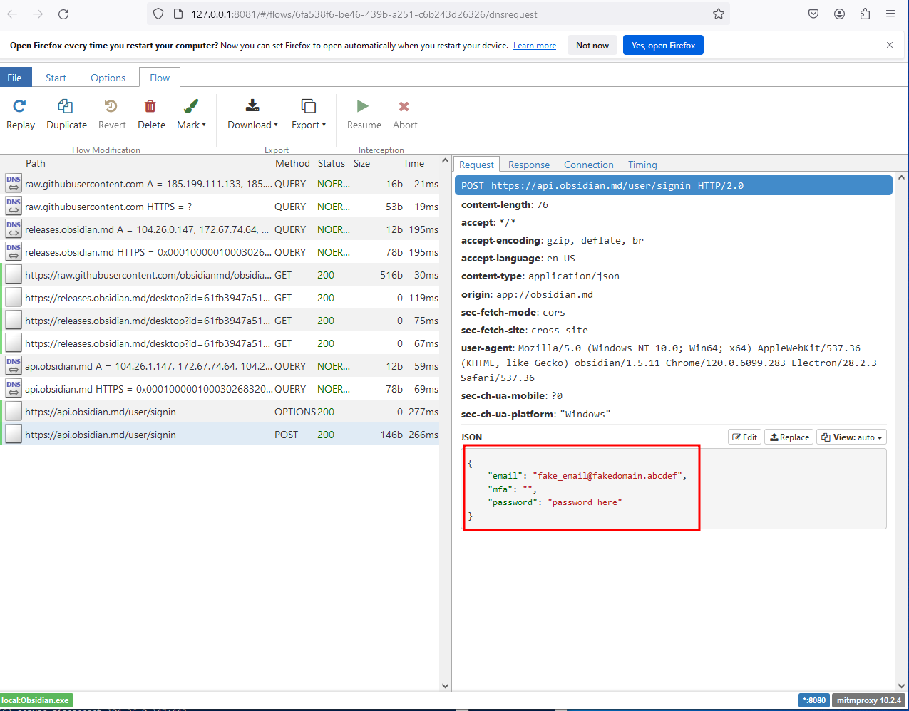
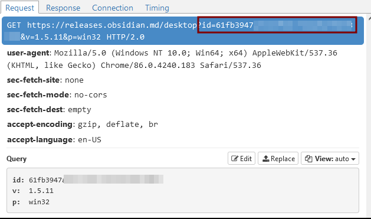
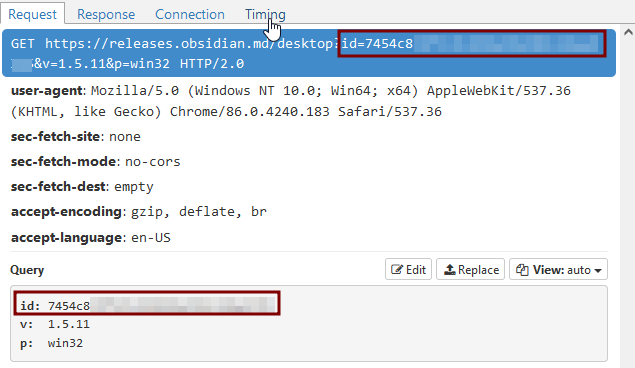
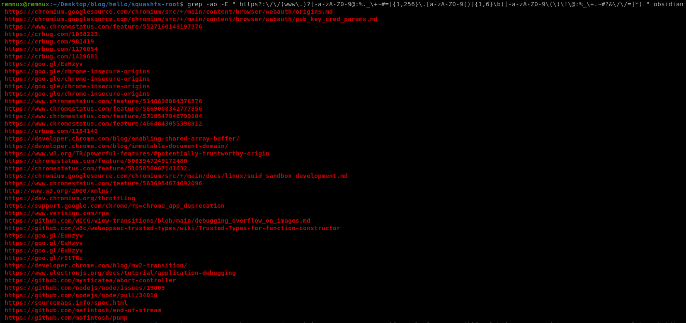

# Basic Software Investigation

There are a lot of software out there that claim to be "private". A lot of people, including myself, use these software without fully investigating them. A great example can be seen here: [https://keyfindings.blog/2020/03/23/be-careful-what-you-osint-with/](https://keyfindings.blog/2020/03/23/be-careful-what-you-osint-with/). This blog is my way of trying out various ways to capture and observe the connections and executions going out from apps, as a way to show how to monitor these. This is meant to be a tutorial and blog wrapped in one, for users to understand how to test closed-source applications (partially). **This blog will focus primarily on Linux (the man-in-the-middle portion focuses on Windows), but the mentality is the same for Windows and macOS as well. Compatibility layers such as `wine` and `proton` allow for running Windows applications on Linux distributions, which means you can test the same Windows applications on Linux as well.**

The ideology behind this blog is as follows: Malware analysis is meant to analyze malicious software. As individuals who value privacy, we should be treating all software as malicious, until it is validated. Thus, the same tools that would be used for Malware Analysis can be used for us to validate and investigate the software we use on a daily basis.

_Also, yes I see the irony in me using third-party tools to validate other third-party tools._

### Tools

When it comes to malware analysis, there seem to be two main distributions that are used for this: [REMnux](https://docs.remnux.org/) (Linux) and [FLARE-VM](https://github.com/mandiant/flare-vm) (Windows). I will be using REMnux in this blog.

## Behavioral Analysis

### Network Connections via an Isolated Network Namespace

By default, a Linux distribution shares **one** set of network interfaces and routing table entries \[2]. Network namespaces allow you to have "separate instances of network interfaces and routing tables that operate independent of each other" \[2]. The following code leverages these namespaces allowing us to have a segmented networking area where only the software we are running will have outgoing network connections, allowing us to observe the traffic. The reason I used a namespace is to prevent regular network processes from interfering with the network processes coming out from an application we are looking into. \[1] (cited below) uses commands split by text. I will combine that into a single script that can be run. **Please review the `network_interface` and `IP_address` variables to make sure they are correct for your system before running.**

```bash
#/bin/bash

#I assume the first interface is local (lo) and the second is your primary interface
network_interface=$(ip link show | grep "2:" | grep -o -P '(?<=\:\s).*(?=\:\s\<)')
#grabbing IP from hostname
IP_address=$(hostname -I)

#create a test network namespace
ip netns add test
#create a pair of virtual network interfaces (veth-a and veth-b)
ip link add veth-a type veth peer name veth-b
#change the active namespace of the veth-a interface
ip link set veth-a netns test
#configure the IP addresses of the virtual interfaces
ip netns exec test ifconfig veth-a up 192.168.163.1 netmask 255.255.255.0
ifconfig veth-b up 192.168.163.254 netmask 255.255.255.0
#configure the routing in the test namespace
ip netns exec test route add default gw 192.168.163.254 dev veth-a
#activate ip_forward and establish a NAT rule to forward the traffic coming in from the namespace you created (you have to adjust the network interface and SNAT ip address)
echo 1 > /proc/sys/net/ipv4/ip_forward
iptables -t nat -A POSTROUTING -s 192.168.163.0/24 -o $network_interface -j SNAT --to-source $IP_address
```

This script should be run as root (REMnux requires root for working with the ip commands we use): `sudo bash script.sh`. All apps that would need to be run in the namespace would be run with the following format (sudo is required): `sudo ip netns exec test your_program_here`. I will test the note-taking tool "Obsidian" in this blog.

#### **Obsidian**

I downloaded the AppImage file from [https://obsidian.md/](https://obsidian.md/) to get started. From there, I ran `chmod +x Obsidian-1.5.8.AppImage` to make the AppImage executable. I use [Terminator](https://gnome-terminator.org/) to create two side-by-side windows to make it easy to keep track of the apps I am running. I run Wireshark (`ip netns exec test wireshark`) on the first terminal, choose the `veth-a` interface, then run Obsidian (`sudo ip netns exec test ./Obsidian-1.5.8.AppImage --no-sandbox`) on the next:

<figure><figcaption></figcaption></figure>

We start to see DNS and ARP requests start piling up into Wireshark. One thing to note here, is that this setup does **not** allow the program to connect to the internet. As such, we can only see outgoing connections and not back and forth communications between the application and its server. As for Obsidian, we get the following logs excerpt (removed duplicates to save space on the blog; I have also removed some information about my own system from this):

```
0.000000000 [IPv6 Address] → ff02::2      ICMPv6 70 Router Solicitation from [MAC Address]
290.050304897 192.168.163.1 → 127.0.0.53   DNS 79 Standard query 0x65f5 A redirector.gvt1.com
290.050354057 192.168.163.1 → 127.0.0.53   DNS 79 Standard query 0x79e6 HTTPS redirector.gvt1.com
290.052591970 192.168.163.1 → 127.0.0.53   DNS 80 Standard query 0x8aef A releases.obsidian.md
290.052613015 192.168.163.1 → 127.0.0.53   DNS 80 Standard query 0x87b5 HTTPS releases.obsidian.md
460.328057970 192.168.163.1 → 127.0.0.53   DNS 75 Standard query 0xb73d A api.obsidian.md
460.328106250 192.168.163.1 → 127.0.0.53   DNS 75 Standard query 0xfb6a HTTPS api.obsidian.md
```

I didn't see any connections that I don't expect, so I am satisfied with this at the moment. When I tried to login, that is when it began to query the `api` subdomain, which I am assuming is where the credentials are verified.

### System Interactions via Isolated Network Namespace

I don't think that an isolated network namespace is _specifically_ required for this, however, as this allows more segmentation at the network layer, I was comfortable with this setup. The tool I use here is [sysdig](https://github.com/draios/sysdig). In a similar manner to the previous section, executing commands will be a bit similar, but modified: `sudo ip netns exec test sysdig > sysdig_obsidian.log` for syslog and `sudo ip netns exec test ./Obsidian-1.5.8.AppImage --no-sandbox` for Obsidian. Let's break down the sysdig command a bit:

> sudo ip netns exec test sysdig > sysdig\_obsidian.log
>
> sysdig - the executable to run
>
> sysdig\_obsidian.log - output or write this to sysdig\_obsidian.log

There is an option to output the file in .scap format, which can be read by running `sysdig -r obsidian_output_sysdig.scap`, however, the plain text version works for me. You could, of course, output to the scap, then read it to stream with sysdig, then output that to a text file.

In order to find the process name, I ran `sudo ip netns exec test sysdig -p"%proc.name %fd.name"` to see all running processes and file descriptors to see what was running. I then ran Obsidian on the other terminal to see what the output in sysdig would look like, leading me to find two process names for it being "obsidian" and "Obsidian-1.5.8.". If there is only one process name, then `sudo ip netns exec test sysdig proc.name=obsidian > sysdig_obsidian.log` will work.

<figure><figcaption></figcaption></figure>

> NOTE: If you wanted, you can run three windows: one for wireshark (mentioned in the previous section), one for sysdig, and the final for the application you want to inspect. This will allow for one run letting you see potentially all interactions at once.

After outputting the file, I used `glogg` to read the contents of the file:

<figure><figcaption></figcaption></figure>

While browsing the logs, nothing seemed out of place to me there either.

### Man-in-the-middle

While looking for MITM solutions for Linux, I learned of two: PolarProxy and mitmproxy. They both work similarly by decrypting TLS traffic by becoming the middle-man (hence, man-in-the-middle).  mitmproxy currently has local redirect modes for [Windows](https://mitmproxy.org/posts/local-redirect/windows/) and [macOS](https://mitmproxy.org/posts/local-redirect/macos/), but nothing for Linux yet. As such, here is the short list of steps I conducted to get this to work for Windows:

1. Downloaded Windows 10 Enterprise LTSC 64-bit ISO file (regular Windows 10/11 Home should work as well)
2. In VirtualBox, I uploaded this ISO and gave it 3 CPU and 50 GB of space
3. After setup, in the VM, I downloaded the mitmproxy Installer from [https://mitmproxy.org/](https://mitmproxy.org/)
   1. When I ran mitmproxy for the first time, I got an error similar to "MSVCP140.dll was not found". To mitigate this, I downloaded Microsoft Visual C++ 2015 - 2022 Redistributable x64 and it was resolved
4. I downloaded the Obsidian software
5. In order to decrypt some SSL/TLS traffic, you need to [install or import the CA certificate](https://docs.mitmproxy.org/stable/concepts-certificates/). On Windows, this can be done by navigating to the files with an admin PowerShell terminal (for me was `C:\Users\vboxuser\.mitmproxy`) and then running the following: `certutil -addstore root mitmproxy-ca-cert.cer`.
   1. NOTE: the `C:\Users\vboxuser\.mitmproxy` directory will be created after initial run of mitmproxy
6. After installation, I located where the EXE for Obsidian was located
   1. This can be done by right-clicking the shortcut, viewing its properties, and then seeing where it points to under "Target:"
7. In the Obsidian EXE folder, I ran the following to attach mitmweb to the Obsidian.exe executable: `mitmweb --mode local:Obsidian.exe`
   1. **I would recommend using `mitmweb --mode local` as an alternative as well, to make sure you don't miss any subprocesses spawned or any network traffic**
8. If done properly, you should be able to see traffic on the web portal (127.0.0.1:8080).
9. (Optional) Save the flows to reuse later for an investigation

<figure><figcaption></figcaption></figure>

<figure><figcaption></figcaption></figure>

<figure><figcaption></figcaption></figure>

While looking around, I did notice something interesting:

<figure><figcaption></figcaption></figure>

To me it seems that Obsidian is tracking end users by assigning a desktop ID to each app. At first, I thought it was maybe assigned to the specific version of the app. When I followed the same steps as above again on a clean install, I got the following:

<figure><figcaption></figcaption></figure>

It does seem like it is a generated ID for each application. Companies usually use IDs for telemetry and crash error analytics. However, I am not why there is an ID per application, since the version ("v") and product ("p") should be enough for them to provide an update or release. In addition, I did not see for a way to disable crash analytics in the app. I did not sign-in to the app, so perhaps my options were limited. My best guess for this is that maybe it is used to track in a masked way which applications are on what version and what OS to gain insight from a corporate perspective.&#x20;


If my assumption is incorrect, please feel free to reach out and let me know why an ID is being used **per application** basis or if the ID is for something else completely.&#x20;


Other than this, nothing notable stood out here either.

## Static Analysis

Static Analysis allows us to see hard-coded strings in an application to gain insight into some of the items it calls on such as variables and IP Addresses.

#### IPv4 Addresses

In order to check out the main executable, we have to "unpack" the AppImage file. This can be done by running `./Obsidian-1.5.8.AppImage --appimage-extract`\[7] to extract the files. From there, we can see an executable titled "obsidian". Since we know the main program is titled `obsidian`, we can then run `grep -ao -E "(\b25[0-5]|\b2[0-4][0-9]|\b[01]?[0-9][0-9]?)(\.(25[0-5]|2[0-4][0-9]|[01]?[0-9][0-9]?)){3}" obsidian` to grab all IPv4 addresses hard-coded into the program.

#### URLs

Running the `grep -ao -E " https?:\/\/(www\.)?[-a-zA-Z0-9@:%._\+~#=]{1,256}\.[a-zA-Z0-9()]{1,6}\b([-a-zA-Z0-9\(\)\!\@:%_\+.~#?&\/\/=]*) " obsidian` command, we can see all of the URLs in the file as well:

<figure><figcaption></figcaption></figure>

## Conclusion

Obsidian is already a well-known app for taking note-taking to the next level. I used Obsidian as a test to see what information I can gain from a closed-source app in order to be more informed about the application's interactions. Based on the limited monitoring I did, I did not find anything of concern, thus being "safe" for me to use for now.

I set out to find ways to validate and investigate the applications I use on a daily basis. This does fall partially into the Malware Analysis topic, however, we are using the same tools for what we deem could be a threat to our privacy. I did learn a lot about namespaces and some other networking concepts. I do plan to do this for other apps going forward.&#x20;

#### Credit

A huge thanks to Joshua Richards for allowing me to bounce this idea off of him and for reviewing this blog.

### Sources:

1. https://askubuntu.com/questions/11709/how-can-i-capture-network-traffic-of-a-single-process
2. https://blog.scottlowe.org/2013/09/04/introducing-linux-network-namespaces/
3. https://github.com/draios/sysdig/wiki
4. https://github.com/draios/sysdig/wiki/Sysdig-Examples
5. https://docs.mitmproxy.org/stable/howto-transparent/
6. https://docs.mitmproxy.org/stable/concepts-certificates/
7. https://superuser.com/a/1389548
8. https://ihateregex.io/expr/ip/
9. https://ihateregex.io/expr/url/
