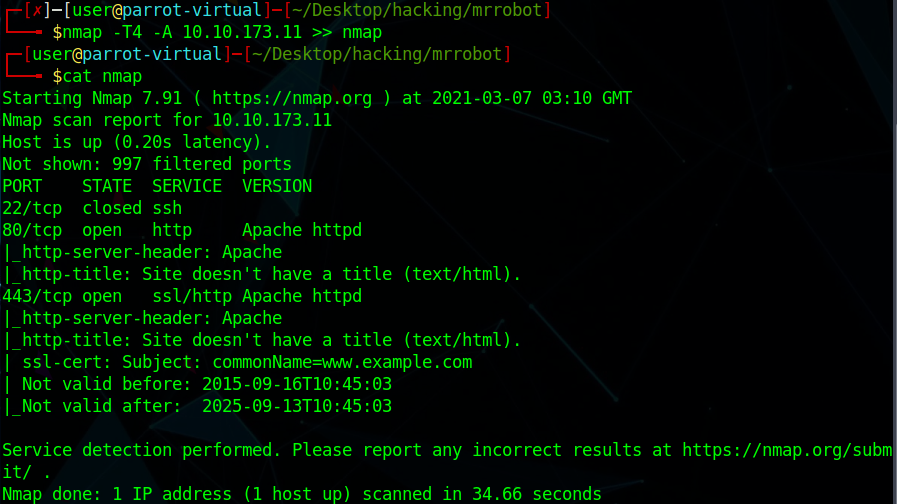

# Mr Robot CTF

My first step is to run nmap on the IP address. This will let us know the ports that are open on the IP address. 

We can see that there are 3 main ports available: 22 \(for SSH\), 80 \(for HTTP\), and 443 \(HTTPS\). If we go to the website, on port 22, we can see the following:

Based on the hint \#1 given by TryHackMe, which was "Robots". This gave me a hint that I can use robots.txt in order to find what files are available to access on the IP. When I entered IP\_address/robots.txt, I got the following:

There are 2 files that are here: one is dictionary \(or a wordlist\), and the other one is one of the answers for the CTF. The dictionary will come handy later in the CTF. The second hint is "White coloured font", which makes me think I have to look more closely at a html file, in order to find where the white colored text is. 


### Under Maintanence


