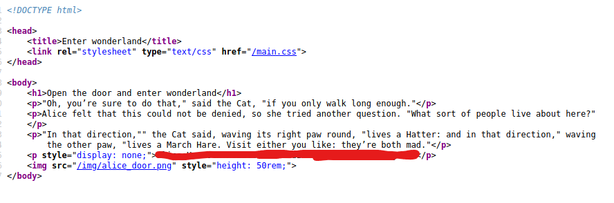

# Wonderland

I will first run an nmap scan on the IP address, in order to find what is on the web server. Here is the output from the scan:

```c
22/tcp open  ssh     OpenSSH 7.6p1 Ubuntu 4ubuntu0.3 (Ubuntu Linux; protocol 2.0)
| ssh-hostkey: 
|   2048 8e:ee:fb:96:ce:ad:70:dd:05:a9:3b:0d:b0:71:b8:63 (RSA)
|   256 7a:92:79:44:16:4f:20:43:50:a9:a8:47:e2:c2:be:84 (ECDSA)
|_  256 00:0b:80:44:e6:3d:4b:69:47:92:2c:55:14:7e:2a:c9 (ED25519)
80/tcp open  http    Golang net/http server (Go-IPFS json-rpc or InfluxDB API)
|_http-title: Follow the white rabbit.
Service Info: OS: Linux; CPE: cpe:/o:linux:linux_kernel
```

I can see that port 80 \(most common for HTTP\) is being used. I then ran gobuster on the website. This can be done by the following command:

```c
gobuster dir -u http://10.10.213.33 -t 10 -w SecLists/Discovery/Web-Content/directory-list-2.3-small.txt
```

> -u = IP or URL to the website
>
> -t = threads to run at once
>
> -w = location of the wordlist

The word list that I am using is from [Github](https://github.com/danielmiessler/SecLists). You can clone it to your own system, and then use it. It has a lot of lists, so you can choose which one you think is a good idea. I got a couple results from the gobuster command:

```c
gobuster dir -u http://10.10.213.33 -q -t 10 -w SecLists/Discovery/Web-Content/directory-list-2.3-small.txt 
/img (Status: 301)
/r (Status: 301)
```

I checked out /img, and it did not have anything that interesting. I then checked out /r. 


In this file, it tells us to keep going. So I will run gobuster on it again, to see where I can go from here. this time, I will add "/r" at the end of my IP address. I did get another result:


I can see a directory called /a. In the directory, I did not see anything special other than the main page of it:


My guess is that, it could be the word rabbit, bit a "/" between each letter. That worked! I ended up at a page called IP\_address/r/a/b/b/i/t. Looking at the source code for the website, I did see the a hint:



I added this hint to my notes. This could be a way in through ssh.

