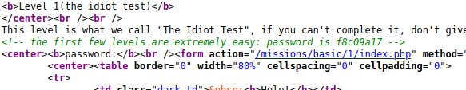

# Basic Missions - Basic 1

The question is asking us to look around in order to find the answer. My first thought was to look at the html or source code of the file. After looking at the .html file, the answer was in plain sight:

