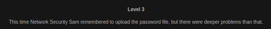
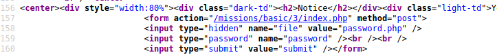
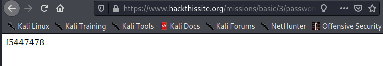

# Basic Missions - Basic 3

After reading the prompt, I decided to look at the html source code for this question.

I notice a file called "password.php", and I decide to check it out. 

On the page, I get the password in plain text and pass this level.

