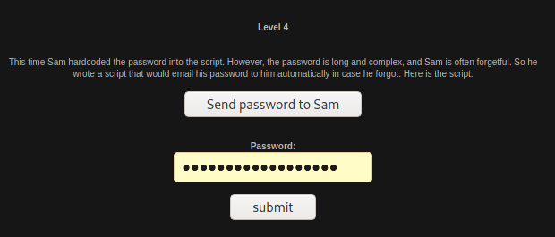
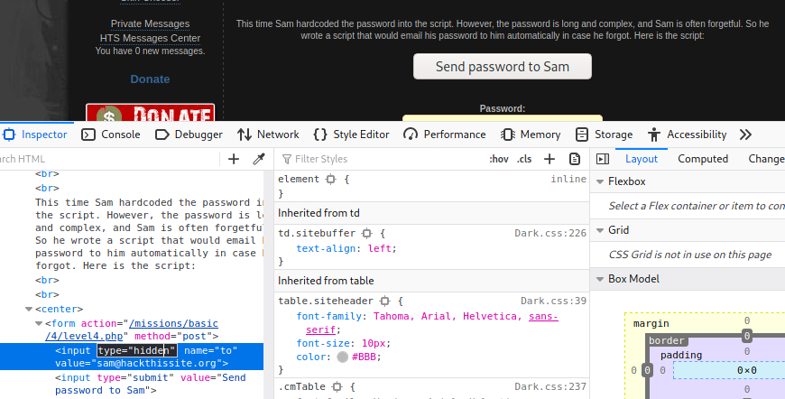
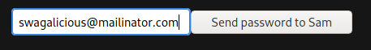
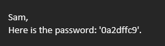
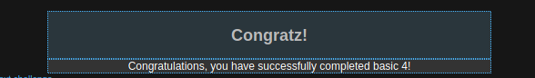

# Basic Missions - Basic 4

This level tells us that there is a script set in place that will send the password to Sam, in case he forgets it. This is our way to get the password. Unfortunately, after looking at the source code. I did not get anywhere. I was lost and had to look up a write-up to get a nudge to get my next step. I unfortunately have lost the website where I got the information from. From the website, I have found that my next step was to use the Developer Tools on Inspect Element in order to display the email field.

So I replaced "hidden" with "" \(nothing\), it will display the box or email input.

I then replaced this with my HackThisSite account email. \(NOTE: The email in the image is NOT my email for the account\)

I then got the password in my email.

I passed the level with that password.

