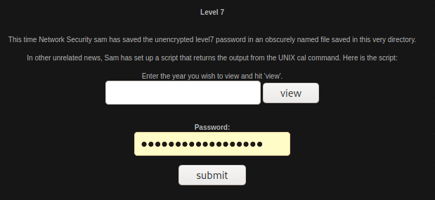
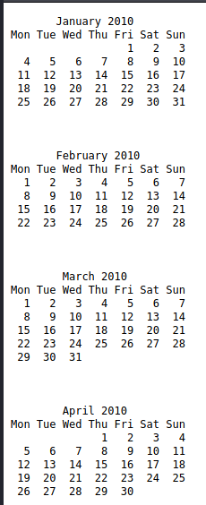
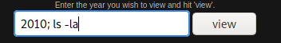
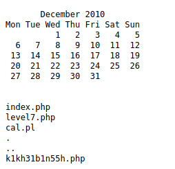
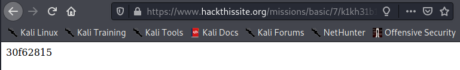

# Basic Missions - Basic 7

For this level, it lets us know that there is a UNIX command setup. For me, that shows that I should be able to use a Linux command to get the flag. If I enter just a year, such as 2010, it then shows me this as the output.

My thought after this, was to see if I can modify the input to change the output. My first thought was to append "ls" or the Linux command for listing files/directories in the current directory. 

This then gave me this output:

Here we can see a php file that seems to be out of the ordinary. If I change the directory to that of the file, I get the flag for the challenge.

