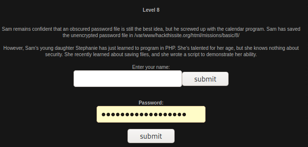
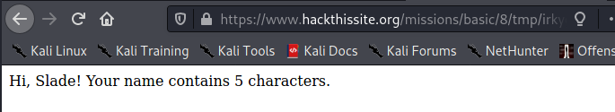
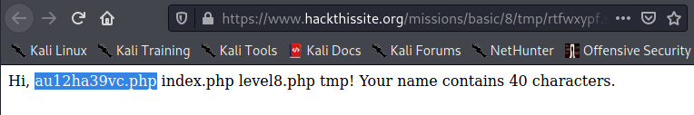
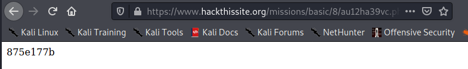

# Basic Missions - Basic 8

For this level, it tells us that the password is unencrypted and it is stored at a location. I also noticed that I would have to work with a bit of php in order to get to the password. I was lost at the foothold story, so I got help from the following websites in order to get a foothold for this level: [http://www.gensale.net/hts-basic-level-8/](http://www.gensale.net/hts-basic-level-8/) and [https://mont3cris7o.blogspot.com/2017/10/hack-this-site-basic-8.html](https://mont3cris7o.blogspot.com/2017/10/hack-this-site-basic-8.html).

I entered a random name just to see what the php script was doing. It was taking a user input and then calculating how many letters there were in the entry. After getting some assistance from the websites mentioned above, I entered " &lt;!--\#exec cmd="ls ../"--&gt;", which gave me this output:

I can assume that the flag is in the php file, and when I enter that into my search bar, I get this:

That is the password for the level.

