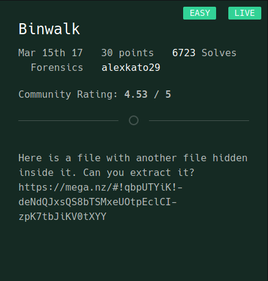
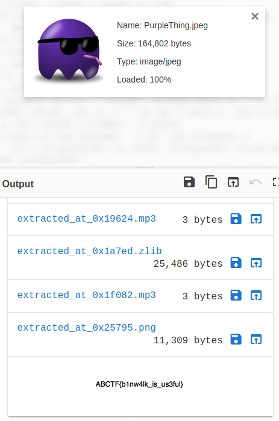
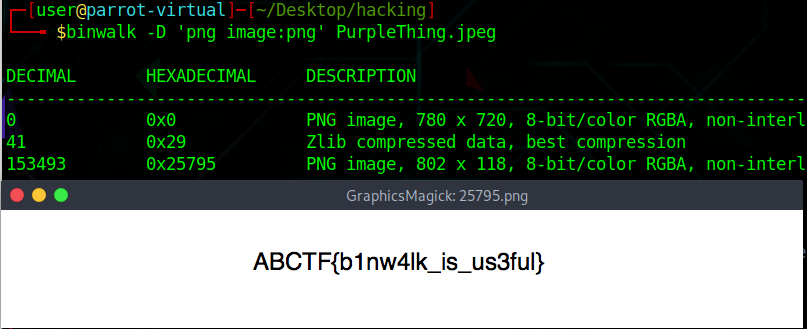

# Binwalk

For this problem, we know from the title that we will have to use Binwalk in order to extract another file from the file they will give us. However, the way I found the flag was by using CyberChef, which is a hint I got from the comments section.

Reading through the comments, I did learn that there was anther way to solve the problem: the correct way. This would be actually using binwalk to extract the file out. I had spent 10 minutes using the wrong flag \(binwalk -e file\). The correct one, which I found out after I solved the problem, is shown in the following image:

