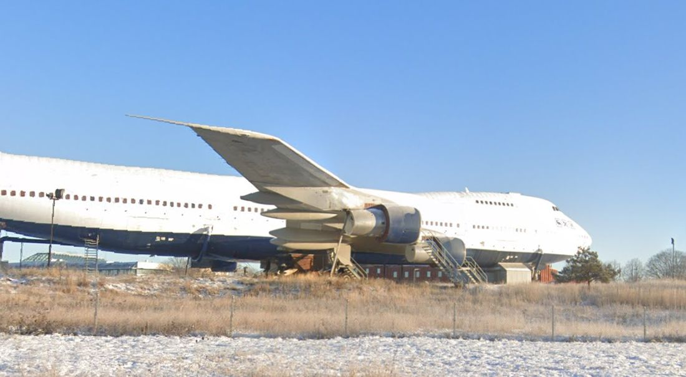
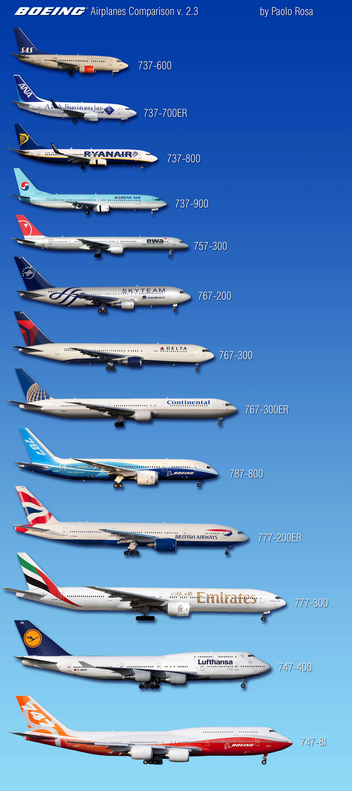
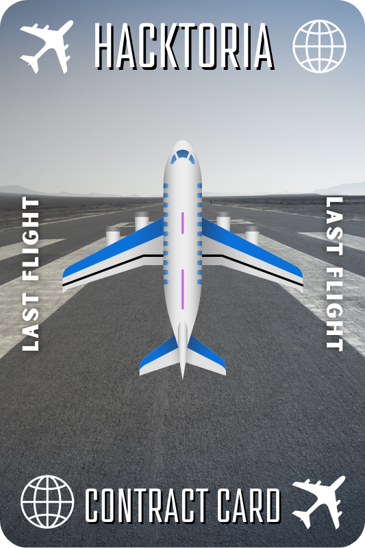

# Last Flight

<figure><figcaption></figcaption></figure>

I read the background and instructions (from the challenge page at [https://hacktoria.com/contracts/last-flight/](https://hacktoria.com/contracts/last-flight/)) and got the following notes out of it:

* I might have to look into what an ECCM is in relation to a plane
* Wanda has a photo of the plane, but without any metadata
* The answer format is `country_of_deployement-icao_code_of_airport-country_of_airport` example being `belgium-lfou-france`

I tried to unzip the file and got an error:

<figure><figcaption></figcaption></figure>

I then tried `7zz` and was asked for a password:

<figure><figcaption></figcaption></figure>

I then realized that the folder probably requires a password to complete the challenge. The main image I believe I am expected to work off of is:

<figure><figcaption></figcaption></figure>

I ran `exiftool` on the file and got the following:

```
ExifTool Version Number         : 12.40
File Name                       : starting-image-last-flight.jpg
Directory                       : .
File Size                       : 84 KiB
File Modification Date/Time     : 2023:05:06 19:02:32-05:00
File Access Date/Time           : 2023:05:06 19:02:32-05:00
File Inode Change Date/Time     : 2023:05:06 19:02:32-05:00
File Permissions                : -rw-rw-r--
File Type                       : JPEG
File Type Extension             : jpg
MIME Type                       : image/jpeg
JFIF Version                    : 1.01
Resolution Unit                 : inches
X Resolution                    : 72
Y Resolution                    : 72
Profile CMM Type                : Little CMS
Profile Version                 : 2.1.0
Profile Class                   : Display Device Profile
Color Space Data                : RGB
Profile Connection Space        : XYZ
Profile Date Time               : 2015:11:10 12:18:56
Profile File Signature          : acsp
Primary Platform                : Unknown (*nix)
CMM Flags                       : Not Embedded, Independent
Device Manufacturer             : 
Device Model                    : 
Device Attributes               : Reflective, Glossy, Positive, Color
Rendering Intent                : Perceptual
Connection Space Illuminant     : 0.9642 1 0.82491
Profile Creator                 : Little CMS
Profile ID                      : 0
Profile Description             : sRGB-elle-V2-srgbtrc.icc
Profile Copyright               : Copyright 2015, Elle Stone (website: http://ninedegreesbelow.com/; email: ellestone@ninedegreesbelow.com). This ICC profile is licensed under a Creative Commons Attribution-ShareAlike 3.0 Unported License (https://creativecommons.org/licenses/by-sa/3.0/legalcode).
Media White Point               : 0.9642 1 0.82491
Chromatic Adaptation            : 1.04788 0.02292 -0.05022 0.02959 0.99048 -0.01707 -0.00925 0.01508 0.75168
Red Matrix Column               : 0.43604 0.22249 0.01392
Blue Matrix Column              : 0.14305 0.06061 0.71393
Green Matrix Column             : 0.38512 0.7169 0.09706
Red Tone Reproduction Curve     : (Binary data 8204 bytes, use -b option to extract)
Green Tone Reproduction Curve   : (Binary data 8204 bytes, use -b option to extract)
Blue Tone Reproduction Curve    : (Binary data 8204 bytes, use -b option to extract)
Chromaticity Channels           : 3
Chromaticity Colorant           : Unknown (0)
Chromaticity Channel 1          : 0.64 0.33002
Chromaticity Channel 2          : 0.3 0.60001
Chromaticity Channel 3          : 0.15001 0.06
Image Width                     : 1100
Image Height                    : 605
Encoding Process                : Baseline DCT, Huffman coding
Bits Per Sample                 : 8
Color Components                : 3
Y Cb Cr Sub Sampling            : YCbCr4:2:0 (2 2)
Image Size                      : 1100x605
Megapixels                      : 0.665
```

Nothing really stood out to me in the output. I then wanted to find out what kind of plane it was. I found this image online:

<figure><figcaption></figcaption></figure>

The bottom two planes seem to relate to the plane we are supposed to investigate the most. I then counted the windows on the top floor of the plane (image is modified using Upscayl):

<figure><figcaption></figcaption></figure>

In the image given, there are 9 aisles that have windows. In the image I posted previously, there seem to be way more. With that in mind, I do believe that the plane I am looking for it a 747, due to the "hump" on top of the planes. The closest thing I ended up finding was on: [https://www.airlines-inform.com/commercial-aircraft/Boeing-747-family.html](https://www.airlines-inform.com/commercial-aircraft/Boeing-747-family.html), which was the image below.

<figure><figcaption></figcaption></figure>

This is the Boeing 747-100, and it has 10 windows on the upper deck. My current thought is that maybe the image was taken in a way where the last window on the upper deck was hidden, due to sunlight reflection or tampering with the image. My next idea was to work off of the images or icons on the plane:

<figure><figcaption></figcaption></figure>

My best guess is that these are related to an airline operator. If I can find out what operators or companies use those icons, I might be able to narrow it down a bit. I then found this Wikipedia page online: [https://en.wikipedia.org/wiki/List\_of\_Boeing\_747\_operators](https://en.wikipedia.org/wiki/List\_of\_Boeing\_747\_operators). This led me to believe that the plane we are looking at can also be a 747SP ([https://en.wikipedia.org/wiki/Boeing\_747SP](https://en.wikipedia.org/wiki/Boeing\_747SP)):

<figure><figcaption></figcaption></figure>

&#x20;After a long time of looking around, I found it. I was using Google with different key words when `747 sports edition` ended me getting the lead. I used that query because I thought the left  image was of people fencing or fighting in some way. I thought it could have been an Olympic plane or something to that aspect. After my search, I saw this:

<figure><figcaption></figcaption></figure>

Those images kind of look like the image we have...but it feels like a reach still to me. However, there are three icons on this plane as well, so this can maybe end up being the answer. I read that article and it basically mentioned a 747 that is now converted to a hotel somewhere in Sweden. I ran a search on Google for that, and found [https://www.jumbostay.com/contact/how-to-find-us/](https://www.jumbostay.com/contact/how-to-find-us/). Using the Google Map embed they use, I was able to find the exact image:

<figure><figcaption></figcaption></figure>

Now all I have to do is get the information needed for the password: Country of Deployment, ICAO Code of Airport, and Country of Airport. I was able to find the IATA Code of Airport on  [https://www.jumbostay.com/arlanda/](https://www.jumbostay.com/arlanda/): Stockholm Arlanda Airport – ARN. The Country of Airport would be Sweden, I assume. The Country of Deployment might be a bit more difficult to find. I started to read a bit more on the history on: [https://www.jumbostay.com/info-history/](https://www.jumbostay.com/info-history/). I also was reading more on [https://en.wikipedia.org/wiki/Boeing\_747](https://en.wikipedia.org/wiki/Boeing\_747), which led me to find [https://flightaware.com/live/flight/9VSQE](https://flightaware.com/live/flight/9VSQE). After multiple tries, I realized I had the wrong code for the airport:

<figure><figcaption></figcaption></figure>

I should be using "ESSA". I also do know that the plane is in Sweden currently. That is 2/3 parts of the flag. I tried the following for the flag: singapore-essa-sweden, unitedstates-essa-sweden,  sweden-essa-sweden, germany-essa-sweden, indonesia-essa-sweden, and netherlands-essa-sweden. These were not brute-force guesses, but based on the locations the plane was seen in. I was looking for a bit more clarification on what the "country of deployment" was referring to. I got an answer from one of the "Confidants" in the Hacktoria discord:

> Essentially the “country of deployment” is the operator at the time.

I used this information to go back to this history of the plane to see who operated the plane in April of 1993. I ended up finding [https://www.planelogger.com/Aircraft/Registration/9V-SQE/526100](https://www.planelogger.com/Aircraft/Registration/9V-SQE/526100), which shows the following:

<figure><figcaption></figcaption></figure>

The Airline operating that around the time of April 1993 would be Tower Air, based on closeness of "Delivered" date. After looking more into it, I ended up finding out it was Air Club International:

<figure><figcaption></figcaption></figure>

The previous output also mentioned it was a Canadian airline, so the passphrase then became: `canada-essa-sweden`. I then then able to get the flag file:

<figure><figcaption></figcaption></figure>

<figure><figcaption></figcaption></figure>
