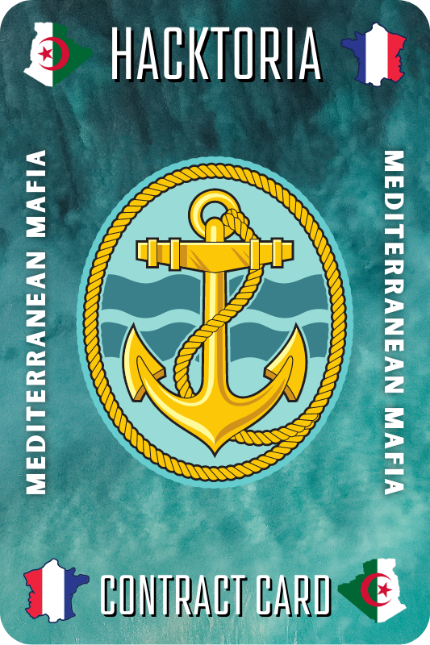

# Mediterranean Mafia

<figure><figcaption></figcaption></figure>

## Briefing

Greetings, Special Agent K.

We just received word from one of our field operatives, Thomas Johnson. He’s currently assigned to the INTERPOL case for taking on a drug smuggling operation in the Mediterranean. Thomas has successfully located the point where the ship will leave.

He’s also obtained a picture through a local source. Which is claimed to be the dock where the smugglers’ ship will arrive. It’s your task to locate where this dock is, so we can sent in the B.T.R.U. to intercept the shipment.

As always, Special Agent K. The Contract is yours, if you choose to accept.

## Materials and Answer Instruction

<figure><figcaption></figcaption></figure>

The answer format is how the name would appear on Google Maps: `Aparcament Port Arenys-de-Mar`

## Solution

The first thing I did is upscale the image using [Upscayl](https://www.upscayl.org/). This allows me to get more into the details, however it uses AI to fill in the gaps while enlarging. This got me from 1024x593 to 4096x2372. I then started looking into the image for clues. The first thing that pops out is the ARGO name on the boat. I started working off of that. I ended up visiting [https://www.marinetraffic.com](https://www.marinetraffic.com), and looking in the Mediterranean Sea for where ships are visiting or docked a lot, suggesting a port of some sort.&#x20;

<figure><figcaption></figcaption></figure>

I realized this would be me having to go to each port and look around. I ended up using Google Lens and found the following image on [https://www.yachtworld.com/yacht/2012-fairline-squadron-42-8209972/](https://www.yachtworld.com/yacht/2012-fairline-squadron-42-8209972/):

<figure><figcaption></figcaption></figure>

This could be the location of the boat. I see the same boat on [https://www.boats.com/power-boats/2012-fairline-squadron-42-8209972/](https://www.boats.com/power-boats/2012-fairline-squadron-42-8209972/) as well. But the best image I found was on [https://www.yachtvillage.net/en/detail/560c3aa6-b57a-4210-b0ca-811955902662](https://www.yachtvillage.net/en/detail/560c3aa6-b57a-4210-b0ca-811955902662):

<figure><figcaption></figcaption></figure>

<figure><figcaption></figcaption></figure>

This one has some sort of identification on it. I also ended up finding the actual seller page: [https://www.medinboats.fr/bateaux-occasion/fairline-squadron-42-2012-653380/](https://www.medinboats.fr/bateaux-occasion/fairline-squadron-42-2012-653380/). France has 10+ ports, so for unlocking the flag I will try the location of: 14 avenue docteur Robin, Hyeres, 83400 , France. I did find this address on [https://sunbirdyachts.eu/locations/france-mediterranean.php](https://sunbirdyachts.eu/locations/france-mediterranean.php), as well. I tried multiple passwords, but I was unable to get the password. I then watching the challenge get created: [https://www.youtube.com/watch?v=suAG9elumpY](https://www.youtube.com/watch?v=suAG9elumpY). I was able to find where the boat is currently being available from 08/02/2022. In the video, Frank finds this boat and the image is from 2019:&#x20;

<figure><figcaption></figcaption></figure>

Let me see if I can find a way to track the boat without cheating off of the video. I did hear from B0neShAd0w (Hacktoria Discord member) that they were able to find the final location by looking at other sale web sites for the boat mentioned above. I visited [https://www.boats.com/power-boats/2012-fairline-squadron-42-8211281/](https://www.boats.com/power-boats/2012-fairline-squadron-42-8211281/), and see the location is mentioned as: France Méditerranée, Var, France.&#x20;

<figure><figcaption></figcaption></figure>

I am still in the same area I was previously. I went back to [https://www.vesselfinder.com/](https://www.vesselfinder.com/), and noticed that ports are shown when you zoom into a location. I looked at the area from Google Maps and headed to that same area on VesselFinder. I then only had limited choices to choose from:

<figure><figcaption></figcaption></figure>

My goal now is to find a port where the background of the image matches what the given image was. I did find some where the background looked similar, but there was no road alongside the dock. I ended up finding a background that looked similar in Cavalaire-sur-Mer, and this had a road alongside the dock:

<figure><figcaption></figcaption></figure>

Going to the end of the dock, I was able to find it:

<figure><figcaption></figcaption></figure>

The port is `Cavalaire-sur-Mer`, but on Hacktoria it also says `Name of the harbor as displayed on Google Maps`. That would be: `Port de Cavalaire-sur-Mer`. This was the flag.

<figure><figcaption></figcaption></figure>
