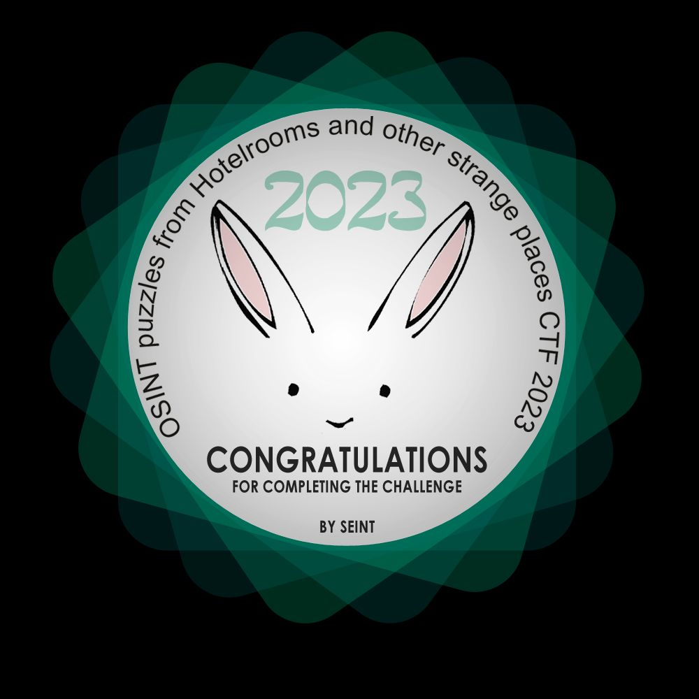

# 2023


The link to the challenge: [https://github.com/seintpl/osintquiz/tree/main/2023](https://github.com/seintpl/osintquiz/tree/main/2023)


Running the command `echo -n dive | md5sum` results in the following output:

`b9f5bcd98fe1627e37cd87a27b4a7fd6`

This allows us to begin the challenge.

## Step 1

<figure><figcaption></figcaption></figure>

```
Let's go on a trip again! But where shall we start? I found this postcard from long ago and the view looks promising. But where was this photo taken? Can you help me geolocate the place? In the nerby town, the was a really big event several decades ago. This event had a logo with something very special to the surrounding area on it.

The key to the next step is the MD5 hash of the latin name (written in lowercase without spaces) of this special thing, depicted on the logo.
```

I ran the `exiftool` program on the file and saw the following:

```
GPS Latitude                    : 61 deg 5' 39.57" N
GPS Longitude                   : 10 deg 26' 6.47" E
GPS Position                    : 61 deg 5' 39.57" N, 10 deg 26' 6.47" E
```

Using [https://gps-coordinates.org/](https://gps-coordinates.org/) I was able to locate an address: `Nord-Torpvegen 778, 2880 Nord-Torpa, Norway.`

However, when I used [https://www.gps-coordinates.net/](https://www.gps-coordinates.net/), I got the following address: `Øyresbrettingen, E 6, 2619 Lillehammer, Norway`.

After looking for a while, I ended up finding out that there was possibly a Olympic event that was held there (Source: [https://www.triphobo.com/places/lillehammer-norway/lillehammer-olympic-bob-and-luge-track](https://www.triphobo.com/places/lillehammer-norway/lillehammer-olympic-bob-and-luge-track)). I double checked this with Wikipedia as well: [https://en.wikipedia.org/wiki/1994\_Winter\_Olympics](https://en.wikipedia.org/wiki/1994\_Winter\_Olympics). Reading on [https://logos.fandom.com/wiki/Lillehammer\_1994](https://logos.fandom.com/wiki/Lillehammer\_1994), we can see that the logo is based on the northern lights. After looking into the latin name, I stumbled across [https://www.thoughtco.com/classical-origin-of-aurora-borealis-118328](https://www.thoughtco.com/classical-origin-of-aurora-borealis-118328), where it mentions it is `Aurora Borealis`. When I entered `aurora borealis` (hashed), I was not able to unlock it. Let me do some more research on this.

At this point, I had tried the following:

```
aurora polaris
aurora
aurora borealis
```

I then re-read the directions, and I realized that I had to remove the spaces between the words for it to be in the correct format. With `auroraborealis`, I was able to go to the next step.

## Step 2

```
So you found the location of the Norwegian town, good. But where to next? 
Let's see, what is this strange code here: 4KDB1677355222? Is it a database of 4K images? Or a date? Or something else? Where can it lead us?

Once you can link this code to a certain place, I will be waiting for you in the nearby café and having the best squares in the world. 

As strange as it may sound, you task is to find out what are my squares made of. To uncover the next step, make a hash of the name of the ingredient, written in lowercase.

Bon appetit!% 
```

I searched for the string `4KDB1677355222` on DuckDuckGo and ended up getting nowhere. On Google, I saw the following:

<figure><figcaption></figcaption></figure>

If this is the location, there are multiple cafe's or desert locations around. One of these has the word "Cafe" in it: `Cafe Jireh`. Looking at their Facebook profile ([https://www.facebook.com/cafejirehrarotonga/](https://www.facebook.com/cafejirehrarotonga/)), I was able to see the mention of the term "squares":

<figure><figcaption></figcaption></figure>

Could the ingredient mentioned in the directions be `caramello`? Unfortunately, it was not. I then realized that there might be more "squares" mentioned later on. I then found the following:

<figure><figcaption></figcaption></figure>

With that I was able to unlock the next step with `custard`. I tried to look around and see what "4KDB1677355222" actually meant, but did not end up getting anywhere.

## Step 3

```
Those custard squares were the best! Now it's time for a giant leap over the water and some historical lookup. On October 13th, 2012, something really big happened. It was so big, that it took two days to move it. There was also a strong car involved in the movement. 

Can you find out tha make and model of this car?

The answer, that will lead you to the next step, is the hash of the make and model of the car, written in lowercase without a space, like this: chevroletcorvette

Don't forget to make a hash of it.%
```

I was able to find the same information on two sites: [https://takemeback.to/13-October-2012#events](https://takemeback.to/13-October-2012#events) and [https://en.wikipedia.org/wiki/Portal:Current\_events/2012\_October\_13](https://en.wikipedia.org/wiki/Portal:Current\_events/2012\_October\_13). They both talk about a move of the U.S. Space Shuttle Endeavor. From there, based on the context of the question, this is what felt like it could be the right rabbit hole to fall into. I searched for U.S. Space Shuttle Endeavor online.

I see a logo on the "strong car":

<figure><figcaption></figcaption></figure>

On their site ([https://www.sarens.com/media/851737/press\_release\_sarens\_transports\_space\_shuttle.pdf](https://www.sarens.com/media/851737/press\_release\_sarens\_transports\_space\_shuttle.pdf)), a saw something I felt was interesting:

<figure><figcaption></figcaption></figure>

From the catalog ([https://www.sarens.com/media/20200406/115506\_SINGLE%20PAGE\_%20SMPT(DIG)\_compressed.pdf](https://www.sarens.com/media/20200406/115506\_SINGLE%20PAGE\_%20SMPT\(DIG\)\_compressed.pdf)), we see the following:

<figure><figcaption></figcaption></figure>

Based on the the catalog for the Kamag ([https://www.sarens.com/media/catalog/SPD/SPMT/Kamag2400/DataKamag2400.pdf](https://www.sarens.com/media/catalog/SPD/SPMT/Kamag2400/DataKamag2400.pdf)), I believe it might be the Kamag. I found this image (on [https://en.m.wikipedia.org/wiki/File:Kamag\_Transporttechnik\_Sarens\_Endeavour.jpg](https://en.m.wikipedia.org/wiki/File:Kamag\_Transporttechnik\_Sarens\_Endeavour.jpg)) that might correlate this:

<figure><figcaption></figcaption></figure>

The description was "Selbst angetriebene Module von KAMAG transportieren Raumfähre Endeavour für die US-amerikanische Raumfahrtbehörde NASA.", which translated to English is: Self-propelled modules from KAMAG transport the space shuttle Endeavour for the US space agency NASA. This would make the make and model: Sarens and Kamag. The password for this step would be `sarenskamag`, based on this information. However, I was incorrect. I even tried `sarensspmtkamag` since it was the SPMT type. I then realized that KAMAG was the German group who had created the SPMT based on reading the article here: [https://www.globaltrailermag.com/2013/01/24/special-report-endeavours-last-journey-2/](https://www.globaltrailermag.com/2013/01/24/special-report-endeavours-last-journey-2/).

After a long time, I saw the following image from [https://www.digitaltrends.com/cars/space-shuttle-endeavour-makes-its-final-journey-with-a-little-help-from-toyota/](https://www.digitaltrends.com/cars/space-shuttle-endeavour-makes-its-final-journey-with-a-little-help-from-toyota/), that made me change my understanding a bit:

<figure><figcaption></figcaption></figure>

The car in front was a Toyota Tundra. Thus, `toyotatundra` was the answer.&#x20;

## Step 4

```
Ah, this was an enormous endeavour! So now we will need some rest. It won't be far from the last spot. Let's go to see a sign with four missing letters nearby. We have to be there on the same day and month, on which the first photo of the first writeup for my 2022 CTF was last modified (in case it's not available, look at the first hint).

Stand on the last remaining letter of the big sign exactly at the time, mentioned in the song, that Mick and Keith wrote and released in 1997. Then, look in the direction the sun is currently shining from. In the distance, about 700 meters from you, there is a very important animal, a guardian of the vicinity.

The name given to that animal (not the species, but his first name), written in lowercase and turned into a hash, is the key to the next step.
```

This one is a big one, so I'll go step by step. I start off by looking for a sign in the U.S. with four missing letters. My first thought was the Hollywood sign, and based on [https://en.wikipedia.org/wiki/Hollywood\_Sign](https://en.wikipedia.org/wiki/Hollywood\_Sign), it seems to be a correct hunch. This used to be previously called Hollywoodland.

```
We have to be there on the same day and month, on which the first photo of the first writeup for my 2022 CTF was last modified (in case it's not available, look at the first hint).
```

I went to [https://osint-ctf.gitlab.io/docs/osintquiz/2022/](https://osint-ctf.gitlab.io/docs/osintquiz/2022/), which was the first write-up for the 2022 CTF, and then downloaded the first image. I then realized that the EXIF data would be relative to my system rather than the original EXIF. I saw the hint and it mentioned the following:

```
In case the first writeup is not available, the date is: December 28th, 2022.
```

I was not sure how it was December 28th. Just as a shot in the dark, I looked this site up on the Wayback Machine, and they currently only had one entry, which was for December 27, 2022. I will take the hint and move on.

```
Stand on the last remaining letter of the big sign exactly at the time, mentioned in the song, that Mick and Keith wrote and released in 1997.
```

Mick and Keith are from The Rolling Stones. If you look at [https://en.wikipedia.org/wiki/List\_of\_songs\_recorded\_by\_the\_Rolling\_Stones](https://en.wikipedia.org/wiki/List\_of\_songs\_recorded\_by\_the\_Rolling\_Stones), we can see that there was an album that was dropped in 1997 called "Bridges to Babylon". From there, in the song "Anybody Seen My Baby", we see a time mentioned:

<figure><figcaption></figcaption></figure>

I assume the last remaining letter of the big sign would be "D".&#x20;

```
Then, look in the direction the sun is currently shining from. In the distance, about 700 meters from you, there is a very important animal, a guardian of the vicinity.
```

Looking in that direction at 700m apart would most likely be the following:

<figure><figcaption></figcaption></figure>

> Link to site above: [https://www.suncalc.org/#/34.1341,-118.3215,14/2022.12.28/03:00/1/3](https://www.suncalc.org/#/34.1341,-118.3215,14/2022.12.28/03:00/1/3)

I was able to get the address: `3256 Canyon Lake Dr, Los Angeles, CA, 90068, USA` from the aforementioned site. I entered this into Google Maps and came across this image ([https://www.google.com/maps/@34.1300539,-118.3268159,3a,21.2y,159.5h,88.99t/data=!3m8!1e1!3m6!1sAF1QipM8Hr3Rsc00XHqfRP2NZGMGa3fDiw\_EIWP-I86i!2e10!3e11!6shttps:%2F%2Flh5.googleusercontent.com%2Fp%2FAF1QipM8Hr3Rsc00XHqfRP2NZGMGa3fDiw\_EIWP-I86i%3Dw203-h100-k-no-pi-0-ya354.88123-ro-0-fo100!7i8704!8i4352?entry=ttu](https://www.google.com/maps/@34.1300539,-118.3268159,3a,21.2y,159.5h,88.99t/data=!3m8!1e1!3m6!1sAF1QipM8Hr3Rsc00XHqfRP2NZGMGa3fDiw\_EIWP-I86i!2e10!3e11!6shttps:%2F%2Flh5.googleusercontent.com%2Fp%2FAF1QipM8Hr3Rsc00XHqfRP2NZGMGa3fDiw\_EIWP-I86i%3Dw203-h100-k-no-pi-0-ya354.88123-ro-0-fo100!7i8704!8i4352?entry=ttu)):

<figure><figcaption></figcaption></figure>

This is Smokey the Bear. This would be `smokey` as the password.

## Step 5

```
Now it's time to move on. Let's change the continent and meet some friends. They started their road trip from San Diego, through Barcelona, heading to Valencia. We are heading from Valencia, on the same route, but in the opposite direction. We ride our cars with roughly the same speed, so we shall meet in the middle, after driving 154 miles.
Can you look into the map and tell the name of the town we will be meeting in?

The name of the town, written in lowercase and turned into a hash, is the pass to the next step.

Look out for the traps on the road described above! :)
```

I ended up finding this Wikipedia site on the other Valencias: [https://en.wikipedia.org/wiki/Valencia\_(disambiguation)](https://en.wikipedia.org/wiki/Valencia\_\(disambiguation\)). I found the same for San Diego as well: [https://en.wikipedia.org/wiki/San\_Diego\_(disambiguation)](https://en.wikipedia.org/wiki/San\_Diego\_\(disambiguation\)). Same for Barcelona as well: [https://en.wikipedia.org/wiki/Barcelona\_(disambiguation)](https://en.wikipedia.org/wiki/Barcelona\_\(disambiguation\)).

After finding these I re-read the prompt:

```
Now it's time to move on. Let's change the continent and meet some friends.
```

This means that the U.S. is out of the picture. I then tested the rest.

A potential answer I found was Columbia. San Diego, Columbia to Barcelona, Columbia is \~214.26 miles. Barcelona, Columbia to Valencia, Columbia is \~217.11, bringing the total to \~431.37. This seems to match the equal distance on both sides.

<figure><figcaption></figcaption></figure>

I got stuck at this point for a while. Big thanks to **@hy5b5** on Twitter for the nudge, and changing my mindset about what I should be looking for. I was able to find the location in Venezuela, after looking at [https://en.wikipedia.org/wiki/List\_of\_cities\_in\_Venezuela\_by\_population](https://en.wikipedia.org/wiki/List\_of\_cities\_in\_Venezuela\_by\_population).&#x20;

<figure><figcaption></figcaption></figure>

If you zoom into the map, you can see where both lines meet:

<figure><figcaption></figcaption></figure>

Based on Google Maps, the distance from San Diego, Venezuela to Barcelona, Anzoategui, Venezuela is 298 miles. From Barcelona, Anzoategui, Venezuela to Valencia, Carabobo, Venezuela it is 299 miles. This aligns with what the hint said.

Now to find out what city they will be meeting in. In the prompt, it mentioned that they will meet after driving 154 miles. We need to find a town that is 154 miles from the start of Valencia (since I assumed the "We" in the prompt meant they started from Valencia). After some playing around on Google Maps, I found Marizapa:

<figure><figcaption></figcaption></figure>

`Marizapa` ended up being the location.

## Step 6

```
This is the last part of our journey around the world! It's winter time and everybody's looking for Santa. Are these guys also wishing to see his sleigh in the sky? What can they be looking at?

The name of this thing they are looking at, written in lowercase and without spaces, turned into a hash, is the key!
```

We are also provided this image:

<figure><figcaption></figcaption></figure>

Reverse image searching the cement truck, I learned it is from Japan. After that, I was able to find this location on Google Maps ([https://www.google.com/maps/@35.7087537,139.8083084,3a,75y,184.37h,94.49t/data=!3m6!1e1!3m4!1sjBMMKtC7X2XRosUUdvbr-Q!2e0!7i16384!8i8192?entry=ttu](https://www.google.com/maps/@35.7087537,139.8083084,3a,75y,184.37h,94.49t/data=!3m6!1e1!3m4!1sjBMMKtC7X2XRosUUdvbr-Q!2e0!7i16384!8i8192?entry=ttu)):

<figure><figcaption></figcaption></figure>

After some rabbit holes, the answer was in front of my face ... partially. I just had to turn the "camera" on Google Maps to the direction they were looking in:

<figure><figcaption></figcaption></figure>

This is called the Tokyo Skytree. This would make the password: `tokyoskytree`.

## Step 7

```
  .oooooo.                                                           .               oooo                .    o8o                                 .o. 
 d8P'  `Y8b                                                        .o8               `888              .o8    `"'                                 888 
888           .ooooo.  ooo. .oo.    .oooooooo oooo d8b  .oooo.   .o888oo oooo  oooo   888   .oooo.   .o888oo oooo   .ooooo.  ooo. .oo.    .oooo.o 888 
888          d88' `88b `888P"Y88b  888' `88b  `888""8P `P  )88b    888   `888  `888   888  `P  )88b    888   `888  d88' `88b `888P"Y88b  d88(  "8 Y8P 
888          888   888  888   888  888   888   888      .oP"888    888    888   888   888   .oP"888    888    888  888   888  888   888  `"Y88b.  `8' 
`88b    ooo  888   888  888   888  `88bod8P'   888     d8(  888    888 .  888   888   888  d8(  888    888 .  888  888   888  888   888  o.  )88b .o. 
 `Y8bood8P'  `Y8bod8P' o888o o888o `8oooooo.  d888b    `Y888""8o   "888"  `V88V"V8P' o888o `Y888""8o   "888" o888o `Y8bod8P' o888o o888o 8""888P' Y8P 
                                   d"     YD                                                                                                          
                                   "Y88888P'                                                                                                          
                                                                                                                                                     
CONGRATULATIONS!

You've successfully made it through this year's CTF by The SEINT!

Thank you for participating and I hope you had fun doing the puzzles. You can also find a badge for doing this quiz here.

If you like this quiz, please share it with your friends!

Thanks again!

@SEINT_pl
```

<figure><figcaption></figcaption></figure>
