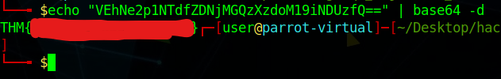

# CTF collection Vol.1

### This is my write-up for the TryHackMe room located at: [https://tryhackme.com/room/ctfcollectionvol1](https://tryhackme.com/room/ctfcollectionvol1)

## Task 2: What does the base said?

The question asks us to decode a code: VEhNe2p1NTdfZDNjMGQzXzdoM19iNDUzfQ==. The command I ran was:

```
echo "VEhNe2p1NTdfZDNjMGQzXzdoM19iNDUzfQ==" | base64 -d
```

This decodes the string in the quotes using base64 encoding. After the command, I got the flag:



## Task 3: Meta Meta

For this problem, it wants us to find a flag using its metadata. For this, I used a metadata reading tool on ParrotOS and Kali Linux called "exiftool". Running that command on the file that the problem presented led me to this:

 (1) (1).png>)

## Task 4: Mon, are we going to be okay?

For this one I had to look at the hint in order to figure out a way to crack the file. The hint pointed out that I should use the steganography tool known as "steghide. The command I used for this was:

```
steghide --extract -sf Extinction.jpg
```

I did not use a password for this, and it output the password in a new file for me:

```
cat Final_message.txt 
It going to be over soon. Sleep my child.

THM{------------------------}
```

## Task 5: Erm......Magick

This problem mentions the word "Magick" in the title. This makes me think that I might need to run image. After 5 minutes of looking online to find the answer, I had to take a look at the hint. The hint told me that the flag could be hidden on the page somewhere. I then found he flag on the page:

 (1) (1).png>)

## Task 6: QRrrrr

For this problem, all a person has to do is to is scan the QR code on the picture you download. When you scan the QR code it shows you the flag on your phone (or the device you use for the scan).

## Task 7: Reverse it or read it?

For this problem, we are downloading a ELF file. This is a program that is an executable. My first thought was using ltrace (a linux command to see a bit more of the backend of the executable). When that did not work, I then ran "strings" on the file such as:

```c
strings hello.hello | grep THM
```

This gave the output:

 (1) (1).png>)

## Task 8: Another decoding stuff

We are asked to decode a string: 3agrSy1CewF9v8ukcSkPSYm3oKUoByUpKG4L. I looked at the hint for this one and noticed that it is in base58. I ran the following command:

```c
echo "3agrSy1CewF9v8ukcSkPSYm3oKUoByUpKG4L" | base58 -d
```

This got me the flag:

 (1) (1).png>)

I later found out that you could find this using ghidra as well. There is a function called "skip", and in the function we can see the print function having the flag in it:

.png>)

## Task 9: Left or right

Reading about this, I realize that this might be some sort of shift. The text did mention ROT 13, so I played around with ROT and then got a ROT number to work for me:

 (1) (1).png>)

The website I used for this was [CyberChef](https://gchq.github.io/CyberChef/).

## Task 10: Make a comment

I needed a hint to know what a foothold can be into solving this puzzle. It did not help me as much as I hoped. I found [this write-up](https://shafdo.github.io/pages/blog/ctf/ctf\_collection\_Vol\_1/), which pointed me in the right direction. I then found the flag:

 (1) (1).png>)

## Task 11: Can you fix it?

For this problem, it states "I accidentally messed up with this PNG file. Can you help me fix it?". This tells me that I have to edit the file header. For this, I will use hexeditor. Looking online, I found the "magic numbers" to be "89 50 4E 47". I then used hexeditor to modify the file.

 (1) (1).png>)

I then got the flag in the image.

 (1) (1).png>)

## Task 12: Read it

This question asks us to find a social media account related to Tryhackme in order to find the flag. I got lost while trying to find the flag. I did run across [this writeup on THM](https://shafdo.github.io/pages/blog/ctf/ctf\_collection\_Vol\_1/), which pointed me in the right direction. I then found the post on the r/Tryhackme subreddit with the flag on it.

 (1) (1).png>)

## Task 13: Spin my head

This looks like a encoding/decoding question. I looked at the hint and it told me that the format was "binaryfuck". I then searched online for a decoder and found the flag:

 (1) (1) (1).png>)

## Task 14: An exclusive!

For this problem, I believe I have to XOR two strings together. I put the strings on a website and got an answer:

 (1).png>)

I did get the result in reverse, so using an online string reverse tool, I got the flag:

 (1).png>)

## Task 15: Binary walk

For this problem, it looks like we would have to use the binwalk tool to extract the file. I ran the following command:

```c
binwalk -e hell.jpg
```

I got an output in a folder. In the folder, there was a file called "hello\_there.txt". I found the flag in it:

.png>)

## Task 16: Darkness

For this problem, it seems that we would have to play around with the image to see the flag. The image itself is pure black. I realized that I would have to run StegSolve on the image to see the image. After running StegSolve, I then found the flag on a blue plane:

.png>)

## Task 17: A sounding QR

For this problem, we get a QR code. I decoded it using an online tool:

 (1).png>)

I then went on the website, and listened to the flag. I then typed the flag into the prompt, and I got it correct.

## Task 18: Dig up the past

For this problem, I will have to the "wayback machine" to find the flag.

 (1).png>)

Once you go to the date mentioned in the task, you will find the flag on the page. You can also download the html file using wget, and then read the flag that way too:

.png>)

## Task 19: Uncrackable!

For this, it seems to be using a vigenere cipher. I found [this website](https://www.guballa.de/vigenere-solver) that decodes it for me without a key. I found the flag using the website:

 (1).png>)

## Task 20: Small bases

For this problem, I would have to deocde the text to get the flag. On the website, the hint says to convert it to hex and then to ascii. After doing that, I found the flag:

 (1).png>)

## Task 21: Read the packet

For this problem, we would have to read the pcap file. I will use wireshark for this. I ran the following command:

```c
wireshark flag.pcapng
```

I then went to File->Export Objects->HTTP, and then saved all the files. In that, one of the files was the flag.txt. I read it and got the flag:

.png>)
