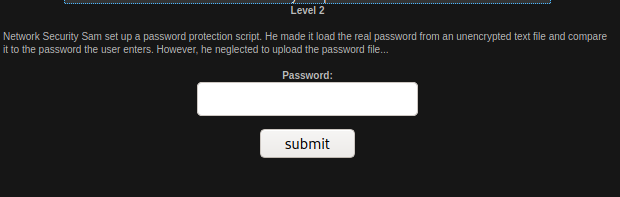
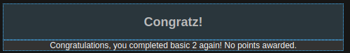

# Basic Missions - Basic 2

The question lets us know that there is a password protection script, HOWEVER, the person who created the script forgot to add a password file. I had a hunch that since there is no password file that the password would be nothing. I pressed the submit button without entering anything into the password location, and turns out I got the question right:

